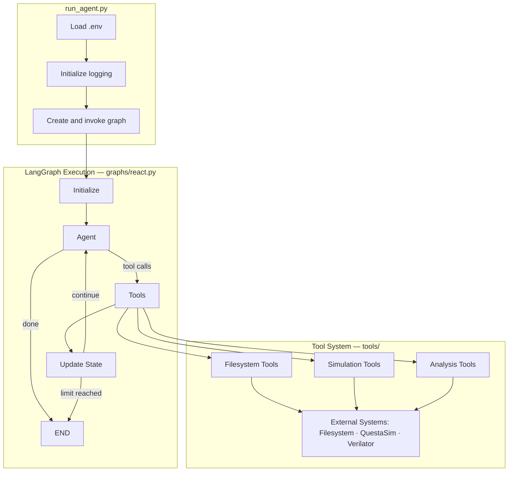
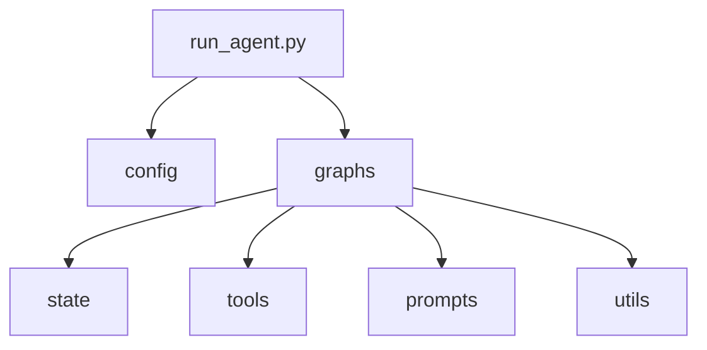
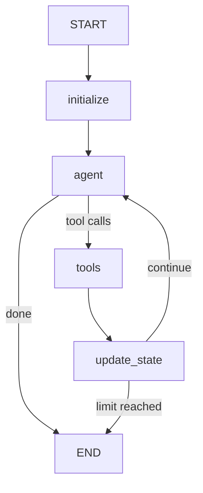
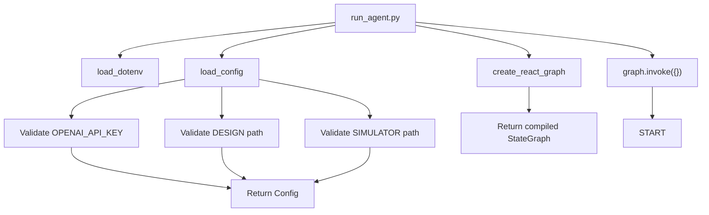
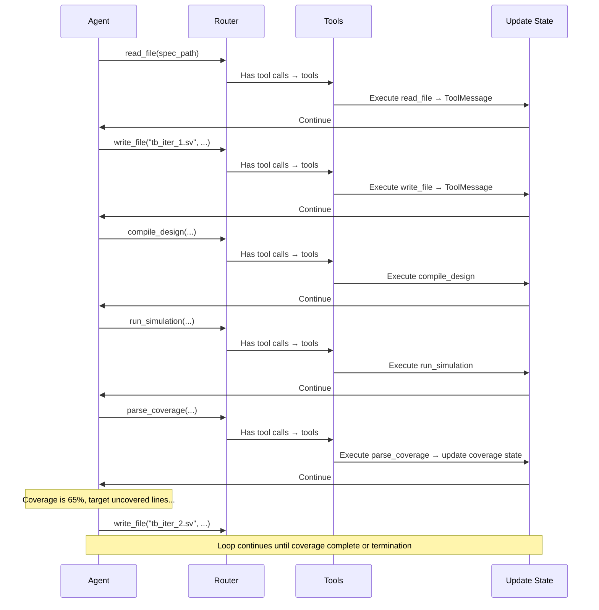
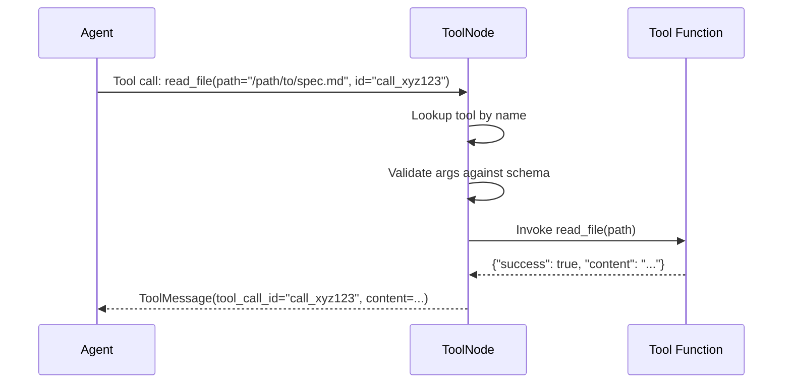
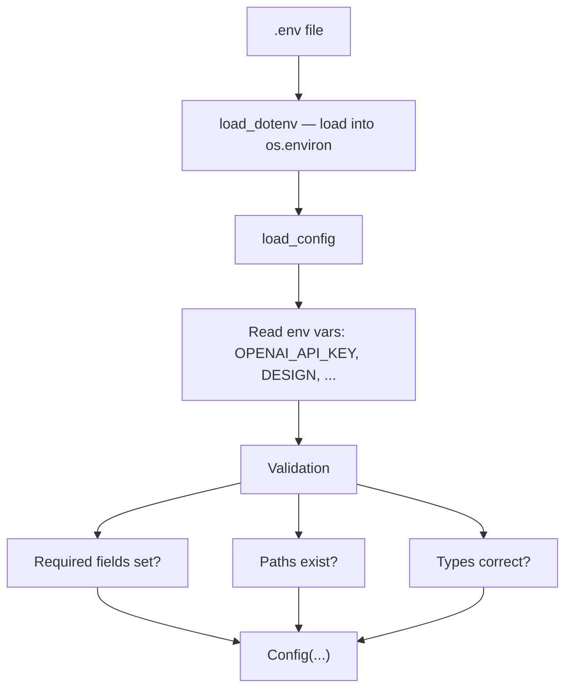

# Spec2Cov Architecture Documentation

## Table of Contents

1. [Overview](#overview)
2. [Architecture Principles](#architecture-principles)
3. [System Architecture](#system-architecture)
4. [Component Details](#component-details)
5. [Data Flow](#data-flow)
6. [Graph Execution Model](#graph-execution-model)
7. [Tool System](#tool-system)
8. [State Management](#state-management)
9. [Configuration System](#configuration-system)
10. [Design Decisions](#design-decisions)
11. [Extension Points](#extension-points)
12. [Performance Considerations](#performance-considerations)

---

## Overview

Spec2Cov is an agentic framework that automates hardware verification using a ReAct (Reasoning + Acting) pattern implemented with LangGraph. The system orchestrates an LLM-powered agent that iteratively generates SystemVerilog testbenches, compiles and simulates them with QuestaSim, analyzes coverage, and refines its approach until achieving complete statement coverage.

### Key Characteristics

- **Autonomous Operation**: Agent makes decisions without human intervention during execution
- **Tool-Oriented**: All actions (file I/O, compilation, simulation) performed through well-defined tools
- **State-Based**: Uses LangGraph's state management for reliable iteration tracking
- **Filesystem-Centric**: Large artifacts stored on disk, state contains only metadata
- **Configurable**: Behavior adapts based on environment variables

---

## Architecture Principles

### 1. Separation of Concerns

Each component has a single, well-defined responsibility:
- **State**: Data structure only, no logic
- **Config**: Environment loading and validation only
- **Utils**: Pure functions for specific tasks (parsing, extraction)
- **Tools**: LangChain tools with well-defined I/O contracts
- **Graph**: Orchestration logic only
- **Prompts**: Template management separate from application logic

### 2. Filesystem-Centric State

**Rationale**: LangGraph state serialization becomes inefficient with large text blobs (multi-KB testbenches, logs, coverage reports).

**Solution**: Store all large artifacts on disk, keep only paths and scalar metadata in state.

**Benefits**:
- Efficient state serialization
- Easy inspection of artifacts (humans can read files directly)
- Natural audit trail (timestamped files)
- Memory efficient

### 3. Tool-Based Abstraction

**Rationale**: Agent needs well-defined capabilities that abstract implementation details.

**Implementation**: LangChain's `@tool` decorator creates callable functions with:
- Automatic schema generation
- Structured input validation
- Consistent return format
- Self-documenting interfaces

**Benefits**:
- LLM can discover and use tools autonomously
- Easy to test tools independently
- Tools can be swapped/mocked for testing
- Clear separation between agent reasoning and execution

### 4. Immutable Configuration

**Rationale**: Configuration changes mid-run lead to inconsistent behavior.

**Implementation**: Load config once at startup, validate all paths and settings, then treat as immutable (except for iteration counter which is controlled state).

**Benefits**:
- Predictable behavior
- Easy debugging (config doesn't change during run)
- Clear error messages at startup if config invalid

### 5. Explicit State Transitions

**Rationale**: Iteration and coverage tracking must be reliable for correct termination.

**Implementation**: State updates happen in specific nodes with clear trigger conditions (coverage improvement, simulation success).

**Benefits**:
- Easy to understand when iterations increment
- Clear audit trail in logs
- Predictable termination behavior

---

## System Architecture

### High-Level Architecture



### Component Diagram



---

## Component Details

### 1. State (`state/schemas.py`)

**Purpose**: Define the data structure that flows through the graph.

**Key Fields**:

```python
class AgentState(TypedDict):
    # Message history (LangGraph managed)
    messages: Annotated[list[BaseMessage], add_messages]

    # Configuration (loaded once during initialization)
    config: Any  # Config object stored in state to avoid repeated loading

    # Design context (immutable after init)
    design_name: str
    design_dir: str
    spec_path: str
    design_files: List[str]      # Main design RTL files (DUT)
    design_context_files: List[str]  # Supporting files (submodules/dependencies)
    rtl_dir: str                 # Deprecated - kept for compatibility
    module_header: str
    work_dir: str

    # Tracking (mutable)
    iteration: int               # Increments after successful compile+sim+coverage cycle
    attempt: int                 # Individual tool attempts (compile or sim calls)
    api_calls: int               # Total LLM API calls - for max_iterations limit
    consecutive_failures: int    # Compile/sim failures in a row - for max_retries limit
    no_progress_count: int       # Consecutive cycles with no coverage improvement

    # Coverage tracking
    current_coverage: float      # Latest coverage percentage (0-100) - single iteration
    max_coverage: float          # Best single-iteration coverage achieved
    cumulative_coverage: float   # Merged coverage across ALL iterations
    cumulative_coverage_db: Optional[str]  # Path to merged coverage database

    # Termination
    is_done: bool
    done_reason: Optional[str]
```

**Design Decisions**:
- `messages` uses `add_messages` reducer for automatic message list merging
- `config` stored in state so nodes access it without reloading
- All file paths stored as strings (not Path objects) for JSON serialization
- Coverage as float (0-100) for easy comparison
- Separate `current_coverage`, `max_coverage`, and `cumulative_coverage` to track per-iteration vs merged progress

### 2. Configuration (`config.py`)

**Purpose**: Load and validate environment configuration.

**Architecture**:

```python
@dataclass
class Config:
    # LLM settings
    openai_api_key: str
    model: str
    temperature: float
    max_tokens: int

    # Design settings
    design_name: str
    design_dir: Path
    spec_path: Path
    design_files: List[Path]
    design_context_files: List[Path]
    design_context_enabled: bool

    # Paths
    work_dir: Path
    simulator_path: Path
    simulator_type: str  # 'questasim' or 'verilator'

    # Workflow
    run_id: str
    max_iterations: int
    max_retries: int
    max_no_progress: int
    sim_runs: int
    sim_timeout: int
    testplan_enabled: bool
    num_feedback_holes: int
    context_window: int  # Max tokens before terminating run

    # Debug
    log_level: str
    log_truncate: bool

    # Runtime (mutable)
    current_iteration: int = 1
    current_attempt: int = 1
```

**Validation Strategy**:
- Fail fast: Raise `ValueError` on missing required fields
- Path validation: Check existence at load time
- Type coercion: Convert env strings to appropriate types
- Defaults: Provide sensible defaults for optional fields

**Global Access Pattern**:
```python
config = load_config()  # Load once
set_tool_config(config)  # Share with tools via global reference
```

### 3. Design Loader (`utils/design_loader.py`)

**Purpose**: Extract design metadata from filesystem.

**Functions**:

1. **`extract_module_header(rtl_file: Path) -> str`**
   - Parses Verilog/SystemVerilog to extract module interface
   - Captures: module name, parameters, port declarations
   - Uses regex-based line-by-line parsing
   - Handles extended port declarations after module header

2. **`scan_design_directory(design_dir: Path) -> Tuple[Path, Path, List[str]]`**
   - Finds specification file in `docs/` subdirectory
   - Finds RTL files in `rtl/` subdirectory
   - Returns: `(spec_path, rtl_dir, rtl_files)`

**Design Rationale**:
- Pure functions (no side effects)
- Fail with descriptive errors if structure invalid
- Support both `.v` and `.sv` extensions

### 4. QuestaSim Utilities (`utils/questasim.py`)

**Purpose**: Build simulator commands and parse outputs.

**Command Builders**:

1. **`build_vlog_command(simulator_path, testbench, design_files) -> List[str]`**
   ```
   vlog -sv +cover=s <testbench> <design_files...>
   ```

2. **`build_vsim_command(simulator_path, ucdb_path) -> List[str]`**
   ```
   vsim work.tb_llm -coverage -sv_seed random -c -do "coverage exclude -du tb_llm;coverage save -onexit <ucdb>;run -all;exit;"
   ```

3. **`build_vcover_merge_command(simulator_path, output, input_ucdbs) -> List[str]`**
   ```
   vcover merge -recursive -out <output> <inputs...>
   ```

4. **`build_coverage_report_command(simulator_path, ucdb, xml_output) -> List[str]`**
   ```
   vsim -viewcov <ucdb> -c -do "coverage report -output <xml> -du=* -detail -annotate -code s -xml;exit;"
   ```

**Output Parsers**:

1. **`check_questasim_success(output: str) -> bool`**
   - Parses last line: `"# Errors: 0, Warnings: X"`
   - Returns `True` if error count is 0

2. **`parse_coverage_xml(xml_path: Path) -> Tuple[float, Dict, Dict]`**
   - Parses QuestaSim XML coverage report
   - Extracts: total coverage, per-module breakdown, uncovered lines
   - Excludes testbench (`tb_llm`) from coverage calculations

**Design Rationale**:
- Command builders return lists (safe for subprocess)
- All paths converted to strings for subprocess compatibility
- Parsers are defensive (handle missing/malformed data)
- Logging at debug level for troubleshooting

### 5. Tools (`tools/`)

**Architecture**: Each tool is a LangChain tool (decorated with `@tool`) that returns a dictionary with structured results.

**Common Return Format**:
```python
{
    "success": bool,
    "error": str,  # if failed
    # ... tool-specific fields
}
```

#### Filesystem Tools (`tools/filesystem.py`)

**Global Config Pattern**:
```python
_config = None

def set_config(config):
    global _config
    _config = config
```

**Tools**:

1. **`read_file(path: str) -> dict`**
   - Reads file contents
   - Enforces `DESIGN_CONTEXT`: Blocks RTL access if disabled
   - Returns: `{success, content, error}`

2. **`write_file(path: str, content: str) -> dict`**
   - Writes to work directory only
   - Security: Prevents directory traversal attacks
   - Creates parent directories automatically
   - Returns: `{success, full_path, error}`

3. **`list_directory(path: str) -> dict`**
   - Lists files and subdirectories
   - Enforces `DESIGN_CONTEXT`
   - Returns: `{success, files, directories, error}`

**Security Considerations**:
- `write_file` validates path is within work directory
- Uses `Path.is_relative_to()` to prevent `../` attacks
- All file operations use `encoding='utf-8', errors='ignore'`

#### Simulation Tools (`tools/simulation.py`)

1. **`compile_design(testbench_path: str) -> dict`**
   - Compiles testbench with all RTL files
   - Runs in work directory (for QuestaSim work library)
   - Saves log to `logs/compile_iter_N.log`
   - Returns: `{success, return_code, stdout, stderr, log_path}`

2. **`run_simulation(testbench_name: str, num_runs: int) -> dict`**
   - Runs multiple simulations with different seeds
   - Merges coverage databases if multiple runs
   - Handles timeouts gracefully (logs warning, continues)
   - Returns: `{success, stdout, stderr, coverage_db_path, log_path, num_runs_completed}`

**Design Decisions**:
- Multi-run strategy: Each run creates separate UCDB, then merged
- Timeout handling: Individual run timeout doesn't fail entire tool call
- Logging: Detailed logs saved to files, summaries in stdout

#### Analysis Tools (`tools/analysis.py`)

1. **`parse_coverage(coverage_db_path: str) -> dict`**
   - Generates XML report from UCDB
   - Parses XML to extract metrics
   - Creates annotated source for top priority uncovered line
   - Returns: `{success, total_coverage, module_breakdown, uncovered_lines, annotated_source}`

**Annotated Source Strategy**:
```python
def _create_annotated_source(uncovered_lines):
    # 1. Prioritize control flow (if, case, while, for)
    # 2. Show top priority uncovered line with context
    # 3. Mark with "##### UNCOVERED - TARGET THIS LINE #####"
```

**Rationale**: Agent needs clear guidance on what to target next.

#### Control Tools (`tools/workflow.py`)

1. **`signal_done(reason: str) -> dict`**
   - Validates reason is one of: `"coverage_complete"`, `"no_progress"`, `"max_iterations"`
   - Returns: `{success, message}`
   - Triggers graph termination in router

### 6. Prompts (`prompts/`)

**Architecture**: Template-based prompt generation with runtime interpolation.

**Components**:

1. **`prompts/system.md`**: Master template
   - Contains placeholder variables: `{design_name}`, `{module_header}`, etc.
   - Includes conditional sections (testplan, design context)
   - Structured as complete system prompt

2. **`prompts/loader.py`**: Template loader
   ```python
   def load_system_prompt(...) -> str:
       # 1. Load template from system.md
       # 2. Extract template content (between ``` markers)
       # 3. Build conditional sections
       # 4. Interpolate variables
       # 5. Return complete prompt
   ```

**Template Extraction Strategy**:
```python
# Template is in code block after "## System Prompt Template"
start_marker = "## System Prompt Template\n\n```"
end_marker = "```\n\n---\n\n## Conditional Sections"
template = full_content[start:end]
```

**Conditional Sections**:
- **Testplan**: Different instructions based on `TESTPLAN` flag
- **Design Context**: Different instructions based on `DESIGN_CONTEXT` flag

### 7. Graph (`graphs/react.py`)

**Purpose**: Orchestrate the ReAct agent loop.

#### Node Implementations

**1. Initialize Node**

```python
def initialize_node(state: AgentState) -> AgentState:
    # 1. Load configuration
    # 2. Create work directory structure
    # 3. Scan design directory
    # 4. Extract module header
    # 5. Load and interpolate system prompt
    # 6. Set tool config
    # 7. Return initialized state
```

**Key Behaviors**:
- Creates: `testbenches/`, `logs/`, `coverage/` subdirectories
- Assumes first RTL file is top module
- Injects system prompt as first message
- Adds human message: "Begin verification..."

**2. Agent Node**

```python
def agent_node(state: AgentState) -> AgentState:
    # 1. Load config
    # 2. Create ChatOpenAI instance
    # 3. Bind tools to LLM
    # 4. Invoke with message history
    # 5. Return response in messages
```

**Key Behaviors**:
- Creates fresh LLM instance each invocation (stateless)
- Uses `bind_tools()` for automatic tool schema injection
- Returns only message update (LangGraph merges with state)

**3. Router (Conditional Edges)**

```python
def route_after_agent(state: AgentState) -> Literal["tools", "agent", END]:
    # 1. Check for signal_done tool call → END
    # 2. Check api_calls >= max_iterations → END
    # 3. Check iteration > max_iterations → END
    # 4. Check consecutive_failures >= max_retries → END
    # 5. Check no_progress_count >= max_no_progress → END
    # 6. Check token count >= context_window → END
    # 7. Check for tool calls → "tools"
    # 8. Otherwise → "agent" (continue reasoning)
```

**Termination Logic**:
- **Priority 1**: Explicit `signal_done` from agent
- **Priority 2**: Hard limits (max API calls, max iterations, max retries, no progress, context window)
- **Priority 3**: Tool execution or continued reasoning

A second routing function `route_after_update` re-checks termination conditions after state is updated by `update_state_node`, catching cases where tool results push the state past limits.

#### Graph Construction

```python
def create_react_graph() -> StateGraph:
    graph = StateGraph(AgentState)

    # Add nodes
    graph.add_node("initialize", initialize_node)
    graph.add_node("agent", agent_node)
    graph.add_node("tools", ToolNode(get_all_tools()))
    graph.add_node("update_state", update_state_node)

    # Add edges
    graph.set_entry_point("initialize")
    graph.add_edge("initialize", "agent")

    # Conditional routing from agent
    graph.add_conditional_edges(
        "agent",
        route_after_agent,
        {"tools": "tools", "agent": "agent", END: END}
    )

    # After tools, update state then check termination
    graph.add_edge("tools", "update_state")

    graph.add_conditional_edges(
        "update_state",
        route_after_update,
        {"agent": "agent", END: END}
    )

    return graph.compile()
```

**Graph Visualization**:



**Design Decisions**:
- **update_state node**: Dedicated node after tool execution tracks coverage progress, iteration counts, and failure states
- **ToolNode**: LangGraph's built-in ToolNode handles tool execution and message formatting
- **Dual routing**: `route_after_agent` checks termination before tool execution; `route_after_update` re-checks after state updates

---

## Data Flow

### Initialization Flow



### Iteration Flow (Typical Success Case)



### State Evolution

```
Iteration 1:
{
  iteration: 1,
  current_coverage: 0.0,
  max_coverage: 0.0,
  consecutive_failures: 0,
  messages: [SystemMessage, HumanMessage]
}

After first simulation:
{
  iteration: 1,
  current_coverage: 65.0,
  max_coverage: 65.0,
  consecutive_failures: 0,
  messages: [..., ToolMessage(parse_coverage, {total_coverage: 65.0})]
}

After coverage improvement:
{
  iteration: 2,  # Incremented
  current_coverage: 82.0,
  cumulative_coverage: 82.0,
  max_coverage: 82.0,
  consecutive_failures: 0,  # Reset
  no_progress_count: 0,  # Reset
  messages: [...]
}

After no cumulative improvement:
{
  iteration: 3,  # Still incremented (cycle was successful)
  current_coverage: 75.0,  # This iteration's coverage
  cumulative_coverage: 82.0,  # Unchanged (merged didn't improve)
  max_coverage: 82.0,
  consecutive_failures: 0,  # Reset (cycle was successful)
  no_progress_count: 1,  # Incremented
  messages: [...]
}
```

State updates are handled by the dedicated `update_state_node` which runs after every tool execution.

---

## Graph Execution Model

### LangGraph Execution Semantics

LangGraph uses a **message-passing, reducer-based** execution model:

1. **State**: `AgentState` TypedDict with field reducers
2. **Reducers**: Functions that merge node outputs into state
   - `add_messages`: Appends messages to list
   - Default: Replace value
3. **Node Execution**: Each node returns partial state update
4. **State Merging**: LangGraph applies reducers to merge updates

### Message Flow

```
Initialize Node:
  Returns: {messages: [SystemMessage, HumanMessage], ...}

State after init:
  messages = [SystemMessage, HumanMessage]

Agent Node:
  Returns: {messages: [AIMessage with tool_calls]}

State after agent:
  messages = [SystemMessage, HumanMessage, AIMessage]  # add_messages

Tools Node:
  Returns: {messages: [ToolMessage]}

State after tools:
  messages = [SystemMessage, HumanMessage, AIMessage, ToolMessage]
```

### Conditional Routing

Router function receives current state and returns next node name:

```python
def route_after_agent(state):
    if has_signal_done():
        return END
    if at_limits():  # api_calls, iterations, retries, no_progress, context_window
        return END
    if has_tool_calls():
        return "tools"
    return "agent"

def route_after_update(state):
    if at_limits():  # Re-check with updated state
        return END
    return "agent"
```

LangGraph follows returned edge to next node.

### Termination

Graph terminates when:
1. Agent calls `signal_done` tool
2. Router function returns `END` (limits exceeded: max API calls, max iterations, max retries, no progress, or context window)
3. Exception raised (error termination)

---

## Tool System

### LangChain Tool Architecture

```python
@tool
def example_tool(arg1: str, arg2: int) -> dict:
    """Tool description for LLM.

    Args:
        arg1: Description of arg1
        arg2: Description of arg2

    Returns:
        Dictionary with results
    """
    # Implementation
    return {"success": True, "result": "..."}
```

**What `@tool` provides**:
- JSON schema generation from type hints
- Automatic docstring parsing for descriptions
- Input validation
- Tool name extraction from function name

### Tool Calling Flow



### Tool Configuration Pattern

**Problem**: Tools need access to config, but `@tool` functions can't take config as parameter (LLM provides args).

**Solution**: Module-level global config reference.

```python
# tools/filesystem.py
_config = None

def set_config(config):
    global _config
    _config = config

@tool
def read_file(path: str):
    # Access config via _config
    if not _config.design_context_enabled:
        # Block RTL access
```

**Initialization** (in graph):
```python
config = load_config()
set_tool_config(config)  # Sets globals in all tool modules
```

**Rationale**:
- Simple and explicit
- Clear initialization point
- Easy to test (set mock config)
- Avoids complex dependency injection

### Tool Return Format

**Standard Format**:
```python
{
    "success": bool,      # Always present
    "error": str,         # Present if success=False
    # ... tool-specific fields
}
```

**Examples**:

```python
# Success
{"success": True, "content": "file contents"}

# Failure
{"success": False, "error": "File not found"}

# Complex success
{
    "success": True,
    "total_coverage": 85.5,
    "uncovered_lines": {"/path/to/file.v": [42, 87]},
    "annotated_source": "..."
}
```

**Rationale**:
- Consistent error handling
- Agent can check success field
- Structured data for complex results
- JSON-serializable for message content

---

## State Management

### State Schema Design

```python
class AgentState(TypedDict):
    messages: Annotated[list[BaseMessage], add_messages]
    # ... other fields
```

**Key Concepts**:

1. **TypedDict**: Python type checking for state fields
2. **Annotated**: Attach reducer to field
3. **add_messages**: Built-in reducer that appends messages

### Reducers

**What are reducers?**
Functions that define how node outputs merge into state.

**Built-in Reducers**:
- `add_messages`: Append to list, merge by ID
- `operator.add`: Addition
- Default: Replace value

**Custom Reducer Example**:
```python
def max_reducer(current, update):
    return max(current, update)

class MyState(TypedDict):
    max_value: Annotated[float, max_reducer]
```

### State Update Pattern

**Node returns partial update**:
```python
def my_node(state):
    return {
        "field1": new_value,
        "field2": other_value
    }
```

**LangGraph merges**:
```python
new_state = {
    **old_state,
    "field1": reducer1(old_state["field1"], new_value),
    "field2": reducer2(old_state["field2"], other_value)
}
```

### Message History Management

**add_messages reducer**:
- Appends new messages to list
- Merges messages with same ID (for tool calls/results)
- Preserves order

**Message Types**:
- `SystemMessage`: System prompt
- `HumanMessage`: User input
- `AIMessage`: Agent response (may include tool_calls)
- `ToolMessage`: Tool execution result (linked by tool_call_id)

**Example History**:
```python
[
    SystemMessage(content="You are an expert..."),
    HumanMessage(content="Begin verification"),
    AIMessage(content="I'll read the spec", tool_calls=[...]),
    ToolMessage(tool_call_id="...", content='{"success": true, ...}'),
    AIMessage(content="Based on the spec, I'll generate..."),
    # ...
]
```

---

## Configuration System

### Environment Variable Loading

**Flow**:



### Validation Strategy

**Required Fields**:
```python
api_key = os.getenv("OPENAI_API_KEY")
if not api_key:
    raise ValueError("OPENAI_API_KEY not set")
```

**Path Validation**:
```python
design = os.getenv("DESIGN")
if not design or not Path(design).exists():
    raise ValueError(f"DESIGN path invalid: {design}")
```

**Type Coercion**:
```python
max_iterations = int(os.getenv("MAX_ITERATIONS", "10"))
temperature = float(os.getenv("TEMPERATURE", "0.4"))
design_context = os.getenv("DESIGN_CONTEXT", "1") == "1"
```

### Work Directory Structure

```python
work_base = Path(os.getenv("WORK_DIR", "./work"))
run_id = os.getenv("RUN_ID", "default_run")
work_dir = work_base / run_id
```

**Created Structure**:
```
work/
└── {RUN_ID}/
    ├── testbenches/
    │   ├── tb_iter_1.sv
    │   ├── tb_iter_2.sv
    │   └── ...
    ├── logs/
    │   ├── compile_iter_1.log
    │   ├── sim_iter_1.log
    │   └── ...
    ├── coverage/
    │   ├── iter_1_run_0.ucdb
    │   ├── iter_1.ucdb
    │   ├── iter_1_report.xml
    │   └── ...
    └── testplan.md (optional)
```

---

## Design Decisions

### 1. Why LangGraph over LangChain Agents?

**LangGraph Advantages**:
- Explicit state management
- Full control over node execution
- Easy to add custom logic (iteration tracking, coverage comparison)
- Visual graph representation
- Deterministic execution order

**LangChain Agents Limitations**:
- Opaque state management
- Limited control over iteration logic
- Hard to add custom termination conditions

### 2. Why Global Config in Tools?

**Alternatives Considered**:

**Option A: Pass config in tool args**
```python
@tool
def read_file(path: str, config: dict):  # ❌ LLM provides args!
```
Problem: LLM can't provide config, it's not in spec.

**Option B: Closure over config**
```python
def create_tools(config):
    @tool
    def read_file(path: str):
        # Access config from closure
    return [read_file, ...]
```
Problem: More complex, harder to test individual tools.

**Option C: Global config** ✅
```python
_config = None
def set_config(config): ...
```
Benefits: Simple, explicit, testable.

### 3. Why Filesystem-Centric State?

**Problem**: Storing large strings in state is inefficient:
- State serialized after each node
- Large testbenches (1-5KB) + logs (10-100KB) = slow serialization
- Hard to inspect artifacts during debugging

**Solution**: Store only paths in state:
```python
state = {
    "work_dir": "/path/to/work",
    # NOT: "testbench_content": "..."
}
```

**Benefits**:
- Fast state serialization
- Easy debugging (cat file.sv)
- Natural audit trail
- Familiar for developers

### 4. Why Multiple Simulation Runs?

**Problem**: Single simulation with fixed seed gives incomplete coverage.

**Solution**: Run N simulations with different random seeds:
```python
for run_idx in range(num_runs):
    ucdb = f"iter_{i}_run_{run_idx}.ucdb"
    vsim ... -sv_seed random ...
```

Then merge:
```bash
vcover merge -out iter_i.ucdb iter_i_run_*.ucdb
```

**Benefits**:
- Better random coverage
- Discovers corner cases
- Configurable (SIM_RUNS)

### 5. Why Exclude Testbench from Coverage?

```python
# In parse_coverage_xml
if du_name == 'tb_llm':
    continue  # Skip testbench
```

**Rationale**:
- Coverage measures design, not testbench
- Testbench coverage is 100% by definition (it runs)
- Avoids artificially inflating coverage numbers

### 6. Why Prioritize Control Flow in Coverage?

```python
if re.search(r'\b(if|case|while|for)\s*\(', code):
    prioritized.insert(0, ...)  # High priority
else:
    prioritized.append(...)  # Low priority
```

**Rationale**:
- Control flow uncovered = functional gap
- Assignments uncovered = less critical
- Agent should target high-value coverage first

### 7. Explicit State Update Node

The graph includes a dedicated `update_state` node between `tools` and `agent`. After every tool execution, `update_state_node` inspects recent tool results (compile, simulation, coverage) and updates:
- `consecutive_failures` — incremented on compile/sim failure, reset on successful cycle
- `iteration` — incremented after each successful compile+sim+coverage cycle
- `current_coverage` / `cumulative_coverage` — updated from `parse_coverage` results
- `no_progress_count` — incremented when cumulative coverage doesn't improve

This keeps state transitions explicit and auditable rather than scattered across routing logic.

---

## Extension Points

### 1. Adding New Tools

**Steps**:
1. Create tool function in appropriate file
2. Decorate with `@tool`
3. Add to `get_all_tools()` in `tools/__init__.py`
4. Update system prompt to document tool

**Example**:
```python
# tools/analysis.py
@tool
def generate_waveform(ucdb_path: str) -> dict:
    """Generate waveform from coverage database."""
    # Implementation
    return {"success": True, "waveform_path": "..."}

# tools/__init__.py
def get_all_tools():
    return [
        # ... existing tools
        generate_waveform
    ]
```

### 2. Adding New Simulators

**Current**: QuestaSim (full UCDB coverage) and Verilator (line coverage) are supported.

**Extension Pattern** (e.g., adding VCS):
1. Create `utils/verilator.py` (or `vcs.py`)
2. Implement command builders
3. Implement output parsers
4. Add config field: `SIMULATOR_TYPE=questasim|verilator|vcs`
5. Update tools to dispatch based on type

**Example**:
```python
# tools/simulation.py
def compile_design(testbench_path: str):
    if _config.simulator_type == "questasim":
        command = build_vlog_command(...)
    elif _config.simulator_type == "verilator":
        command = build_verilator_command(...)
    # ...
```

### 3. Adding Coverage Metrics

**Current**: Statement coverage only.

**Extension**:
1. Update `parse_coverage_xml` to extract branch/toggle coverage
2. Add fields to state: `branch_coverage`, `toggle_coverage`
3. Update termination logic to check all metrics
4. Update system prompt to guide agent on all metrics

### 4. Adding Multi-Module Support

**Current**: Assumes single top module (first RTL file).

**Extension**:
1. Add config field: `TOP_MODULE=module_name`
2. Update `extract_module_header` to find specific module
3. Update `compile_design` to compile in correct order
4. Update system prompt with multi-module context

### 5. Adding Test Plan Generation

**Current**: Testplan optional but not validated.

**Extension**:
1. Add tool: `validate_testplan(testplan_path: str)`
2. Add node: `validate_testplan_node`
3. Insert node after agent generates testplan, before first testbench
4. Check testplan has required sections

### 6. Adding Summary JSON

**Extension**:
```python
# At end of main.py
summary = {
    "design": final_state["design_name"],
    "iterations": final_state["iteration"],
    "final_coverage": final_state["current_coverage"],
    "max_coverage": final_state["max_coverage"],
    "done_reason": final_state["done_reason"],
    "testbenches": list_testbenches(),
    "logs": list_logs()
}

with open(work_dir / "summary.json", "w") as f:
    json.dump(summary, f, indent=2)
```

---

## Performance Considerations

### 1. LLM Calls

**Cost per iteration**:
- Agent reasoning: 1 call
- Tool selection: 1 call (if agent decides to use tools)
- Total: ~2 calls per iteration

**Optimization**:
- Use lower temperature (0.2-0.4) for faster, more deterministic responses
- Use gpt-4o (faster than gpt-4-turbo)
- Enable streaming for user feedback (future enhancement)

### 2. Simulation Time

**Bottleneck**: QuestaSim compilation and simulation.

**Typical Times**:
- Compilation: 5-30 seconds
- Simulation: 5-60 seconds per run
- Multi-run (5x): 25-300 seconds

**Optimization**:
- Reduce `SIM_RUNS` during development
- Use incremental compilation (requires QuestaSim library management)
- Parallelize simulation runs (future enhancement)

### 3. State Serialization

**Current**: Minimal overhead (state is small).

**If state grows**:
- Consider checkpoint strategy (save state periodically, not every node)
- Use binary serialization (pickle) instead of JSON
- Implement state compression

### 4. File I/O

**Current**: Many small file operations.

**Optimization**:
- Batch file operations where possible
- Use memory mapping for large logs
- Implement file caching layer

### 5. Memory Usage

**Current**: Low (< 100MB typical).

**Growth factors**:
- Message history grows with iterations
- Each message contains full tool results

**Mitigation**:
- Implement message summarization (compress old messages)
- Clear tool result details after processing
- Set max message history length

---

## Debugging Guide

### Enable Debug Logging

```bash
# .env
LOG_LEVEL=DEBUG
```

**Output**:
- Config loading details
- Tool execution details
- QuestaSim command output
- State transitions

### Inspect Work Directory

```bash
tree work/{RUN_ID}/
```

**Check**:
- Testbenches generated correctly?
- Compilation logs show errors?
- Coverage databases created?
- XML reports parseable?

### Manual Tool Testing

```python
from src.tools.filesystem import read_file, set_config
from src.config import load_config

config = load_config()
set_config(config)

result = read_file("path/to/file")
print(result)
```

### Graph Visualization

```python
from src.graphs.react import create_react_graph

graph = create_react_graph()
graph.get_graph().print_ascii()
```

### Checkpoint Inspection

LangGraph checkpoints state after each node. Use `get_state()` to inspect:

```python
result = graph.invoke({})
state = result  # Final state

# Inspect specific fields
print(f"Iterations: {state['iteration']}")
print(f"Coverage: {state['current_coverage']}")
print(f"Messages: {len(state['messages'])}")
```

---

## Summary

Spec2Cov implements a ReAct agent using LangGraph with:

1. **Modular Architecture**: Clear separation of state, config, utils, tools, prompts, and graph
2. **Tool-Based Abstraction**: Well-defined tools with structured I/O contracts
3. **Filesystem-Centric State**: Efficient state management via file paths
4. **Configurable Behavior**: Environment-driven configuration for flexibility
5. **Extensible Design**: Clear extension points for new features

The architecture prioritizes:
- **Reliability**: Explicit state transitions, validation, error handling
- **Debuggability**: Comprehensive logging, file-based artifacts
- **Maintainability**: Pure functions, clear responsibilities
- **Extensibility**: Plugin-style tool system, configurable behavior

This document serves as the technical reference for understanding, debugging, and extending the Spec2Cov framework.
