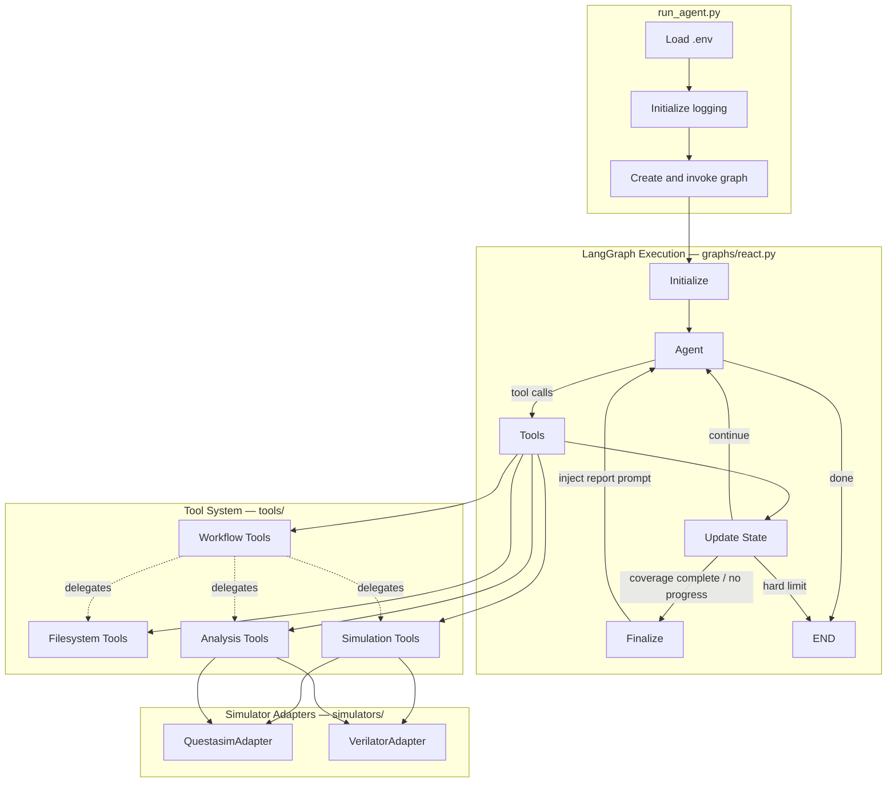
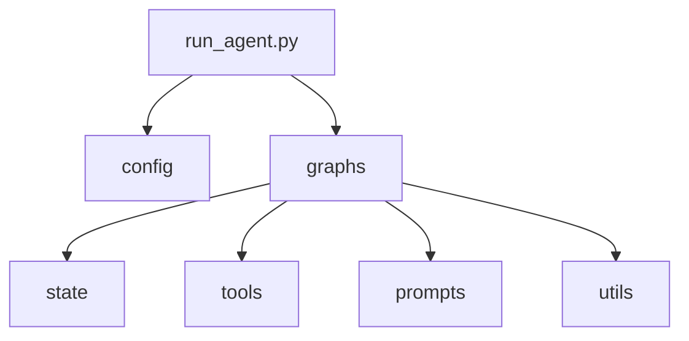
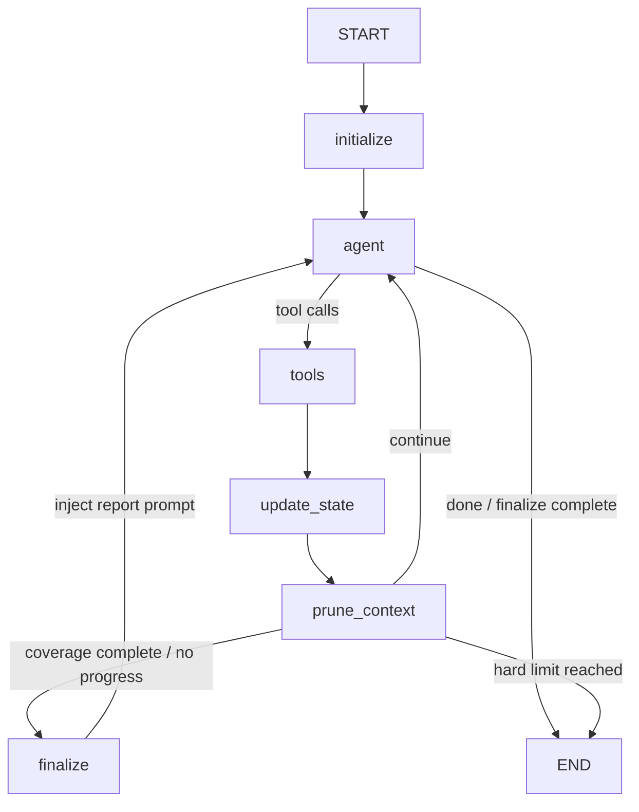
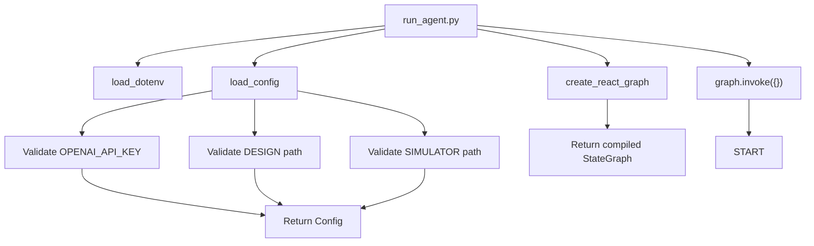
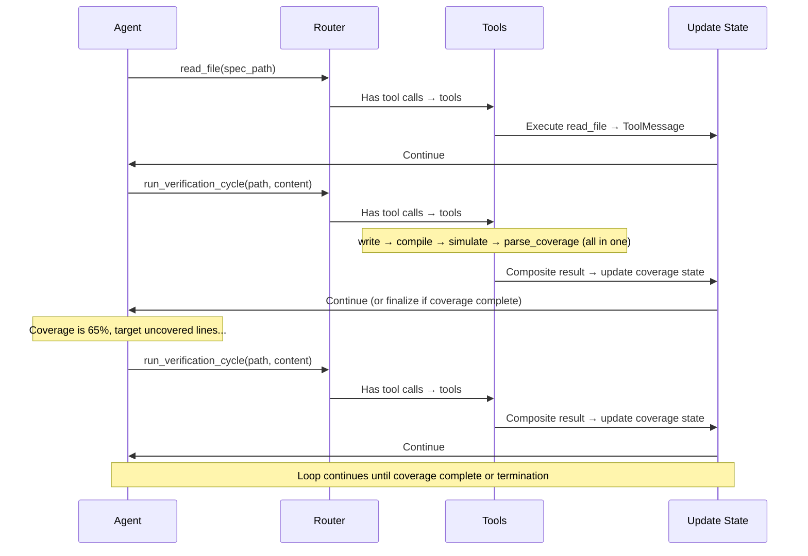
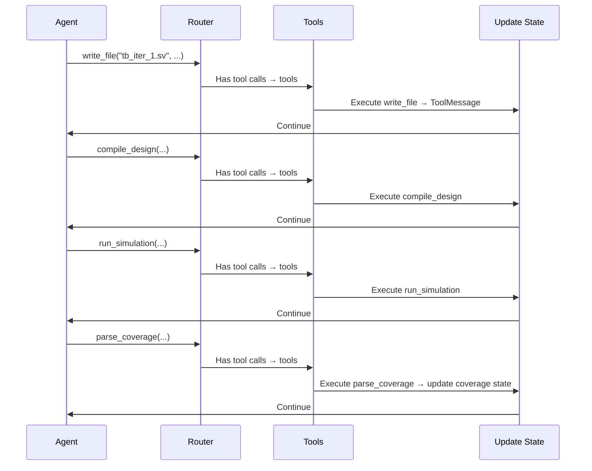
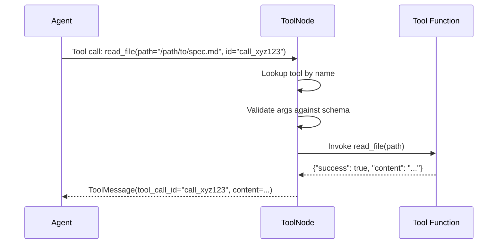
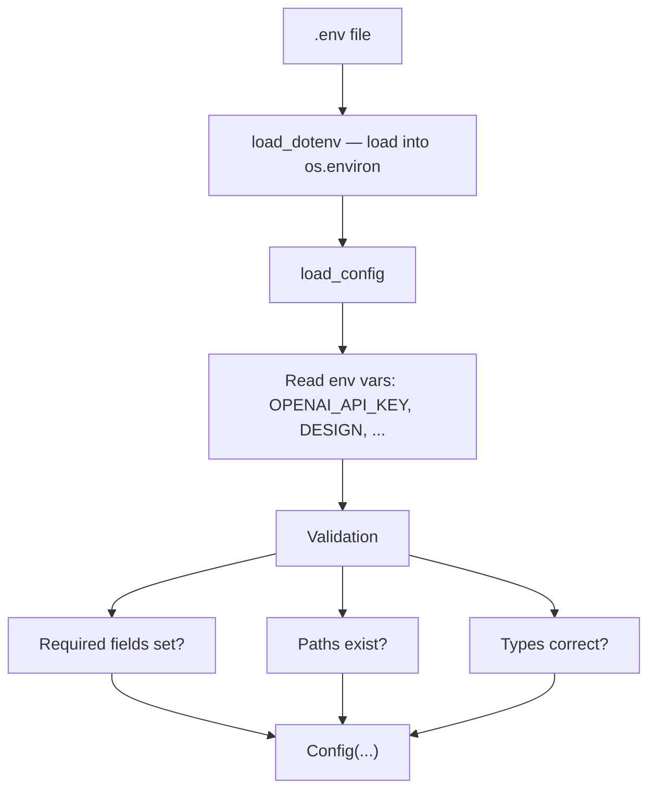
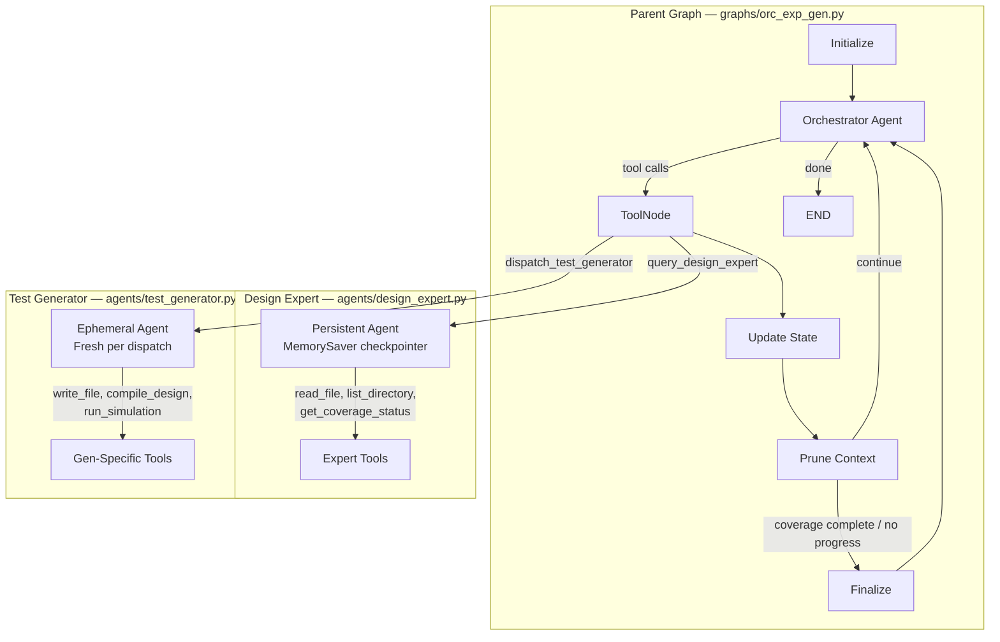

# CovAgent Architecture Documentation

## Table of Contents

1. [Overview](#overview)
2. [Architecture Principles](#architecture-principles)
3. [System Architecture](#system-architecture)
4. [Component Details](#component-details)
5. [Data Flow](#data-flow)
6. [Graph Execution Model](#graph-execution-model)
7. [Tool System](#tool-system)
8. [State Management](#state-management)
9. [Configuration System](#configuration-system)
10. [Design Decisions](#design-decisions)
11. [Extension Points](#extension-points)
12. [Performance Considerations](#performance-considerations)

---

## Overview

CovAgent is an agentic framework that automates hardware verification using a ReAct (Reasoning + Acting) pattern implemented with LangGraph. The system orchestrates an LLM-powered agent that iteratively generates SystemVerilog testbenches, compiles and simulates them with QuestaSim or Verilator, analyzes coverage, and refines its approach until achieving complete statement coverage. When a termination condition is reached (coverage complete or no progress), a finalize node gives the agent one last turn to write a run report before ending.

### Key Characteristics

- **Autonomous Operation**: Agent makes decisions without human intervention during execution
- **Tool-Oriented**: All actions (file I/O, compilation, simulation) performed through well-defined tools
- **State-Based**: Uses LangGraph's state management for reliable iteration tracking
- **Filesystem-Centric**: Large artifacts stored on disk, state contains only metadata
- **Configurable**: Behavior adapts based on environment variables

---

## Architecture Principles

### 1. Separation of Concerns

Each component has a single, well-defined responsibility:
- **State**: Data structure only, no logic
- **Config**: Environment loading and validation only
- **Utils**: Pure functions for specific tasks (parsing, extraction)
- **Tools**: LangChain tools with well-defined I/O contracts
- **Graph**: Orchestration logic only
- **Prompts**: Template management separate from application logic

### 2. Filesystem-Centric State

**Rationale**: LangGraph state serialization becomes inefficient with large text blobs (multi-KB testbenches, logs, coverage reports).

**Solution**: Store all large artifacts on disk, keep only paths and scalar metadata in state.

**Benefits**:
- Efficient state serialization
- Easy inspection of artifacts (humans can read files directly)
- Natural audit trail (timestamped files)
- Memory efficient

### 3. Tool-Based Abstraction

**Rationale**: Agent needs well-defined capabilities that abstract implementation details.

**Implementation**: LangChain's `@tool` decorator creates callable functions with:
- Automatic schema generation
- Structured input validation
- Consistent return format
- Self-documenting interfaces

**Benefits**:
- LLM can discover and use tools autonomously
- Easy to test tools independently
- Tools can be swapped/mocked for testing
- Clear separation between agent reasoning and execution

### 4. Immutable Configuration

**Rationale**: Configuration changes mid-run lead to inconsistent behavior.

**Implementation**: Load config once at startup, validate all paths and settings, then treat as immutable (except for iteration counter which is controlled state).

**Benefits**:
- Predictable behavior
- Easy debugging (config doesn't change during run)
- Clear error messages at startup if config invalid

### 5. Explicit State Transitions

**Rationale**: Iteration and coverage tracking must be reliable for correct termination.

**Implementation**: State updates happen in specific nodes with clear trigger conditions (coverage improvement, simulation success).

**Benefits**:
- Easy to understand when iterations increment
- Clear audit trail in logs
- Predictable termination behavior

---

## System Architecture

### High-Level Architecture



### Component Diagram



---

## Component Details

### 1. State (`state/schemas.py`)

**Purpose**: Define the data structure that flows through the graph.

**Key Fields**:

```python
def _append_token_records(left: List[dict], right: List[dict]) -> List[dict]:
    """Reducer that appends new token usage records to the list."""
    return (left or []) + (right or [])


class AgentState(TypedDict):
    # Message history (LangGraph managed)
    messages: Annotated[list[BaseMessage], add_messages]

    # Configuration (loaded once during initialization)
    config: Any  # Config object stored in state to avoid repeated loading

    # Design context (immutable after init)
    design_name: str
    design_dir: str
    spec_path: str
    design_files: List[str]          # Main design RTL files (DUT)
    design_context_files: List[str]  # Supporting files (submodules/dependencies)
    rtl_dir: str                     # Deprecated - kept for compatibility
    module_header: str
    work_dir: str

    # Tracking (mutable)
    iteration: int               # Increments after successful compile+sim+coverage cycle
    attempt: int                 # Individual tool attempts (compile or sim calls)
    api_calls: int               # Total LLM API calls - for max_iterations limit
    consecutive_failures: int    # Compile/sim failures in a row - for max_retries limit
    no_progress_count: int       # Consecutive cycles with no coverage improvement
    no_tool_call_count: int      # Consecutive responses with no tool calls - for max_no_tool_calls limit

    # Coverage tracking
    current_coverage: float      # Latest coverage percentage (0-100) - single iteration
    max_coverage: float          # Best single-iteration coverage achieved
    cumulative_coverage: float   # Merged coverage across ALL iterations
    cumulative_coverage_db: Optional[str]  # Path to merged coverage database

    # Token usage tracking (per-API-call records, appended via custom reducer)
    # Each record: {api_call, iteration, input_tokens, output_tokens, total_tokens,
    #               reasoning_tokens, cached_input_tokens, tool_calls, category, ...}
    token_usage: Annotated[List[dict], _append_token_records]

    # Termination
    is_done: bool
    done_reason: Optional[str]   # "coverage_complete", "no_progress", "no_tool_calls", "max_iterations"
    is_finalizing: bool  # True when framework has triggered termination and agent gets one last turn for report
```

**Design Decisions**:
- `messages` uses `add_messages` reducer for automatic message list merging
- `config` stored in state so nodes access it without reloading
- All file paths stored as strings (not Path objects) for JSON serialization
- Coverage as float (0-100) for easy comparison
- Separate `current_coverage`, `max_coverage`, and `cumulative_coverage` to track per-iteration vs merged progress

### 2. Configuration (`config.py`)

**Purpose**: Load and validate environment configuration.

**Architecture**:

```python
@dataclass
class Config:
    # LLM settings
    openai_api_key: str
    model: str
    temperature: float
    max_tokens: int
    reasoning_effort: str  # 'disabled', 'low', 'medium', or 'high'

    # Design settings
    design_name: str
    design_dir: Path
    spec_path: Path
    design_files: List[Path]
    design_context_files: List[Path]
    compile_deps_files: List[Path]   # Ordered compile-time dependencies
    design_context_enabled: bool

    # Paths
    work_dir: Path
    simulator_path: Path
    simulator_type: str  # 'questasim' or 'verilator'

    # Workflow
    run_id: str
    max_iterations: int
    max_retries: int
    max_no_progress: int
    max_no_tool_calls: int  # Max consecutive responses with no tool calls
    sim_runs: int
    sim_timeout: int
    testplan_enabled: bool
    num_feedback_holes: int  # Priority coverage holes in feedback (0 = unbounded)
    coverage_hole_radius: int  # Context lines above/below each coverage hole (0-20)
    context_window: int  # Max tokens before terminating run
    keep_latest_failures: int  # Failed verification cycles to keep in context

    # LangGraph
    recursion_limit: int  # LangGraph graph recursion limit

    # Debug
    log_level: str
    log_truncate: bool

    # Runtime (mutable)
    current_iteration: int = 1
    current_attempt: int = 1
    compile_attempts_this_iter: int = 0
    sim_attempts_this_iter: int = 0
```

**Validation Strategy**:
- Fail fast: Raise `ValueError` on missing required fields
- Path validation: Check existence at load time
- Type coercion: Convert env strings to appropriate types
- Defaults: Provide sensible defaults for optional fields

**Global Access Pattern**:
```python
config = load_config()  # Load once
set_tool_config(config)  # Share with tools via global reference
```

### 3. Design Loader (`utils/design_loader.py`) and Dashboard Loader (`utils/dashboard_loader.py`)

**Purpose**: Load design configurations and extract design metadata.

**Dashboard Loader** (`utils/dashboard_loader.py`):

Provides two modes for loading design configurations:

1. **Dashboard mode** (recommended): Uses `DESIGN_NAME` + `DASHBOARD_PATH` to look up design files from a centralized `dashboard.json` registry. Supports `$(BASE_DIR)` variable substitution in paths.

2. **Direct mode** (fallback): Uses `DESIGN` path with auto-discovery. Scans the directory for `docs/*.md` (spec) and `rtl/*.sv`/`rtl/*.v` (design files).

Returns a `DesignConfig` object containing `design_name`, `spec_path`, `design_files`, and `design_context_files`.

**Design Loader** (`utils/design_loader.py`):

1. **`extract_module_header(rtl_file: Path) -> str`**
   - Parses Verilog/SystemVerilog to extract module interface
   - Captures: module name, parameters, port declarations
   - Uses regex-based line-by-line parsing
   - Handles extended port declarations after module header

2. **`extract_all_module_headers(design_files: List[Path]) -> str`**
   - Extracts headers from ALL design files and combines them
   - First file labeled as `TOP MODULE`, subsequent files labeled as `MODULE N`
   - Used to provide module interface context in the system prompt

3. **`scan_design_directory(design_dir: Path) -> Tuple[Path, Path, List[str]]`**
   - Finds specification file in `docs/` subdirectory
   - Finds RTL files in `rtl/` subdirectory
   - Returns: `(spec_path, rtl_dir, rtl_files)`

**Design Rationale**:
- Pure functions (no side effects)
- Fail with descriptive errors if structure invalid
- Support both `.v` and `.sv` extensions
- Dashboard mode enables centralized design management for batch experiments

### 4. Simulator Adapters (`simulators/`)

**Purpose**: Provide a unified interface for different HDL simulators through the adapter pattern.

**Architecture**:

```python
# simulators/base.py
class SimulatorAdapter(ABC):
    def compile(self, testbench_path, design_files, work_dir, timeout) -> Dict
    def simulate(self, testbench_name, num_runs, work_dir, iteration, timeout) -> Dict
    def parse_coverage(self, coverage_db_path) -> CoverageResult
    def merge_cumulative_coverage(self, iteration_db, cumulative_db) -> None
    def filter_compile_output(self, output) -> str  # Strip noise for LLM
    def filter_sim_output(self, output) -> str       # Strip noise for LLM
    def cleanup(work_dir) -> None

@dataclass
class CoverageResult:
    total_coverage: float        # 0-100
    breakdown: Dict[str, float]  # Module/file -> coverage %
    uncovered_lines: Dict[str, List[int]]  # File -> line numbers
```

**Available Adapters**:

1. **`QuestasimAdapter`** (`simulators/questasim_adapter.py`)
   - Uses `vlog` for compilation with `+cover=s` (statement coverage)
   - Uses `vsim` for simulation with `-coverage -sv_seed random`
   - Uses `vcover merge` for combining coverage across runs
   - Parses XML coverage reports for detailed metrics
   - Excludes testbench (`tb_llm`) from coverage calculations
   - Filters compile/sim output to remove QuestaSim banner noise

2. **`VerilatorAdapter`** (`simulators/verilator_adapter.py`)
   - Uses `verilator` for compilation with `--coverage` flag
   - Compiles to C++ and builds with `make`
   - Uses `verilator_coverage` for coverage reporting
   - Parses `.dat` coverage files for line coverage metrics

**Legacy Utilities**: `utils/questasim.py` contains lower-level command builders and parsers used by the QuestaSim adapter.

**Design Rationale**:
- Adapter pattern allows simulator-agnostic tool layer
- Factory selection in `tools/simulation.py` based on `config.simulator_type`
- Command builders return lists (safe for subprocess)
- All paths converted to strings for subprocess compatibility
- Parsers are defensive (handle missing/malformed data)
- Output filtering reduces token waste in LLM context

### 5. Tools (`tools/`)

**Architecture**: Each tool is a LangChain tool (decorated with `@tool`) that returns a dictionary with structured results.

**Common Return Format**:
```python
{
    "success": bool,
    "error": str,  # if failed
    # ... tool-specific fields
}
```

#### Filesystem Tools (`tools/filesystem.py`)

**Global Config Pattern**:
```python
_config = None

def set_config(config):
    global _config
    _config = config
```

**Tools**:

1. **`read_file(path: str) -> dict`**
   - Reads file contents
   - Enforces `DESIGN_CONTEXT`: Blocks RTL access if disabled
   - Returns: `{success, content, error}`

2. **`write_file(path: str, content: str) -> dict`**
   - Writes to work directory only
   - Security: Prevents directory traversal attacks
   - Creates parent directories automatically
   - Scans for forbidden testbench constructs (`force`, `release`, `$signal_force`, `$signal_release`, `deposit`, `$error`, `$fatal`, `$stop`) and logs warnings
   - Returns: `{success, full_path, error}`

3. **`list_directory(path: str) -> dict`**
   - Lists files and subdirectories
   - Enforces `DESIGN_CONTEXT`
   - Returns: `{success, files, directories, error}`

**Security Considerations**:
- `write_file` validates path is within work directory
- Uses `Path.is_relative_to()` to prevent `../` attacks
- All file operations use `encoding='utf-8', errors='ignore'`

#### Simulation Tools (`tools/simulation.py`)

1. **`compile_design(testbench_path: str) -> dict`**
   - Delegates to the simulator adapter (`QuestasimAdapter` or `VerilatorAdapter`)
   - Includes all design files and context files from config
   - Tracks per-iteration retry count: `compile_iter_N.log` or `compile_iter_N_retry_M.log`
   - On success: summarizes output for LLM (full log saved to file)
   - On failure: filters output through adapter's `filter_compile_output` to reduce noise
   - Returns: `{success, return_code, stdout, stderr, log_path, iteration, retry}`

2. **`run_simulation(testbench_name: str, num_runs: int) -> dict`**
   - Delegates to the simulator adapter
   - Runs multiple simulations with different random seeds
   - Merges coverage databases if multiple runs
   - Handles timeouts gracefully (logs warning, continues)
   - Tracks per-iteration retry count: `sim_iter_N.log` or `sim_iter_N_retry_M.log`
   - On success: summarizes output for LLM
   - On failure: filters output through adapter's `filter_sim_output`
   - Returns: `{success, stdout, stderr, coverage_db_path, log_path, num_runs_completed, iteration, retry}`

**Design Decisions**:
- Multi-run strategy: Each run creates separate coverage DB, then merged by adapter
- Timeout handling: Individual run timeout doesn't fail entire tool call
- Logging: Detailed logs saved to files, summaries returned to LLM
- Retry naming: Uses per-iteration counters that reset when iteration increments, avoiding log file overwrites

#### Analysis Tools (`tools/analysis.py`)

1. **`parse_coverage(coverage_db_path: str) -> dict`**
   - Parses iteration coverage (this testbench alone) via the simulator adapter
   - Automatically merges with cumulative coverage across all iterations
   - Creates annotated source for priority uncovered lines from cumulative coverage
   - Returns: `{success, iteration_coverage, cumulative_coverage, total_coverage, breakdown, annotated_source, cumulative_coverage_db}`

**Cumulative Coverage Merging**:
The tool maintains a cumulative coverage database (`cumulative.ucdb` or `cumulative.dat`) in the coverage directory. Each call to `parse_coverage` merges the new iteration's coverage into this cumulative database, ensuring the agent sees what lines remain uncovered across ALL testbenches, not just the latest one.

**Annotated Source Strategy**:
```python
def _create_annotated_source(uncovered_lines, max_holes=0):
    # 1. Prioritize control flow (if, case, while, for)
    # 2. Deduplicate by proximity (coverage_hole_radius * 2)
    # 3. Select top N holes (0 = unbounded, show all)
    # 4. Group by file with total uncovered counts
    # 5. Show context window (coverage_hole_radius lines above/below)
    # 6. Mark with "##### UNCOVERED - TARGET THIS LINE #####"
```

The number of holes shown is controlled by `NUM_FEEDBACK_HOLES` (0 = unbounded). Context radius is controlled by `COVERAGE_HOLE_RADIUS` (default: 5, range: 1-20).

**Rationale**: Agent needs clear guidance on what to target next, but showing too many holes wastes tokens.

#### Composite Workflow Tool (`tools/workflow.py`)

**Purpose**: Reduce LLM round-trips by combining write, compile, simulate, and coverage-parse into a single tool call. This is the recommended default for new testbench iterations.

**Global Config Pattern**: Same `set_config()` / `_config` pattern as other tool modules. Wired in `set_tool_config()`.

1. **`run_verification_cycle(testbench_path: str, testbench_content: str, testbench_name: str = "tb_llm", num_runs: int = None) -> dict`**
   - Writes the testbench file, compiles the design, runs simulation, and parses coverage in a single invocation
   - Stops early if any stage fails, returning the error context for that stage
   - Internally delegates to `write_file`, `compile_design`, `run_simulation`, and `parse_coverage` via lazy imports (avoids circular dependencies)
   - Uses `_ensure_dict()` helper to normalize tool `.invoke()` results (handles JSON string returns)
   - `num_runs` defaults to the value from config when `None`
   - Returns a composite result dict:
     ```python
     {
         "stopped_at": str,       # Last stage reached: "write" | "compile" | "simulate" | "coverage"
         "success": bool,         # True only if ALL four stages succeeded
         "write_result": dict,    # Result from write_file
         "compile_result": dict,  # Result from compile_design (if write succeeded)
         "sim_result": dict,      # Result from run_simulation (if compile succeeded)
         "coverage_result": dict, # Result from parse_coverage (if sim succeeded)
         "error_stage": str,      # Stage that failed (only on failure)
         "error_summary": str,    # Human-readable error description (only on failure)
     }
     ```

**Pipeline Stages**:
1. **Write** -- calls `write_file` with the provided path and content
2. **Compile** -- calls `compile_design` with the testbench path
3. **Simulate** -- calls `run_simulation` with testbench name and optional `num_runs`
4. **Coverage** -- extracts `coverage_db_path` from simulation result, calls `parse_coverage`

**Early-Stop Behavior**: Each stage checks the `success` field of the sub-result. On failure, the tool populates `error_stage` and `error_summary` (including compiler/simulator stdout when available) and returns immediately. The agent can read the error context and decide whether to retry the full cycle or use individual tools for a targeted fix.

**When to Use Which**:
- `run_verification_cycle` -- Default for every new testbench iteration. One call does write + compile + simulate + coverage.
- Individual tools (`compile_design`, `run_simulation`, `parse_coverage`) -- Use for targeted retries after fixing a specific error (e.g., re-compiling after editing only the testbench).

### 6. Token Tracking (`utils/tokens.py` and `utils/token_tracking.py`)

**Purpose**: Track context window usage to prevent API errors, enable context-aware termination, and classify per-API-call token usage for post-run analysis.

#### Context Window Tracking (`utils/tokens.py`)

1. **`count_message_tokens(messages, model) -> int`**
   - Counts tokens in the full message list using `tiktoken`
   - Includes content, role, tool calls, and message metadata
   - Caches encoder instances per model

2. **`format_token_count(token_count, context_limit) -> str`**
   - Formats as `"1,234 (1.0%)"` showing count and percentage of context window

**Usage**: Called in `agent_node` logging and in routing functions to check the `CONTEXT_WINDOW` limit. When token count exceeds the configured context window, the run terminates.

#### Per-Call Token Records (`utils/token_tracking.py`)

Each LLM API call produces a token record (built in `agent_node` via `build_token_record()`) that captures input/output/reasoning/cached token counts, tool call names and arguments, and the current failure and coverage state. Records start as `"unclassified"` and are classified in `update_state_node` via `classify_pending_records()`.

**Classification Categories** (`classify_api_call()`):
| Category | Trigger |
|---|---|
| `new_tb_generation` | Tool calls include `run_verification_cycle`, or `write_file` targeting `testbenches/` |
| `spec_rtl_reading` | `read_file` calls with no compile/sim/coverage tools |
| `error_recovery` | Any call made while `consecutive_failures > 0` |
| `overhead` | Everything else (compile, simulate, parse_coverage, report writing, pure reasoning, list_directory) |

> **Note**: `run_verification_cycle` is classified as `new_tb_generation` because it always contains testbench content. Finalizing (report writing) is always `overhead`.

### 7. Prompts (`prompts/`)

**Architecture**: Template-based prompt generation with runtime interpolation.

**Components**:

1. **`prompts/system.md`**: Master template
   - Contains placeholder variables: `{design_name}`, `{module_header}`, etc.
   - Includes conditional sections (testplan, design context)
   - Structured as complete system prompt
   - Documents all available tools including `run_verification_cycle` as the recommended default
   - Workflow steps consolidated: Step 3 ("Generate Testbench and Run Verification Cycle") uses `run_verification_cycle` as the primary action, with individual tools reserved for targeted retries

2. **`prompts/loader.py`**: Template loader
   ```python
   def load_system_prompt(...) -> str:
       # 1. Load template from system.md
       # 2. Extract template content (between ``` markers)
       # 3. Build conditional sections
       # 4. Interpolate variables
       # 5. Return complete prompt
   ```

**Template Extraction Strategy**:
```python
# Template is in code block after "## System Prompt Template"
start_marker = "## System Prompt Template\n\n```"
end_marker = "```\n\n---\n\n## Conditional Sections"
template = full_content[start:end]
```

**Conditional Sections**:
- **Testplan**: Different instructions based on `TESTPLAN` flag
- **Design Context**: Different instructions based on `DESIGN_CONTEXT` flag

### 8. Graph (`graphs/react.py`)

**Purpose**: Orchestrate the ReAct agent loop.

#### Node Implementations

**1. Initialize Node**

```python
def initialize_node(state: AgentState) -> AgentState:
    # 1. Load configuration
    # 2. Create work directory structure
    # 3. Scan design directory
    # 4. Extract module header
    # 5. Load and interpolate system prompt
    # 6. Set tool config
    # 7. Return initialized state
```

**Key Behaviors**:
- Creates: `testbenches/`, `logs/`, `coverage/` subdirectories
- Assumes first RTL file is top module
- Injects system prompt as first message
- Adds human message: "Begin verification..."

**2. Agent Node**

```python
def agent_node(state: AgentState) -> AgentState:
    # 1. Load config
    # 2. Create ChatOpenAI instance
    # 3. Bind tools to LLM
    # 4. Invoke with message history
    # 5. Return response in messages
```

**Key Behaviors**:
- Creates fresh LLM instance each invocation (stateless)
- Uses `bind_tools()` for automatic tool schema injection
- Returns only message update (LangGraph merges with state)
- Logs all API requests and responses with token counts, coverage state, and iteration info

**3. Update State Node**

```python
def update_state_node(state: AgentState) -> AgentState:
    # Priority 0: Check run_verification_cycle results (composite tool)
    # Priority 1: Check compile_design failures → increment consecutive_failures
    # Priority 2: Check run_simulation failures → increment consecutive_failures
    # Priority 3: Check parse_coverage results → update coverage, iteration, no_progress_count
```

**Key Behaviors**:
- **Priority 0** (`run_verification_cycle`): Checks if the latest message is from the composite tool. On failure at compile/simulate stage, increments `consecutive_failures`. On full success, mirrors the `parse_coverage` success logic -- updates `current_coverage`, `cumulative_coverage`, `iteration`, and resets/increments `no_progress_count` based on whether cumulative coverage improved. Write or coverage-only failures return an empty update (agent sees the error in the tool result).
- **Priority 1-3** (individual tools): Same as before -- checks recent messages for `compile_design`, `run_simulation`, and `parse_coverage` results in priority order.
- Only checks the latest relevant tool message to avoid re-processing
- Increments `iteration` after every successful coverage parse (regardless of improvement)
- Resets `consecutive_failures` on successful cycle
- Tracks `no_progress_count` for cumulative coverage stalls
- Syncs `config.current_iteration` for correct log file naming
- Also classifies any unclassified token usage records via `classify_pending_records()`

**4. Prune Context Node**

```python
def prune_verification_cycles(state: AgentState) -> dict:
    # Remove old failed run_verification_cycle AIMessage+ToolMessage pairs
    # Keep all successful (coverage) pairs, keep only latest N failures
```

**Key Behaviors**:
- Runs after `update_state` and before routing, so state counters are already updated
- Keeps all successful cycle pairs (coverage feedback is valuable across iterations)
- Prunes old failed cycle pairs (compile/sim errors), controlled by `KEEP_LATEST_FAILURES` env var (default: 1)
- Removes both the AIMessage (with large `testbench_content` in tool_calls args) and its ToolMessage to maintain valid conversation structure
- Skips removal if the AIMessage has mixed tool calls (to avoid orphaning other tool results)
- Emits `context_prune` JSONL event

**5. Finalize Node**

```python
def finalize_node(state: AgentState) -> AgentState:
    # 1. Determine termination reason (coverage_complete or no_progress)
    # 2. Inject HumanMessage instructing agent to write report.md
    # 3. Set is_finalizing=True and done_reason
```

**Key Behaviors**:
- Called when `route_after_update` detects coverage complete or no-progress limit
- Injects a `HumanMessage` telling the agent to write `report.md` using `write_file`
- Sets `is_finalizing=True` so the router knows this is the last turn
- Routes back to `agent` for one final LLM call, then END

**6. Router (Conditional Edges)**

```python
def route_after_agent(state: AgentState) -> Literal["tools", "agent", END]:
    # 1. In finalize mode: let tool calls execute (write_file for report), then END
    # 2. Check api_calls >= max_iterations → END
    # 3. Check iteration > max_iterations → END
    # 4. Check consecutive_failures >= max_retries → END
    # 5. Check no_progress_count >= max_no_progress → END
    # 6. Check token count >= context_window → END
    # 7. Check for tool calls → "tools"
    # 8. Otherwise → "agent" (continue reasoning)
```

**Termination Logic**:
- **Priority 1**: Finalize mode (allows final tool calls, then END)
- **Priority 2**: Hard limits (max API calls, max iterations, max retries, no progress, context window)
- **Priority 3**: Tool execution or continued reasoning

A second routing function `route_after_update` re-checks termination conditions after state is updated by `update_state_node`. Instead of immediately ending on coverage complete or no-progress, it routes to the `finalize` node which gives the agent one last turn to write a run report.

#### Graph Construction

```python
def create_react_graph() -> StateGraph:
    graph = StateGraph(AgentState)

    # Add nodes
    graph.add_node("initialize", initialize_node)
    graph.add_node("agent", agent_node)
    graph.add_node("tools", ToolNode(get_all_tools()))
    graph.add_node("update_state", update_state_node)
    graph.add_node("prune_context", prune_verification_cycles)
    graph.add_node("finalize", finalize_node)

    # Add edges
    graph.set_entry_point("initialize")
    graph.add_edge("initialize", "agent")

    # Conditional routing from agent
    graph.add_conditional_edges(
        "agent",
        route_after_agent,
        {"tools": "tools", "agent": "agent", END: END}
    )

    # After tools, update state, prune old messages, then check termination
    graph.add_edge("tools", "update_state")
    graph.add_edge("update_state", "prune_context")

    # Finalize routes back to agent for one last turn
    graph.add_edge("finalize", "agent")

    graph.add_conditional_edges(
        "prune_context",
        route_after_update,
        {"agent": "agent", "finalize": "finalize", END: END}
    )

    return graph.compile()
```

**Graph Visualization**:



**Design Decisions**:
- **update_state node**: Dedicated node after tool execution tracks coverage progress, iteration counts, and failure states
- **prune_context node**: Removes old failed verification cycle message pairs to keep context window clean (controlled by `KEEP_LATEST_FAILURES`)
- **ToolNode**: LangGraph's built-in ToolNode handles tool execution and message formatting
- **Dual routing**: `route_after_agent` checks termination before tool execution; `route_after_update` re-checks after state updates (wired from `prune_context`)

---

## Data Flow

### Initialization Flow



### Iteration Flow (Typical Success Case — Composite Tool)



> **Note**: The agent may also use individual tools (`compile_design`, `run_simulation`, `parse_coverage`) for targeted retries after fixing a specific error. The sequence diagram above shows the recommended default flow using the composite tool.

### Iteration Flow (Legacy — Individual Tools)



### State Evolution

```
Iteration 1:
{
  iteration: 1,
  current_coverage: 0.0,
  max_coverage: 0.0,
  consecutive_failures: 0,
  messages: [SystemMessage, HumanMessage]
}

After first simulation:
{
  iteration: 1,
  current_coverage: 65.0,
  max_coverage: 65.0,
  consecutive_failures: 0,
  messages: [..., ToolMessage(parse_coverage, {total_coverage: 65.0})]
}

After coverage improvement:
{
  iteration: 2,  # Incremented
  current_coverage: 82.0,
  cumulative_coverage: 82.0,
  max_coverage: 82.0,
  consecutive_failures: 0,  # Reset
  no_progress_count: 0,  # Reset
  messages: [...]
}

After no cumulative improvement:
{
  iteration: 3,  # Still incremented (cycle was successful)
  current_coverage: 75.0,  # This iteration's coverage
  cumulative_coverage: 82.0,  # Unchanged (merged didn't improve)
  max_coverage: 82.0,
  consecutive_failures: 0,  # Reset (cycle was successful)
  no_progress_count: 1,  # Incremented
  messages: [...]
}
```

State updates are handled by the dedicated `update_state_node` which runs after every tool execution.

---

## Graph Execution Model

### LangGraph Execution Semantics

LangGraph uses a **message-passing, reducer-based** execution model:

1. **State**: `AgentState` TypedDict with field reducers
2. **Reducers**: Functions that merge node outputs into state
   - `add_messages`: Appends messages to list
   - Default: Replace value
3. **Node Execution**: Each node returns partial state update
4. **State Merging**: LangGraph applies reducers to merge updates

### Message Flow

```
Initialize Node:
  Returns: {messages: [SystemMessage, HumanMessage], ...}

State after init:
  messages = [SystemMessage, HumanMessage]

Agent Node:
  Returns: {messages: [AIMessage with tool_calls]}

State after agent:
  messages = [SystemMessage, HumanMessage, AIMessage]  # add_messages

Tools Node:
  Returns: {messages: [ToolMessage]}

State after tools:
  messages = [SystemMessage, HumanMessage, AIMessage, ToolMessage]
```

### Conditional Routing

Router function receives current state and returns next node name:

```python
def route_after_agent(state):
    if is_finalizing:
        if has_tool_calls():  # Let write_file run for report
            return "tools"
        return END  # Report written, done
    if at_limits():  # api_calls, iterations, retries, no_progress, context_window
        return END
    if has_tool_calls():
        return "tools"
    return "agent"

def route_after_update(state):
    if is_finalizing:
        return END  # Agent had its last turn
    if coverage_complete():
        return "finalize"  # Give agent one last turn for report
    if hard_limits_exceeded():  # api_calls, iterations, retries, context_window
        return END
    if no_progress_limit():
        return "finalize"  # Give agent one last turn for report
    return "agent"
```

LangGraph follows returned edge to next node.

### Termination

Graph terminates when:
1. Hard limits exceeded (max API calls, max iterations, max retries, or context window) -- immediate END
2. Coverage complete or no progress limit reached -- routes to `finalize` node, which gives the agent one last turn to write `report.md`, then END
3. Exception raised (error termination)

---

## Tool System

### LangChain Tool Architecture

```python
@tool
def example_tool(arg1: str, arg2: int) -> dict:
    """Tool description for LLM.

    Args:
        arg1: Description of arg1
        arg2: Description of arg2

    Returns:
        Dictionary with results
    """
    # Implementation
    return {"success": True, "result": "..."}
```

**What `@tool` provides**:
- JSON schema generation from type hints
- Automatic docstring parsing for descriptions
- Input validation
- Tool name extraction from function name

### Tool Calling Flow



### Tool Configuration Pattern

**Problem**: Tools need access to config, but `@tool` functions can't take config as parameter (LLM provides args).

**Solution**: Module-level global config reference.

```python
# tools/filesystem.py
_config = None

def set_config(config):
    global _config
    _config = config

@tool
def read_file(path: str):
    # Access config via _config
    if not _config.design_context_enabled:
        # Block RTL access
```

**Initialization** (in graph):
```python
config = load_config()
set_tool_config(config)  # Sets globals in all tool modules
```

`set_tool_config` calls `set_config()` on four modules: `filesystem`, `simulation`, `analysis`, and `workflow`.

**Rationale**:
- Simple and explicit
- Clear initialization point
- Easy to test (set mock config)
- Avoids complex dependency injection

### Tool Return Format

**Standard Format**:
```python
{
    "success": bool,      # Always present
    "error": str,         # Present if success=False
    # ... tool-specific fields
}
```

**Examples**:

```python
# Success
{"success": True, "content": "file contents"}

# Failure
{"success": False, "error": "File not found"}

# Complex success
{
    "success": True,
    "total_coverage": 85.5,
    "uncovered_lines": {"/path/to/file.v": [42, 87]},
    "annotated_source": "..."
}
```

**Rationale**:
- Consistent error handling
- Agent can check success field
- Structured data for complex results
- JSON-serializable for message content

---

## State Management

### State Schema Design

```python
class AgentState(TypedDict):
    messages: Annotated[list[BaseMessage], add_messages]
    # ... other fields
```

**Key Concepts**:

1. **TypedDict**: Python type checking for state fields
2. **Annotated**: Attach reducer to field
3. **add_messages**: Built-in reducer that appends messages

### Reducers

**What are reducers?**
Functions that define how node outputs merge into state.

**Built-in Reducers**:
- `add_messages`: Append to list, merge by ID
- `operator.add`: Addition
- Default: Replace value

**Custom Reducer Example**:
```python
def max_reducer(current, update):
    return max(current, update)

class MyState(TypedDict):
    max_value: Annotated[float, max_reducer]
```

### State Update Pattern

**Node returns partial update**:
```python
def my_node(state):
    return {
        "field1": new_value,
        "field2": other_value
    }
```

**LangGraph merges**:
```python
new_state = {
    **old_state,
    "field1": reducer1(old_state["field1"], new_value),
    "field2": reducer2(old_state["field2"], other_value)
}
```

### Message History Management

**add_messages reducer**:
- Appends new messages to list
- Merges messages with same ID (for tool calls/results)
- Handles `RemoveMessage` for deletion by ID
- Preserves order

**Message Types**:
- `SystemMessage`: System prompt
- `HumanMessage`: User input
- `AIMessage`: Agent response (may include tool_calls)
- `ToolMessage`: Tool execution result (linked by tool_call_id)
- `RemoveMessage`: Deletes a message by ID (used by `prune_context` node)

**Context Pruning** (`prune_verification_cycles`):
- After each tool execution, old failed `run_verification_cycle` AIMessage+ToolMessage pairs are removed via `RemoveMessage`
- Successful cycle pairs (with coverage feedback) are always kept
- Only the latest N failed pairs are retained (configured by `KEEP_LATEST_FAILURES`, default: 1)
- This removes both the large `testbench_content` in tool call args and the error feedback from old failures

---

## Configuration System

### Environment Variable Loading

**Flow**:



### Validation Strategy

**Required Fields**:
```python
api_key = os.getenv("OPENAI_API_KEY")
if not api_key:
    raise ValueError("OPENAI_API_KEY not set")
```

**Path Validation**:
```python
design = os.getenv("DESIGN")
if not design or not Path(design).exists():
    raise ValueError(f"DESIGN path invalid: {design}")
```

**Type Coercion**:
```python
max_iterations = int(os.getenv("MAX_ITERATIONS", "10"))
temperature = float(os.getenv("TEMPERATURE", "0.4"))
design_context = os.getenv("DESIGN_CONTEXT", "1") == "1"
```

### Work Directory Structure

```python
work_base = Path(os.getenv("WORK_DIR", "./work"))
run_id = os.getenv("RUN_ID", "default_run")
work_dir = work_base / run_id
```

**Created Structure**:
```
work/
└── {RUN_ID}/
    ├── run.log                          # Full agent log (ANSI stripped)
    ├── final_state.json                 # Serialized final state (no messages, key redacted)
    ├── report.md                        # Agent-written run report (from finalize node)
    ├── testplan.md                      # Generated test plan (optional)
    ├── testbenches/
    │   ├── tb_iter_1.sv
    │   ├── tb_iter_2.sv
    │   └── ...
    ├── logs/
    │   ├── compile_iter_1.log
    │   ├── compile_iter_1_retry_2.log   # Retry logs when compilation fails
    │   ├── sim_iter_1.log
    │   ├── sim_iter_1_retry_2.log       # Retry logs when simulation fails
    │   └── ...
    └── coverage/
        ├── iter_1_run_0.ucdb            # Individual run coverage
        ├── iter_1.ucdb                  # Merged per-iteration coverage
        ├── cumulative.ucdb              # Merged across ALL iterations
        ├── iter_1_report.xml            # Coverage report
        └── ...
```

---

## Design Decisions

### 1. Why LangGraph over LangChain Agents?

**LangGraph Advantages**:
- Explicit state management
- Full control over node execution
- Easy to add custom logic (iteration tracking, coverage comparison)
- Visual graph representation
- Deterministic execution order

**LangChain Agents Limitations**:
- Opaque state management
- Limited control over iteration logic
- Hard to add custom termination conditions

### 2. Why Global Config in Tools?

**Alternatives Considered**:

**Option A: Pass config in tool args**
```python
@tool
def read_file(path: str, config: dict):  # ❌ LLM provides args!
```
Problem: LLM can't provide config, it's not in spec.

**Option B: Closure over config**
```python
def create_tools(config):
    @tool
    def read_file(path: str):
        # Access config from closure
    return [read_file, ...]
```
Problem: More complex, harder to test individual tools.

**Option C: Global config** ✅
```python
_config = None
def set_config(config): ...
```
Benefits: Simple, explicit, testable.

### 3. Why Filesystem-Centric State?

**Problem**: Storing large strings in state is inefficient:
- State serialized after each node
- Large testbenches (1-5KB) + logs (10-100KB) = slow serialization
- Hard to inspect artifacts during debugging

**Solution**: Store only paths in state:
```python
state = {
    "work_dir": "/path/to/work",
    # NOT: "testbench_content": "..."
}
```

**Benefits**:
- Fast state serialization
- Easy debugging (cat file.sv)
- Natural audit trail
- Familiar for developers

### 4. Why Multiple Simulation Runs?

**Problem**: Single simulation with fixed seed gives incomplete coverage.

**Solution**: Run N simulations with different random seeds:
```python
for run_idx in range(num_runs):
    ucdb = f"iter_{i}_run_{run_idx}.ucdb"
    vsim ... -sv_seed random ...
```

Then merge:
```bash
vcover merge -out iter_i.ucdb iter_i_run_*.ucdb
```

**Benefits**:
- Better random coverage
- Discovers corner cases
- Configurable (SIM_RUNS)

### 5. Why Exclude Testbench from Coverage?

```python
# In parse_coverage_xml
if du_name == 'tb_llm':
    continue  # Skip testbench
```

**Rationale**:
- Coverage measures design, not testbench
- Testbench coverage is 100% by definition (it runs)
- Avoids artificially inflating coverage numbers

### 6. Why Prioritize Control Flow in Coverage?

```python
if re.search(r'\b(if|case|while|for)\s*\(', code):
    prioritized.insert(0, ...)  # High priority
else:
    prioritized.append(...)  # Low priority
```

**Rationale**:
- Control flow uncovered = functional gap
- Assignments uncovered = less critical
- Agent should target high-value coverage first

### 7. Explicit State Update Node

The graph includes a dedicated `update_state` node between `tools` and `agent`. After every tool execution, `update_state_node` inspects recent tool results (compile, simulation, coverage) and updates:
- `consecutive_failures` — incremented on compile/sim failure, reset on successful cycle
- `iteration` — incremented after each successful compile+sim+coverage cycle
- `current_coverage` / `cumulative_coverage` — updated from `parse_coverage` results
- `no_progress_count` — incremented when cumulative coverage doesn't improve

This keeps state transitions explicit and auditable rather than scattered across routing logic.

### 8. Why a Composite Verification Cycle Tool?

**Problem**: Each verification iteration (write testbench, compile, simulate, parse coverage) previously required 4 separate tool calls, each requiring an LLM round-trip. The LLM added little value between these steps -- it simply chained the output of one into the next.

**Solution**: `run_verification_cycle` combines all four steps into a single tool call. The LLM provides the testbench content once, and the tool handles the entire pipeline locally.

**Benefits**:
- Reduces LLM round-trips from ~4-5 per iteration to 1
- Lower token cost (no intermediate reasoning between pipeline steps)
- Faster wall-clock time per iteration
- Early-stop on error still provides full context for the agent to diagnose and fix

**Trade-off**: Less LLM visibility into intermediate steps. Mitigated by returning all sub-results in the composite response and by keeping individual tools available for targeted retries.

---

## Extension Points

### 1. Adding New Tools

**Steps**:
1. Create tool function in appropriate file
2. Decorate with `@tool`
3. Add to `get_all_tools()` in `tools/__init__.py`
4. If the tool needs config, add a `set_config()` function and wire it in `set_tool_config()`
5. Update system prompt to document tool
6. If the tool produces state-relevant results, add handling in `update_state_node`

**Current Tool Registry** (`tools/__init__.py`):
```python
def get_all_tools():
    return [
        read_file,
        write_file,
        list_directory,
        compile_design,
        run_simulation,
        parse_coverage,
        run_verification_cycle,  # Composite: write + compile + sim + coverage
    ]
```

**Example**:
```python
# tools/analysis.py
@tool
def generate_waveform(ucdb_path: str) -> dict:
    """Generate waveform from coverage database."""
    # Implementation
    return {"success": True, "waveform_path": "..."}

# tools/__init__.py
def get_all_tools():
    return [
        # ... existing tools
        generate_waveform
    ]
```

### 2. Adding New Simulators

**Current**: QuestaSim and Verilator are supported via the adapter pattern in `simulators/`.

**Extension Pattern** (e.g., adding VCS):
1. Create `simulators/vcs_adapter.py` implementing `SimulatorAdapter`
2. Implement `compile()`, `simulate()`, `parse_coverage()`, `merge_cumulative_coverage()`, `cleanup()`
3. Add `'vcs'` to valid simulators in `config.py`
4. Add factory case in `tools/simulation.py` and `tools/analysis.py` `set_config()`

**Example**:
```python
# simulators/vcs_adapter.py
class VcsAdapter(SimulatorAdapter):
    def compile(self, testbench_path, design_files, work_dir, timeout):
        # VCS-specific compilation
    def simulate(self, testbench_name, num_runs, work_dir, iteration, timeout):
        # VCS-specific simulation
    def parse_coverage(self, coverage_db_path):
        # VCS-specific coverage parsing
```

### 3. Adding Coverage Metrics

**Current**: Statement coverage only.

**Extension**:
1. Update `parse_coverage_xml` to extract branch/toggle coverage
2. Add fields to state: `branch_coverage`, `toggle_coverage`
3. Update termination logic to check all metrics
4. Update system prompt to guide agent on all metrics

### 4. Adding Multi-Module Support

**Current**: Assumes single top module (first RTL file).

**Extension**:
1. Add config field: `TOP_MODULE=module_name`
2. Update `extract_module_header` to find specific module
3. Update `compile_design` to compile in correct order
4. Update system prompt with multi-module context

### 5. Adding Test Plan Generation

**Current**: Testplan optional but not validated.

**Extension**:
1. Add tool: `validate_testplan(testplan_path: str)`
2. Add node: `validate_testplan_node`
3. Insert node after agent generates testplan, before first testbench
4. Check testplan has required sections

### 6. Final State JSON

The runner (`run_agent.py`) already saves a `final_state.json` to the work directory after each run. This contains all state fields except `messages` and with `config` serialized (API key redacted). This can be used for post-run analysis, dashboards, or CI integration.

---

## Performance Considerations

### 1. LLM Calls

**Cost per iteration (with `run_verification_cycle`)**:
- Agent reasoning + tool call: 1 LLM call
- Composite tool executes write + compile + simulate + coverage: 0 LLM calls (all local)
- Total: **1 LLM call per full verification iteration**

Previously, each iteration required separate LLM calls for `write_file`, `compile_design`, `run_simulation`, and `parse_coverage`, totaling 4-5 LLM round-trips. The composite tool reduces this to a single round-trip per iteration.

**Optimization**:
- Use `run_verification_cycle` as the default (recommended in system prompt)
- Use individual tools only for targeted error recovery
- Use lower temperature (0.2-0.4) for faster, more deterministic responses
- Use gpt-4o (faster than gpt-4-turbo)
- Enable streaming for user feedback (future enhancement)

### 2. Simulation Time

**Bottleneck**: QuestaSim compilation and simulation.

**Typical Times**:
- Compilation: 5-30 seconds
- Simulation: 5-60 seconds per run
- Multi-run (5x): 25-300 seconds

**Optimization**:
- Reduce `SIM_RUNS` during development
- Use incremental compilation (requires QuestaSim library management)
- Parallelize simulation runs (future enhancement)

### 3. State Serialization

**Current**: Minimal overhead (state is small).

**If state grows**:
- Consider checkpoint strategy (save state periodically, not every node)
- Use binary serialization (pickle) instead of JSON
- Implement state compression

### 4. File I/O

**Current**: Many small file operations.

**Optimization**:
- Batch file operations where possible
- Use memory mapping for large logs
- Implement file caching layer

### 5. Memory Usage

**Current**: Low (< 100MB typical).

**Growth factors**:
- Message history grows with iterations
- Each message contains full tool results

**Mitigation**:
- Implement message summarization (compress old messages)
- Clear tool result details after processing
- Set max message history length

---

## Debugging Guide

### Enable Debug Logging

```bash
# .env
LOG_LEVEL=DEBUG
```

**Output**:
- Config loading details
- Tool execution details
- QuestaSim command output
- State transitions

### Inspect Work Directory

```bash
tree work/{RUN_ID}/
```

**Check**:
- Testbenches generated correctly?
- Compilation logs show errors?
- Coverage databases created?
- XML reports parseable?

### Manual Tool Testing

```python
from src.tools.filesystem import read_file, set_config
from src.config import load_config

config = load_config()
set_config(config)

result = read_file("path/to/file")
print(result)
```

### Graph Visualization

```python
from src.graphs.react import create_react_graph

graph = create_react_graph()
graph.get_graph().print_ascii()
```

### Checkpoint Inspection

LangGraph checkpoints state after each node. Use `get_state()` to inspect:

```python
result = graph.invoke({})
state = result  # Final state

# Inspect specific fields
print(f"Iterations: {state['iteration']}")
print(f"Coverage: {state['current_coverage']}")
print(f"Messages: {len(state['messages'])}")
```

---

## v2 Multi-Agent Architecture (Orchestrator-Expert-Generator)

### Overview

The v2 architecture splits the single ReAct agent into three specialist agents to address context bloat, reasoning mode mismatch, error recovery pollution, and top-level-only verification limitations of v1.

Set `ARCHITECTURE=v2` to enable.

### Agent Topology



### Agent Responsibilities

| Agent | Role | Persistence | Model Config |
|---|---|---|---|
| **Orchestrator** | Strategic verification engineer. Creates testplans, dispatches generators, tracks coverage, decides strategy. Never reads raw RTL/spec directly. | Message history in parent graph state | `ORCHESTRATOR_MODEL` |
| **Design Expert** | Design knowledge oracle. Reads specs, RTL, coverage reports. Classifies coverage holes, provides stimulus recipes. | Persistent via `MemorySaver` checkpointer (accumulates knowledge across the entire run) | `DESIGN_EXPERT_MODEL` |
| **Test Generator** | Writes, compiles, simulates testbenches. Fresh agent per dispatch — no cross-dispatch memory. Handles internal retries. | Stateless (created fresh each dispatch) | `TEST_GENERATOR_MODEL` |

### Tool Organization

**Orchestrator tools** (`graphs/agents/orchestrator.py`):
- `query_design_expert(query)` — invokes persistent expert
- `dispatch_test_generator(task_description, module_header, target_module, design_context, testplan_section)` — spawns fresh generator
- `get_coverage_status(detail_level)` — shared coverage tool ("summary" tier)
- `write_file(path, content)` — for testplans, reports, notes
- `read_file(path)` — for reading artifacts

**Design Expert tools** (`graphs/agents/design_expert.py`):
- `read_file(path)` — reads spec, RTL, coverage reports
- `list_directory(path)` — explores design structure
- `get_coverage_status(detail_level)` — shared coverage tool ("detailed" tier)

**Test Generator tools** (`graphs/agents/test_generator.py`):
- `write_file(path, content)` — writes testbench (gen-specific closure)
- `compile_design(testbench_path)` — compiles in gen-specific work library
- `run_simulation(testbench_name, num_runs)` — simulates with gen-specific coverage DB

### Tool Isolation for Parallel Generators

Each generator gets its own tool instances via closures that capture generator-specific parameters:

```python
def make_generator_tools(config, iteration, gen_id) -> list:
    gen_sim_dir = config.work_dir / "sim_work" / f"gen_{gen_id}"
    adapter = QuestasimAdapter(config.simulator_path)  # Own instance

    @tool
    def compile_design(testbench_path: str) -> Dict:
        # Uses gen_sim_dir, adapter — no shared mutable state
        ...

    @tool
    def run_simulation(testbench_name: str, num_runs: int) -> Dict:
        # Coverage DB: coverage/cov_iter_{iteration}_gen_{gen_id}.ucdb
        ...

    return [write_file, compile_design, run_simulation]
```

This enables concurrent generators without filesystem conflicts or shared mutable state.

### Coverage Feedback System

The shared `get_coverage_status` tool (`tools/coverage.py`) provides tiered coverage information:

| Detail Level | Consumer | Content |
|---|---|---|
| `"summary"` | Orchestrator | Coverage %, hole counts per module, recent generator results |
| `"detailed"` | Design Expert | Full annotated source with uncovered lines marked |
| `"module"` | Either | Per-module breakdown with uncovered line ranges |

A module-level cache is updated by `update_state_node` after each coverage merge via `update_coverage_cache()`.

### State Schema (`MultiAgentState`)

```python
class MultiAgentState(TypedDict):
    messages: Annotated[list[BaseMessage], add_messages]  # Orchestrator only
    config: Any

    # Design context (immutable after init)
    design_name: str
    module_header: str
    module_registry: Dict[str, str]  # {module_name: header} for unit-level

    # Coverage tracking
    iteration: int
    cumulative_coverage: float
    coverage_history: List[dict]
    no_progress_count: int

    # Subagent tracking
    api_calls: int
    orchestrator_calls: int
    design_expert_calls: int
    test_generator_dispatches: int
    consecutive_gen_failures: int

    # Termination
    is_done: bool
    done_reason: Optional[str]
    is_finalizing: bool

    # Token usage (all agents)
    token_usage: Annotated[List[dict], _append_token_records]
```

Key differences from v1 `AgentState`:
- No `attempt`, `compile_attempts_this_iter`, `consecutive_failures`, `no_tool_call_count` (internal to generators)
- Added `module_registry` for unit-level verification
- Added per-agent call counters
- `consecutive_gen_failures` tracks generator-level failures (not compile/sim)

### Module Registry & Unit-Level Verification

During initialization, a module registry is built from all design files:

```python
from src.utils.design_loader import extract_module_headers_per_module

module_registry = {}
for rtl_file in config.design_files + config.design_context_files:
    headers = extract_module_headers_per_module(rtl_file)
    module_registry.update(headers)
```

The orchestrator can dispatch generators targeting any module (not just top-level). When `target_module != "top"`, the generator instantiates that submodule as the DUT, with the module header provided from the registry.

### Parent Graph Flow (`graphs/orc_exp_gen.py`)

**Pre-initialization** (in `create_multi_agent_graph()`):
1. Load config, create simulator adapter
2. Create Design Expert (persistent graph + thread_id)
3. Create orchestrator tools (closures capturing expert graph, gen_context)
4. Build and compile StateGraph

**Nodes:**

| Node | Purpose |
|---|---|
| `initialize_node` | Build system prompt, init state, emit session_start |
| `agent_node` | Invoke orchestrator LLM with bound tools |
| `ToolNode` | Execute tool calls (expert queries, generator dispatches run here) |
| `update_state_node` | Parse generator results, merge coverage DBs, update cache, inject feedback |
| `prune_context` | Remove old coverage update messages |
| `finalize_node` | Inject report-writing prompt on termination |

**Coverage merge flow** (in `update_state_node`):
1. Scan ToolMessages for `dispatch_test_generator` results
2. For each successful generator: merge its UCDB into cumulative via adapter
3. Parse cumulative coverage
4. Update `_coverage_cache` for the shared `get_coverage_status` tool
5. Write `coverage_tracking.md` artifact
6. Inject brief `HumanMessage` feedback: "Coverage merged. Cumulative: X% (+Y%)"

### Naming Conventions

| Artifact | Pattern |
|---|---|
| Testbench | `testbenches/tb_iter_{N}_gen_{id}.sv` |
| Compile log | `logs/compile_iter_{N}_gen_{id}.log` |
| Sim log | `logs/sim_iter_{N}_gen_{id}.log` |
| Coverage DB | `coverage/cov_iter_{N}_gen_{id}.ucdb` |
| Generator work | `sim_work/gen_{id}/` |

### v2 Work Directory Structure

```
work/{RUN_ID}/
├── run.log
├── events.jsonl
├── final_state.json
├── report.md
├── testplan.md
├── coverage_tracking.md
├── testbenches/
│   ├── tb_iter_1_gen_0.sv
│   ├── tb_iter_1_gen_1.sv
│   └── tb_iter_2_gen_0.sv
├── logs/
│   ├── compile_iter_1_gen_0.log
│   ├── sim_iter_1_gen_0.log
│   └── ...
├── coverage/
│   ├── cov_iter_1_gen_0.ucdb
│   ├── cov_iter_1_gen_1.ucdb
│   ├── cumulative.ucdb
│   └── ...
└── sim_work/
    ├── gen_0/
    │   └── work/    # QuestaSim work library
    ├── gen_1/
    │   └── work/
    └── ...
```

### Token Tracking

Token records in v2 include an `agent` field:
- `"orchestrator"` — orchestrator LLM calls
- `"design_expert"` — expert LLM calls
- `"test_generator"` — generator LLM calls

This enables per-agent token analysis in `events.jsonl` and `final_state.json`.

---

## Summary

CovAgent implements hardware verification automation using LangGraph with two architecture options:

- **v1 (ReAct)**: Single agent with all tools. Simple, effective for smaller designs.
- **v2 (Orchestrator-Expert-Generator)**: Three specialist agents with isolated contexts, persistent expert memory, parallel generator dispatch, and unit-level verification support.

Both architectures share:

1. **Modular Architecture**: Clear separation of state, config, utils, tools, prompts, and graph
2. **Tool-Based Abstraction**: Well-defined tools with structured I/O contracts
3. **Filesystem-Centric State**: Efficient state management via file paths
4. **Configurable Behavior**: Environment-driven configuration for flexibility
5. **Extensible Design**: Clear extension points for new features

The architecture prioritizes reliability (explicit state transitions), debuggability (comprehensive logging, file-based artifacts), maintainability (pure functions, clear responsibilities), and extensibility (plugin-style tool system).

This document serves as the technical reference for understanding, debugging, and extending the CovAgent framework.
