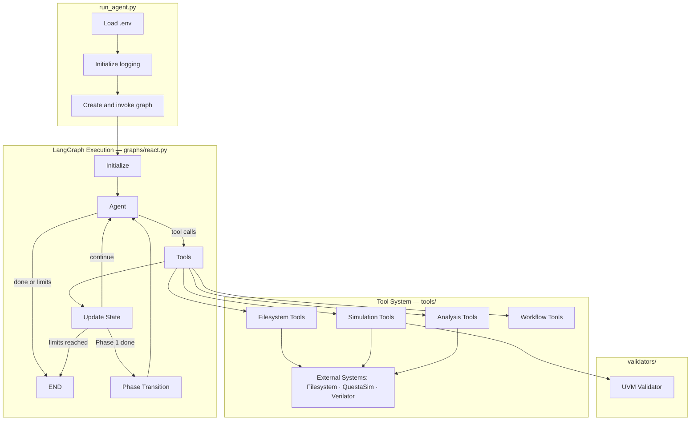
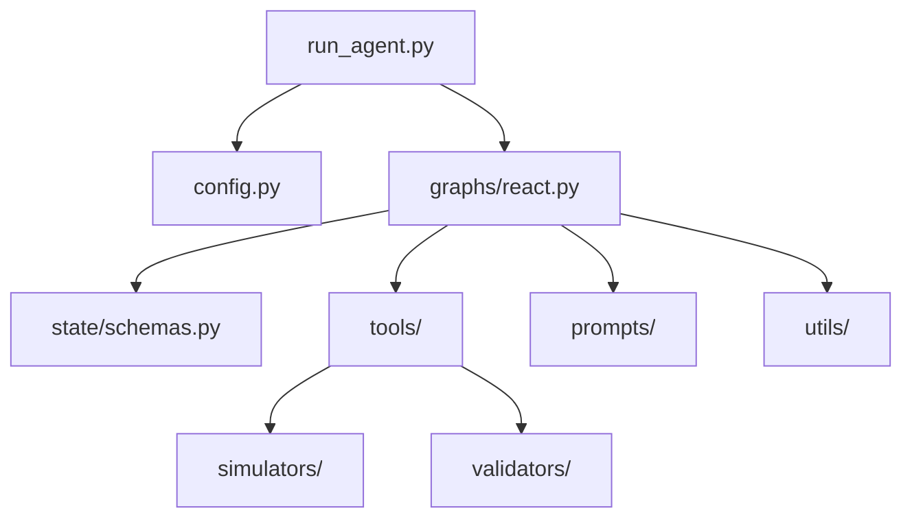
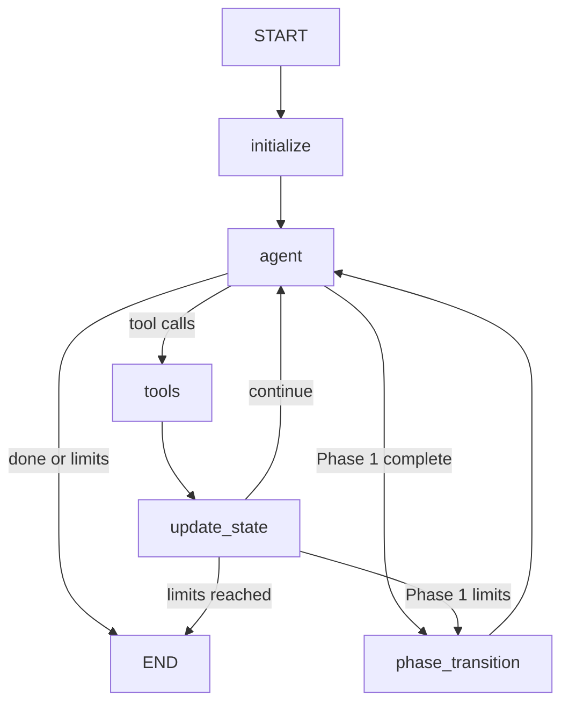
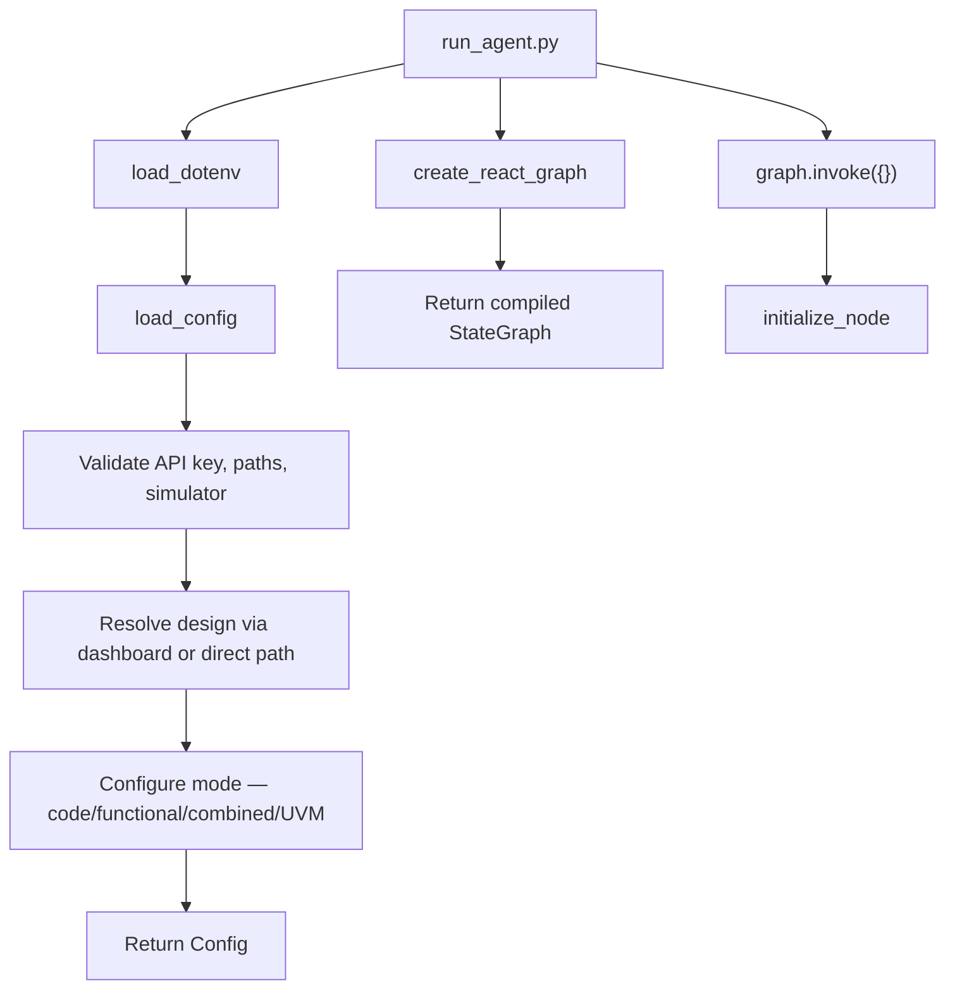
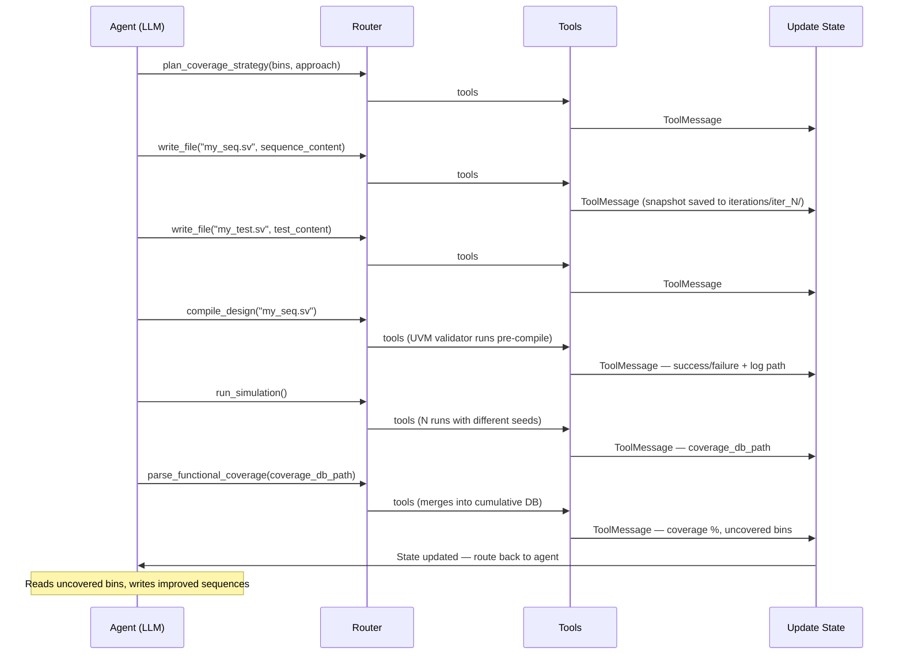
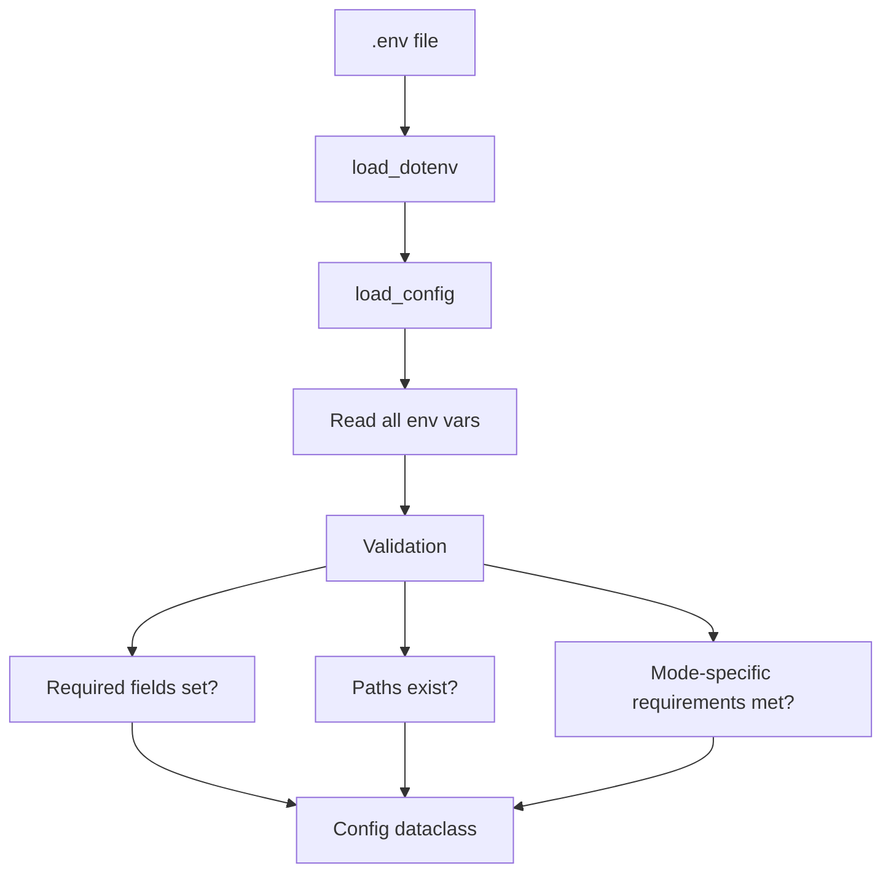

# CovAgent Architecture Documentation

## Table of Contents

1. [Overview](#overview)
2. [Architecture Principles](#architecture-principles)
3. [Verification Modes](#verification-modes)
4. [System Architecture](#system-architecture)
5. [Component Details](#component-details)
6. [Data Flow](#data-flow)
7. [Graph Execution Model](#graph-execution-model)
8. [Tool System](#tool-system)
9. [State Management](#state-management)
10. [Configuration System](#configuration-system)
11. [Design Decisions](#design-decisions)
12. [Extension Points](#extension-points)
13. [Performance Considerations](#performance-considerations)

---

## Overview

CovAgent is an agentic framework that automates hardware verification using a ReAct (Reasoning + Acting) pattern implemented with LangGraph. The system orchestrates an LLM-powered agent that iteratively generates SystemVerilog testbenches or UVM sequences, compiles and simulates them, analyzes coverage, and refines its approach until reaching coverage closure or a termination condition.

Three verification modes share a single LangGraph pipeline. Modes differ in what the LLM generates, how compilation is invoked, and which coverage parser is used — the orchestration loop, routing logic, and state management are identical across all modes.

### Key Characteristics

- **Autonomous Operation**: Agent makes decisions without human intervention during execution
- **Multi-Mode Coverage**: Code coverage, functional coverage, combined two-phase, and UVM-based functional coverage
- **Tool-Oriented**: All actions (file I/O, compilation, simulation, coverage analysis) performed through well-defined tools
- **State-Based**: Uses LangGraph's state management for reliable iteration tracking
- **Filesystem-Centric**: Large artifacts stored on disk, state contains only metadata and scalars
- **Configurable**: Behavior adapts based on environment variables

---

## Architecture Principles

### 1. Separation of Concerns

Each component has a single, well-defined responsibility:
- **State**: Data structure only, no logic
- **Config**: Environment loading and validation only
- **Utils**: Pure functions for specific tasks (parsing, extraction)
- **Tools**: LangChain tools with well-defined I/O contracts
- **Validators**: UVM pre/post-compile static checks
- **Graph**: Orchestration logic only
- **Prompts**: Template management separate from application logic

### 2. Filesystem-Centric State

**Rationale**: LangGraph state serialization becomes inefficient with large text blobs (multi-KB testbenches, logs, coverage reports).

**Solution**: Store all large artifacts on disk, keep only paths and scalar metadata in state.

**Benefits**: Efficient serialization, easy artifact inspection, natural audit trail, memory efficient.

### 3. Tool-Based Abstraction

**Rationale**: The agent needs well-defined capabilities that abstract implementation details.

**Implementation**: LangChain's `@tool` decorator creates callable functions with automatic schema generation, input validation, and self-documenting interfaces.

### 4. Immutable Configuration

**Rationale**: Configuration changes mid-run lead to inconsistent behavior.

**Implementation**: Load config once at startup, validate all paths and settings, then treat as immutable (except for iteration tracking). The only exception is `phase_transition_node` in combined mode, which mutates specific config fields to switch phases.

### 5. Explicit State Transitions

**Rationale**: Iteration and coverage tracking must be reliable for correct termination.

**Implementation**: State updates happen in the dedicated `update_state_node` with clear trigger conditions (coverage improvement, simulation success, failure counting).

---

## Verification Modes

### Mode A: Code Coverage (Default)

- **Activation**: `FUNCTIONAL_COVERAGE_ENABLED=0` (default)
- **LLM generates**: Complete SystemVerilog testbenches (module, DUT, signals, stimulus, `$finish`)
- **Compile flow**: `vlog` + `vopt` with statement/line coverage flags
- **Coverage tool**: `parse_coverage` — returns annotated RTL source with line-level hit counts and uncovered line numbers
- **Success metric**: 100% cumulative code coverage

### Mode B: Functional Coverage

- **Activation**: `FUNCTIONAL_COVERAGE_ENABLED=1` + `FUNCTIONAL_COVERAGE_TESTBENCH=<path>`
- **LLM generates**: Stimulus-only code (variable declarations + signal assignments). The user-provided template defines the module, DUT, signals, covergroups, and `// BEGIN_STIMULUS` / `// END_STIMULUS` markers. The LLM fills only the space between those markers.
- **Compile flow**: `vlog` + `vopt` with functional coverage flags (`+cover=sbfec`)
- **Coverage tool**: `parse_functional_coverage` — returns uncovered bin names with human-readable feedback
- **Success metric**: Reach `FUNCTIONAL_COVERAGE_TARGET` (default 100%)

### Mode C: Combined Coverage (Two-Phase Sequential)

- **Activation**: `COMBINED_COVERAGE_ENABLED=1` + `FUNCTIONAL_COVERAGE_TESTBENCH=<path>`
- **Phase 1**: Code coverage — identical to Mode A, work directory is `work/<RUN_ID>/code_cov/`
- **Transition**: `phase_transition_node` snapshots Phase 1 results, switches `work_dir` to `work/<RUN_ID>/func_cov/`, resets counters, clears message history, and injects a fresh functional coverage system prompt
- **Phase 2**: Functional coverage — identical to Mode B, work directory is `work/<RUN_ID>/func_cov/`

### UVM Mode (Orthogonal Modifier)

- **Activation**: `UVM_ENABLED=1`
- **Effect**: Modifies compilation, simulation, and code generation within any of the above modes. Automatically sets `functional_coverage_enabled=True`.
- **LLM generates**: UVM sequence file (multiple `uvm_sequence` classes) + UVM test file (`uvm_test` subclass) each iteration
- **Fixed files** (user-provided, LLM never modifies): driver, monitor, agent, env, interface, scoreboard, top module, passive coverage module (`tb_llm.sv`), sequence item
- **Compile flow**: 3-step: `vlib` → `vlog` (with UVM includes and DPI library) → `vopt` (`+cover=bcestf`)
- **Coverage modes**: `UVM_COVERAGE_MODE=functional` (default) uses `parse_functional_coverage`; `UVM_COVERAGE_MODE=line` uses `parse_coverage`

---

## System Architecture

### High-Level Architecture



### Component Diagram



---

## Component Details

### 1. State (`state/schemas.py`)

**Purpose**: Define the data structure that flows through the graph.

**Key Fields**:

```python
class AgentState(TypedDict):
    # Message history (LangGraph managed)
    messages: Annotated[list[BaseMessage], add_messages]

    # Configuration (loaded once during initialization)
    config: Any

    # Design context (immutable after init)
    design_name: str
    design_dir: str
    spec_path: str
    design_files: List[str]
    design_context_files: List[str]
    module_header: str
    work_dir: str

    # Tracking (mutable)
    iteration: int               # Successful compile+sim+coverage cycles
    api_calls: int               # Total LLM API calls (for max_iterations limit)
    consecutive_failures: int    # Compile/sim failures in a row (for max_retries limit)
    no_progress_count: int       # Consecutive cycles with no coverage improvement

    # Code coverage tracking
    current_coverage: float      # Latest iteration coverage % (single iteration)
    max_coverage: float          # Best single-iteration coverage achieved
    cumulative_coverage: float   # Merged coverage across ALL iterations

    # Functional coverage tracking
    functional_coverage_enabled: bool
    current_functional_coverage: float
    uncovered_bins: List[Dict]   # Uncovered bins from last parse_functional_coverage

    # Combined mode phase tracking
    coverage_phase: Optional[str]          # "code" or "functional"
    code_coverage_summary: Optional[Dict]  # Phase 1 snapshot saved at transition

    # UVM mode
    uvm_enabled: bool
    infra_modification_enabled: bool       # True after request_infra_modification approved
    original_driver_path: Optional[str]

    # Termination
    is_done: bool
    done_reason: Optional[str]
```

**Design Decisions**:
- `messages` uses `add_messages` reducer for automatic message list merging
- `config` stored in state so nodes access it without reloading from disk
- All file paths stored as strings (not Path objects) for JSON serialization
- Coverage as float (0-100) for easy comparison and logging

### 2. Configuration (`config.py`)

**Purpose**: Load and validate all environment configuration into a single typed dataclass.

```python
@dataclass
class Config:
    # LLM
    openai_api_key: str
    model: str
    temperature: float
    max_tokens: int

    # Design
    design_name: str
    design_dir: Path
    spec_path: Path
    design_files: List[Path]
    design_context_files: List[Path]
    design_context_enabled: bool

    # Paths
    work_dir: Path           # Includes RUN_ID (and phase subdir in combined mode)
    simulator_path: Path
    simulator_type: str      # 'questasim' or 'verilator'

    # Workflow
    run_id: str
    max_iterations: int
    max_retries: int
    max_no_progress: int
    sim_runs: int
    sim_timeout: int
    testplan_enabled: bool
    num_feedback_holes: int
    context_window: int
    read_file_token_limit: int

    # Functional coverage
    functional_coverage_enabled: bool
    functional_coverage_target: float
    functional_coverage_testbench_path: Optional[Path]

    # Combined mode
    combined_coverage_enabled: bool

    # UVM mode
    uvm_enabled: bool
    uvm_coverage_mode: str           # "functional" or "line"
    uvm_testbench_dir: Optional[Path]
    uvm_filelist: Optional[Path]
    uvm_sequence_file: Optional[str]
    uvm_top_module: Optional[str]
    uvm_test_name: Optional[str]
    uvm_home: Optional[str]
    uvm_dpi_lib: Optional[str]
    uvm_seq_item_file: Optional[Path]
    uvm_coverage_module_file: Optional[Path]

    # Debug
    log_level: str
    log_truncate: bool

    # Runtime (mutable)
    current_iteration: int = 1
    uvm_interface_name: Optional[str] = None   # Auto-detected at init
    uvm_env_class: Optional[str] = None        # Auto-detected at init
    uvm_driver_file: Optional[Path] = None     # Auto-detected at init
```

**Validation Strategy**:
- Fail fast: raise `ValueError` on missing required fields
- Path validation: check existence at load time
- Type coercion: convert env strings to appropriate types
- Combined mode validates `FUNCTIONAL_COVERAGE_TESTBENCH` at startup even though Phase 2 hasn't started

### 3. Design Loader (`utils/design_loader.py`)

**Functions**:

1. **`extract_module_header(rtl_file)`**: Parses SystemVerilog to extract module name, parameters, and port declarations using regex-based line-by-line parsing.

2. **`scan_design_directory(design_dir)`**: Finds spec file in `docs/` and RTL files in `rtl/`. Returns `(spec_path, rtl_dir, rtl_files)`.

### 4. Simulators (`simulators/`)

**Pattern**: Abstract base class (`base.py`) with adapter implementations for each simulator.

- **`questasim_adapter.py`**: Implements `vlib → vlog → vopt → vsim → vcover` flows. Handles three compile variants: code coverage, functional coverage, and UVM (3-step). Runs multiple simulation seeds and merges UCDBs.
- **`verilator_adapter.py`**: Implements Verilator compile and simulation with line coverage instrumentation.

### 5. Validators (`validators/uvm_validator.py`)

**Purpose**: Static analysis of LLM-generated UVM files before compilation (zero simulator cost).

**Pre-compile checks**:
- UVM `import`/`` `include `` directives present in both files
- Test class name matches `UVM_TEST_NAME` config
- Factory registration macros present (`` `uvm_object_utils ``, `` `uvm_component_utils ``)
- `config_db` get/set patterns correct (virtual interface passing)
- Balanced `begin`/`end`, `class`/`endclass` keywords
- Sequence parameterization type matches seq item class
- Interface name consistency across files
- Referenced files exist

**Post-compile checks** (after successful `vlog`):
- UVM 1.2 was loaded (not 1.1d)
- No dual-UVM conflicts
- No stale binary warnings (vsim-12460, vsim-8754)

### 6. Prompts (`prompts/`)

**`prompts/system.md`**: Master template (~580 lines). Contains placeholders (`{design_name}`, `{module_header}`, etc.) and conditional sections for each mode.

**`prompts/loader.py`**: Extracts template content, builds conditional sections (testplan, design context, UVM instructions), and interpolates all variables.

**UVM instruction injection** (`_build_uvm_instructions()`): When `UVM_ENABLED=1`, injects inline:
- What files to generate and their required structure
- `start_item`/`finish_item` sequence pattern
- `config_db` get/set requirements for the test class
- Constraint bypass techniques (direct field assignment, `constraint_mode(0)`)
- Prohibitions: never modify fixed infrastructure files
- Context from `seq_item.sv` and `tb_llm.sv` (covergroups/bins)

### 7. Graph (`graphs/react.py`)

**Purpose**: Orchestrate the ReAct agent loop with all mode-specific routing.

#### Nodes

**`initialize_node`**:
- Load config, create work directory structure (`testbenches/`, `logs/`, `coverage/`, `iterations/`)
- Extract module header from RTL
- For UVM: copy and rewrite `.f` filelist (absolute paths, redirect seq/test entries to `work_dir/testbenches/`), read seq item and coverage module files into prompt context
- Build system prompt with design context and mode-specific instructions
- Set tool config globals
- Return: `[SystemMessage, HumanMessage]`

**`agent_node`**:
- Create `ChatOpenAI` instance with tools bound via `bind_tools()`
- Invoke with full message history
- Track consecutive text-only responses (no tool calls); inject nudge message if agent stops calling tools
- Return: `AIMessage` (with or without tool calls)

**`tools_node`** (LangGraph `ToolNode`):
- Execute LLM-requested tools
- Return `ToolMessage` results

**`update_state_node`**:
- Parse last 5 messages for tool results
- Priority 1: `request_infra_modification` result → set `infra_modification_enabled`
- Priority 2: Compile failure → increment `consecutive_failures`
- Priority 3: Sim failure → increment `consecutive_failures`
- Priority 4: Coverage result → update metrics, check for progress
  - Improvement: reset `no_progress_count`, increment `iteration`, reset `consecutive_failures`
  - No improvement: increment `no_progress_count`

**`phase_transition_node`** (combined mode only):
- Snapshot Phase 1: save `iteration`, `max_coverage`, `cumulative_coverage` to `code_coverage_summary`
- Mutate config: switch `work_dir` to `func_cov/`, set `functional_coverage_enabled=True`
- Reset counters (iteration, failures, no_progress)
- Create Phase 2 directory structure
- Build fresh system prompt for functional coverage
- Replace message history (clear Phase 1 context, inject Phase 2 prompt)

#### Routing

**`route_after_agent`** (after `agent_node`):

```python
# 1. signal_done tool call:
#    - Validate termination conditions
#    - If valid AND combined Phase 1 → phase_transition
#    - If valid → END
#    - If invalid → increment no_progress_count, nudge, continue
# 2. Hard termination (max_iterations, max_retries, max_no_progress, context_window):
#    - Combined Phase 1 → phase_transition
#    - Otherwise → END
# 3. Tool calls present → "tools"
# 4. Text-only response → nudge → "agent"
```

**`route_after_update`** (after `update_state_node`):

```python
# Re-check hard termination conditions with updated state
# Combined Phase 1 → phase_transition
# Otherwise → END or continue to "agent"
```

#### Graph Construction



---

## Data Flow

### Initialization Flow



### Iteration Flow (UVM Mode)



### State Evolution

```
Initialization:
{ iteration: 0, cumulative_coverage: 0.0, consecutive_failures: 0, no_progress_count: 0 }

After first successful parse_coverage (code coverage):
{ iteration: 1, current_coverage: 65.0, cumulative_coverage: 65.0, max_coverage: 65.0 }

After second iteration (improvement):
{ iteration: 2, current_coverage: 82.0, cumulative_coverage: 82.0, no_progress_count: 0 }

After third iteration (no improvement):
{ iteration: 3, current_coverage: 75.0, cumulative_coverage: 82.0, no_progress_count: 1 }

Combined mode — Phase 1 complete (transition triggers):
{ coverage_phase: "functional", code_coverage_summary: {iteration: 3, max_coverage: 82.0, ...},
  iteration: 0, cumulative_coverage: 0.0 }  # Reset for Phase 2
```

---

## Graph Execution Model

### LangGraph Execution Semantics

1. **State**: `AgentState` TypedDict with field reducers
2. **Reducers**: `add_messages` (append) for messages field, default replace for all others
3. **Node Execution**: Each node returns a partial state update dict
4. **State Merging**: LangGraph applies reducers to merge node outputs into state

### Message Types

| Type | Source | Purpose |
|------|--------|---------|
| `SystemMessage` | `initialize_node` | System prompt with design context and mode instructions |
| `HumanMessage` | `initialize_node` | "Begin verification..." kickoff message |
| `AIMessage` | `agent_node` | Agent reasoning and tool call requests |
| `ToolMessage` | `tools_node` | Tool execution results, linked by `tool_call_id` |

### Termination Conditions

| Condition | Source | Notes |
|-----------|--------|-------|
| `signal_done("coverage_complete")` | LLM tool call | Validated: code cov ≥100% OR (UVM AND funcov ≥ target) |
| `signal_done("no_progress")` | LLM tool call | Validated: no_progress_count ≥ threshold |
| `max_iterations` reached | Router | Hard cap on LLM API calls |
| `max_retries` reached | Router | Consecutive compile/sim failures |
| `max_no_progress` reached | Router | No cumulative coverage improvement |
| Context window exceeded | Router | Token count of message history |

---

## Tool System

### Tool Categories

#### File Tools (`tools/filesystem.py`)

| Tool | Purpose |
|------|---------|
| `read_file(path)` | Read spec, RTL, logs, coverage reports. Truncates at `READ_FILE_TOKEN_LIMIT`. Enforces `DESIGN_CONTEXT` for RTL access. |
| `write_file(path, content)` | Write testbench/sequence/test files. Mode-aware: injects into template markers (functional coverage mode) or writes directly (code coverage / UVM). Saves snapshot to `iterations/iter_N/` in UVM mode. Validates path stays within work directory (prevents `../` traversal). |
| `list_directory(path)` | List files in work or design directories. |

#### Simulation Tools (`tools/simulation.py`)

| Tool | Purpose |
|------|---------|
| `compile_design(testbench_path)` | Compile testbench + design files using mode-appropriate flow. Returns `{success, return_code, stdout, stderr, log_path}`. Runs UVM pre-compile validator before invoking the simulator. |
| `run_simulation()` | Run `SIM_RUNS` simulations with different random seeds. Merges UCDBs. Returns `{success, stdout, stderr, coverage_db_path, log_path}`. |

**Compile flows by mode**:
- Code coverage: `vlog -sv +cover=s` → `vopt +cover=s`
- Functional coverage: `vlog -sv +cover=sbfec` → `vopt +cover=sbfec`
- UVM: `vlib` → `vlog +incdir+$UVM_HOME/src uvm_pkg.sv ... +cover=bcestf` → `vopt +cover=bcestf`

#### Analysis Tools (`tools/analysis.py`)

| Tool | Purpose |
|------|---------|
| `parse_coverage(db_path)` | Code coverage mode. Merges into `cumulative.ucdb`. Returns `{iteration_coverage, cumulative_coverage, uncovered_lines, annotated_source}`. Annotated source uses `"##### |"` for uncovered lines and `"   N |"` for lines hit N times. |
| `parse_functional_coverage(db_path)` | Functional/UVM mode. Merges into `cumulative_funcov.ucdb`. Returns `{total_coverage, covergroups, uncovered_bins, feedback}`. Feedback lists top `NUM_FEEDBACK_HOLES` uncovered bins with context. |

#### Workflow Tools (`tools/workflow.py`)

| Tool | Purpose |
|------|---------|
| `signal_done(reason)` | Request termination. Returns a dict but actual validation happens in the router — framework can reject the request if conditions aren't met. |
| `request_infra_modification(reason)` | Request permission to modify the UVM driver. Graph sets `infra_modification_enabled=True` if granted. Without this, the LLM is not allowed to edit driver files. |
| `plan_coverage_strategy(target_bins, strategy)` | UVM mode: document reasoning and target bins before writing code. No execution — planning only. Helps preserve context. |

### Tool Return Format

```python
# Success
{"success": True, "content": "..."}

# Failure
{"success": False, "error": "Descriptive message"}

# Complex success (parse_coverage)
{
    "success": True,
    "iteration_coverage": 65.0,
    "cumulative_coverage": 65.0,
    "uncovered_lines": {"path/to/file.sv": [42, 87, 103]},
    "annotated_source": "..."
}
```

### Tool Configuration Pattern

Tools need access to `Config` but `@tool` functions cannot take config as a parameter (the LLM provides all args). Solution: module-level global reference set at initialization.

```python
# tools/filesystem.py
_config = None

def set_config(config):
    global _config
    _config = config

@tool
def read_file(path: str) -> dict:
    if not _config.design_context_enabled:
        ...  # Block RTL access
```

---

## State Management

### State Schema Design

`messages` uses `add_messages` (appends and deduplicates by ID). All other fields use default replace semantics — nodes return only the fields they update.

### Coverage Tracking

The framework maintains three distinct coverage metrics:

| Field | Meaning |
|-------|---------|
| `current_coverage` | Coverage from the most recent iteration's simulation |
| `max_coverage` | Best single-iteration coverage ever seen |
| `cumulative_coverage` | Merged coverage across all iterations (always ≥ previous value) |

`cumulative_coverage` drives the `no_progress_count` logic: it only increments `no_progress_count` when the merged database shows no improvement, regardless of what any single iteration achieved.

---

## Configuration System

### Work Directory Structure

**Single mode** (`work/<RUN_ID>/`):
```
work/my_run/
├── testbenches/           # Generated testbenches (code cov) or seq/test files (UVM)
│   ├── tb_iter_1.sv
│   └── ...
├── logs/
│   ├── compile_iter_1.log
│   ├── sim_iter_1.log
│   └── ...
├── coverage/
│   ├── cumulative.ucdb    # Merged across all iterations
│   ├── sim_run_1.ucdb
│   └── ...
├── iterations/            # Per-iteration snapshots (UVM mode)
│   ├── iter_1/
│   │   ├── my_seq.sv
│   │   └── my_test.sv
│   └── ...
└── testplan.md
```

**Combined mode** (`work/<RUN_ID>/code_cov/` and `work/<RUN_ID>/func_cov/`):
```
work/my_run/
├── code_cov/
│   ├── testbenches/
│   ├── logs/
│   └── coverage/
└── func_cov/
    ├── testbenches/
    ├── logs/
    └── coverage/
```

### Environment Variable Loading



---

## Design Decisions

### 1. Why LangGraph over LangChain Agents?

LangGraph provides explicit state management, full control over node execution, easy custom iteration logic, and deterministic execution order. LangChain agents have opaque state and limited control over iteration termination — incompatible with coverage-driven loop control.

### 2. Why Global Config in Tools?

Tools decorated with `@tool` receive all arguments from the LLM. Config cannot be a tool parameter. Global module-level reference (`set_config(config)` at init) is simple, explicit, and testable.

### 3. Why Filesystem-Centric State?

Testbenches (1-5KB), compile logs (10-100KB), and coverage reports are too large for efficient state serialization. Storing paths instead of content keeps state small and leaves artifacts on disk for debugging.

### 4. Why Multiple Simulation Runs?

A single simulation with a fixed seed gives incomplete random coverage. Running N simulations with different seeds and merging the UCDBs improves bin hit probability significantly. Configurable via `SIM_RUNS`.

### 5. Why a Dedicated `update_state_node`?

State transitions (coverage improvement, iteration increment, failure count) happen in a dedicated node after every tool execution — not scattered across routing logic. This makes state transitions auditable and testable independently.

### 6. Why Static Validation Before UVM Compile?

UVM compilation errors are often non-obvious (missing factory macros, wrong class name). Running a zero-cost static validator before invoking `vlog` catches the most common LLM mistakes immediately, with targeted error messages that guide the next generation attempt without burning simulator time.

### 7. Why Prioritize Top-N Coverage Feedback?

Returning all uncovered lines or bins in large designs can consume thousands of tokens. `NUM_FEEDBACK_HOLES` limits the feedback to the most impactful uncovered targets, keeping the agent focused and preserving context window budget.

---

## Extension Points

### 1. Adding New Tools

1. Create tool function with `@tool` decorator in an appropriate `tools/` file
2. Add to `get_all_tools()` in `tools/__init__.py`
3. Update `system.md` to document the tool for the LLM

### 2. Adding New Simulators

Implement the base adapter class from `simulators/base.py`:
1. Implement `compile()`, `simulate()`, and `parse_coverage()` methods
2. Add a new config option to `SIMULATOR` validation in `config.py`
3. Dispatch in simulation tools based on `config.simulator_type`

### 3. Adding New Coverage Metrics

1. Update `parse_coverage` or `parse_functional_coverage` to extract additional metrics
2. Add fields to `AgentState` for the new metric
3. Update `update_state_node` to track the new metric
4. Update routing/termination logic if needed
5. Update the system prompt to guide the agent on the new metric

### 4. Adding a New Verification Mode

1. Add configuration fields to `Config` dataclass with an env var
2. Add mode detection in `initialize_node` (prompt variant, tool config)
3. Add a new branch in simulation/analysis tools for the mode's compile flags and coverage parser
4. Update `route_after_agent` if the mode has different termination semantics
5. Document the mode in the system prompt template

---

## Performance Considerations

### LLM Calls

Each iteration typically requires 3-5 LLM calls: read spec (iter 1 only), plan strategy, write files, compile, simulate, parse coverage. Using a lower temperature (0.2-0.4) reduces variance and generally produces fewer compile failures.

### Simulation Bottleneck

QuestaSim compilation: 5-30 seconds. Simulation: 5-60 seconds per run. With `SIM_RUNS=5`, total simulation time per iteration is 25-300 seconds. Reduce `SIM_RUNS` during development. The UVM compile flow (3 steps) adds ~10 seconds over the standard flow.

### Context Window Growth

Message history grows with each iteration. Each compile log, simulation result, and coverage report adds tokens. Set `NUM_FEEDBACK_HOLES` and `READ_FILE_TOKEN_LIMIT` conservatively for large designs. The framework terminates the run when `CONTEXT_WINDOW` is exceeded rather than failing with an API error.

---

## Debugging Guide

### Enable Debug Logging

```env
LOG_LEVEL=DEBUG
LOG_TRUNCATE=0   # Show full tool output
```

### Inspect Work Directory

```bash
ls work/<RUN_ID>/testbenches/   # Check generated files
cat work/<RUN_ID>/logs/compile_iter_1.log   # Check compile errors
ls work/<RUN_ID>/iterations/    # UVM per-iteration snapshots
```

### Manual Tool Testing

```python
from src.tools.filesystem import read_file, set_config
from src.config import load_config

config = load_config()
set_config(config)

result = read_file("path/to/file")
print(result)
```

### Graph Visualization

```python
from src.graphs.react import create_react_graph

graph = create_react_graph()
graph.get_graph().print_ascii()
```

---

## Summary

CovAgent implements a ReAct agent using LangGraph with three coverage modes sharing a single pipeline:

1. **Code Coverage** — LLM generates full SystemVerilog testbenches, measures RTL line/branch coverage
2. **Functional Coverage** — LLM generates stimulus-only code for user-provided templates with covergroups
3. **UVM** — LLM generates UVM sequence and test files; fixed infrastructure is user-provided

Key architectural properties:
- **Modular Architecture**: Clear separation of state, config, utils, tools, validators, prompts, and graph
- **Mode-Orthogonal Pipeline**: Three coverage modes share initialization, routing, state, and termination logic
- **Layered Guardrails**: Prompt rules → static validation → runtime guards → feedback prioritization
- **Filesystem-Centric State**: Efficient state management via file paths, full audit trail on disk
- **Explicit State Transitions**: All coverage and iteration tracking in a dedicated `update_state_node`

This document serves as the technical reference for understanding, debugging, and extending the CovAgent framework.
