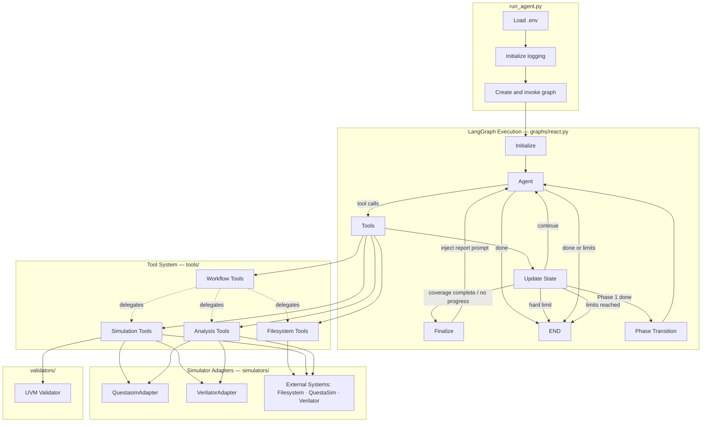
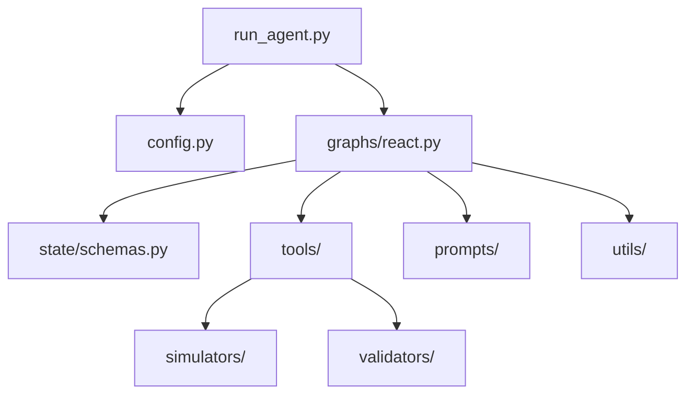
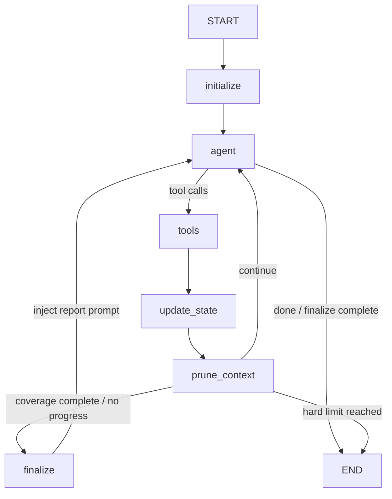
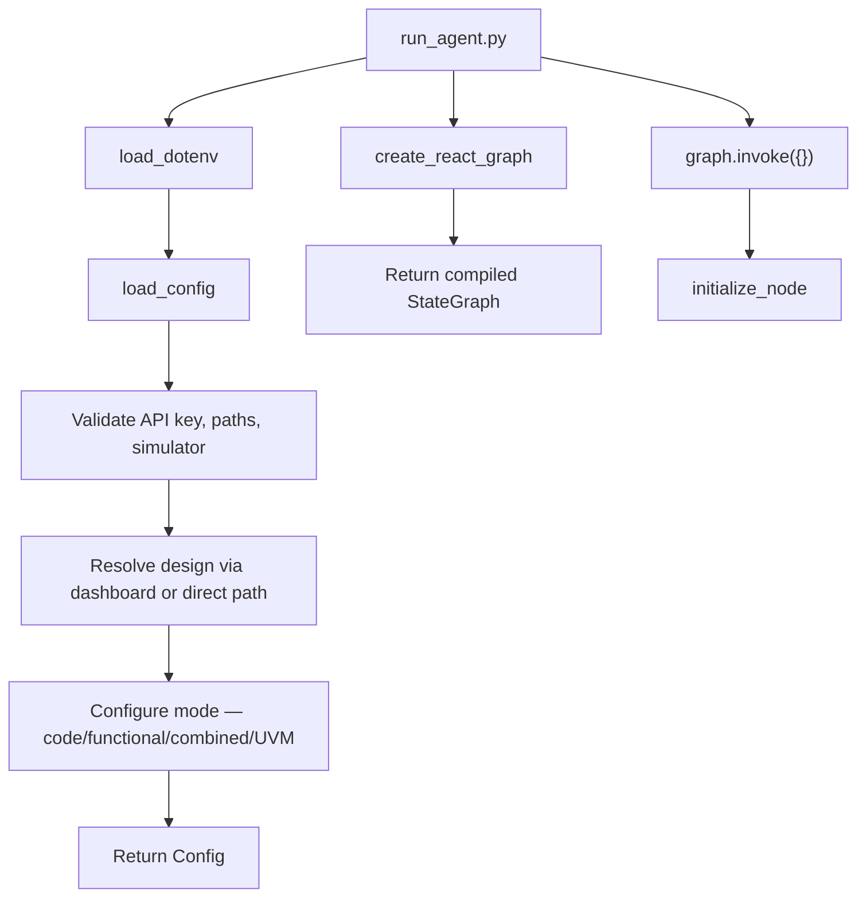
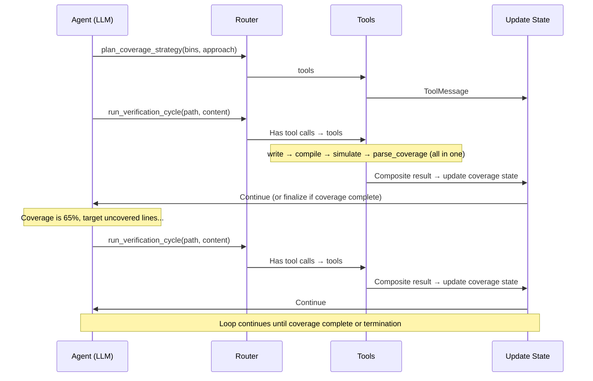
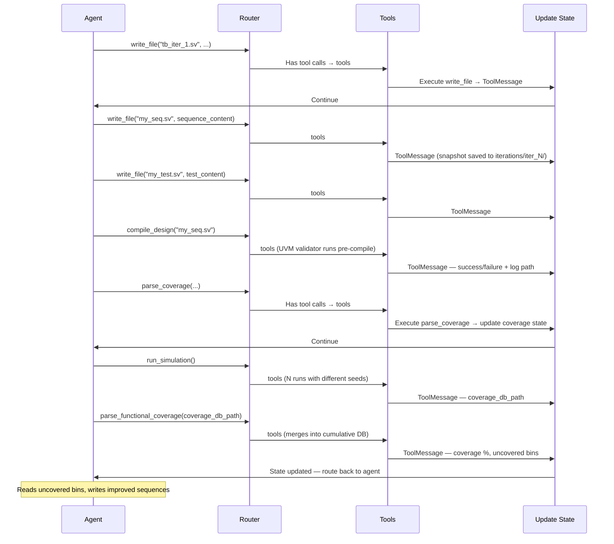
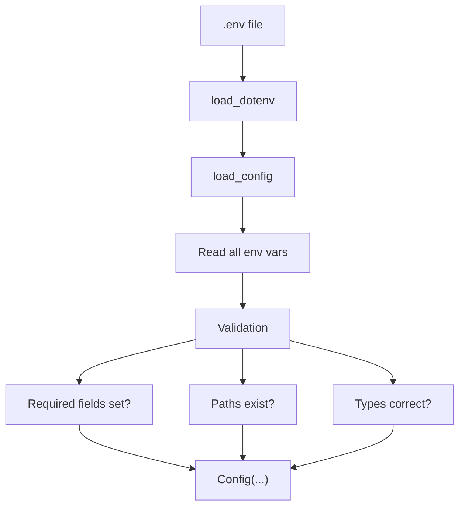

# CovAgent Architecture Documentation

## Table of Contents

1. [Overview](#overview)
2. [Architecture Principles](#architecture-principles)
3. [Verification Modes](#verification-modes)
4. [System Architecture](#system-architecture)
5. [Component Details](#component-details)
6. [Data Flow](#data-flow)
7. [Graph Execution Model](#graph-execution-model)
8. [Tool System](#tool-system)
9. [State Management](#state-management)
10. [Configuration System](#configuration-system)
11. [Design Decisions](#design-decisions)
12. [Extension Points](#extension-points)
13. [Performance Considerations](#performance-considerations)

---

## Overview

CovAgent is an agentic framework that automates hardware verification using a ReAct (Reasoning + Acting) pattern implemented with LangGraph. The system orchestrates an LLM-powered agent that iteratively generates SystemVerilog testbenches, compiles and simulates them with QuestaSim or Verilator, analyzes coverage, and refines its approach until achieving complete statement coverage. When a termination condition is reached (coverage complete or no progress), a finalize node gives the agent one last turn to write a run report before ending.
Spec2Cov is an agentic framework that automates hardware verification using a ReAct (Reasoning + Acting) pattern implemented with LangGraph. The system orchestrates an LLM-powered agent that iteratively generates SystemVerilog testbenches or UVM sequences, compiles and simulates them, analyzes coverage, and refines its approach until reaching coverage closure or a termination condition.

Three verification modes share a single LangGraph pipeline. Modes differ in what the LLM generates, how compilation is invoked, and which coverage parser is used — the orchestration loop, routing logic, and state management are identical across all modes.

### Key Characteristics

- **Autonomous Operation**: Agent makes decisions without human intervention during execution
- **Multi-Mode Coverage**: Code coverage, functional coverage, combined two-phase, and UVM-based functional coverage
- **Tool-Oriented**: All actions (file I/O, compilation, simulation, coverage analysis) performed through well-defined tools
- **State-Based**: Uses LangGraph's state management for reliable iteration tracking
- **Filesystem-Centric**: Large artifacts stored on disk, state contains only metadata and scalars
- **Configurable**: Behavior adapts based on environment variables

---

## Architecture Principles

### 1. Separation of Concerns

Each component has a single, well-defined responsibility:
- **State**: Data structure only, no logic
- **Config**: Environment loading and validation only
- **Utils**: Pure functions for specific tasks (parsing, extraction)
- **Tools**: LangChain tools with well-defined I/O contracts
- **Validators**: UVM pre/post-compile static checks
- **Graph**: Orchestration logic only
- **Prompts**: Template management separate from application logic

### 2. Filesystem-Centric State

**Rationale**: LangGraph state serialization becomes inefficient with large text blobs (multi-KB testbenches, logs, coverage reports).

**Solution**: Store all large artifacts on disk, keep only paths and scalar metadata in state.

**Benefits**: Efficient serialization, easy artifact inspection, natural audit trail, memory efficient.

### 3. Tool-Based Abstraction

**Rationale**: The agent needs well-defined capabilities that abstract implementation details.

**Implementation**: LangChain's `@tool` decorator creates callable functions with automatic schema generation, input validation, and self-documenting interfaces.

### 4. Immutable Configuration

**Rationale**: Configuration changes mid-run lead to inconsistent behavior.

**Implementation**: Load config once at startup, validate all paths and settings, then treat as immutable (except for iteration tracking). The only exception is `phase_transition_node` in combined mode, which mutates specific config fields to switch phases.

### 5. Explicit State Transitions

**Rationale**: Iteration and coverage tracking must be reliable for correct termination.

**Implementation**: State updates happen in the dedicated `update_state_node` with clear trigger conditions (coverage improvement, simulation success, failure counting).

---

## Verification Modes

### Mode A: Code Coverage (Default)

- **Activation**: `FUNCTIONAL_COVERAGE_ENABLED=0` (default)
- **LLM generates**: Complete SystemVerilog testbenches (module, DUT, signals, stimulus, `$finish`)
- **Compile flow**: `vlog` + `vopt` with statement/line coverage flags
- **Coverage tool**: `parse_coverage` — returns annotated RTL source with line-level hit counts and uncovered line numbers
- **Success metric**: 100% cumulative code coverage

### Mode B: Functional Coverage

- **Activation**: `FUNCTIONAL_COVERAGE_ENABLED=1` + `FUNCTIONAL_COVERAGE_TESTBENCH=<path>`
- **LLM generates**: Stimulus-only code (variable declarations + signal assignments). The user-provided template defines the module, DUT, signals, covergroups, and `// BEGIN_STIMULUS` / `// END_STIMULUS` markers. The LLM fills only the space between those markers.
- **Compile flow**: `vlog` + `vopt` with functional coverage flags (`+cover=sbfec`)
- **Coverage tool**: `parse_functional_coverage` — returns uncovered bin names with human-readable feedback
- **Success metric**: Reach `FUNCTIONAL_COVERAGE_TARGET` (default 100%)

### Mode C: Combined Coverage (Two-Phase Sequential)

- **Activation**: `COMBINED_COVERAGE_ENABLED=1` + `FUNCTIONAL_COVERAGE_TESTBENCH=<path>`
- **Phase 1**: Code coverage — identical to Mode A, work directory is `work/<RUN_ID>/code_cov/`
- **Transition**: `phase_transition_node` snapshots Phase 1 results, switches `work_dir` to `work/<RUN_ID>/func_cov/`, resets counters, clears message history, and injects a fresh functional coverage system prompt
- **Phase 2**: Functional coverage — identical to Mode B, work directory is `work/<RUN_ID>/func_cov/`

### UVM Mode (Orthogonal Modifier)

- **Activation**: `UVM_ENABLED=1`
- **Effect**: Modifies compilation, simulation, and code generation within any of the above modes. Automatically sets `functional_coverage_enabled=True`.
- **LLM generates**: UVM sequence file (multiple `uvm_sequence` classes) + UVM test file (`uvm_test` subclass) each iteration
- **Fixed files** (user-provided, LLM never modifies): driver, monitor, agent, env, interface, scoreboard, top module, passive coverage module (`tb_llm.sv`), sequence item
- **Compile flow**: 3-step: `vlib` → `vlog` (with UVM includes and DPI library) → `vopt` (`+cover=bcestf`)
- **Coverage modes**: `UVM_COVERAGE_MODE=functional` (default) uses `parse_functional_coverage`; `UVM_COVERAGE_MODE=line` uses `parse_coverage`

---

## System Architecture

### High-Level Architecture



### Component Diagram



---

## Component Details

### 1. State (`state/schemas.py`)

**Purpose**: Define the data structure that flows through the graph.

**Key Fields**:

```python
def _append_token_records(left: List[dict], right: List[dict]) -> List[dict]:
    """Reducer that appends new token usage records to the list."""
    return (left or []) + (right or [])


class AgentState(TypedDict):
    # Message history (LangGraph managed)
    messages: Annotated[list[BaseMessage], add_messages]

    # Configuration (loaded once during initialization)
    config: Any

    # Design context (immutable after init)
    design_name: str
    design_dir: str
    spec_path: str
    design_files: List[str]          # Main design RTL files (DUT)
    design_context_files: List[str]  # Supporting files (submodules/dependencies)
    rtl_dir: str                     # Deprecated - kept for compatibility
    design_files: List[str]
    design_context_files: List[str]
    module_header: str
    work_dir: str

    # Tracking (mutable)
    iteration: int               # Successful compile+sim+coverage cycles
    api_calls: int               # Total LLM API calls (for max_iterations limit)
    consecutive_failures: int    # Compile/sim failures in a row (for max_retries limit)
    no_progress_count: int       # Consecutive cycles with no coverage improvement
    no_tool_call_count: int      # Consecutive responses with no tool calls - for max_no_tool_calls limit

    # Code coverage tracking
    current_coverage: float      # Latest iteration coverage % (single iteration)
    max_coverage: float          # Best single-iteration coverage achieved
    cumulative_coverage: float   # Merged coverage across ALL iterations

    # Functional coverage tracking
    functional_coverage_enabled: bool
    current_functional_coverage: float
    uncovered_bins: List[Dict]   # Uncovered bins from last parse_functional_coverage

    # Combined mode phase tracking
    coverage_phase: Optional[str]          # "code" or "functional"
    code_coverage_summary: Optional[Dict]  # Phase 1 snapshot saved at transition

    # UVM mode
    uvm_enabled: bool
    infra_modification_enabled: bool       # True after request_infra_modification approved
    original_driver_path: Optional[str]

    # Token usage tracking (per-API-call records, appended via custom reducer)
    # Each record: {api_call, iteration, input_tokens, output_tokens, total_tokens,
    #               reasoning_tokens, cached_input_tokens, tool_calls, category, ...}
    token_usage: Annotated[List[dict], _append_token_records]

    # Termination
    is_done: bool
    done_reason: Optional[str]   # "coverage_complete", "no_progress", "no_tool_calls", "max_iterations"
    is_finalizing: bool  # True when framework has triggered termination and agent gets one last turn for report
```

**Design Decisions**:
- `messages` uses `add_messages` reducer for automatic message list merging
- `config` stored in state so nodes access it without reloading from disk
- All file paths stored as strings (not Path objects) for JSON serialization
- Coverage as float (0-100) for easy comparison and logging

### 2. Configuration (`config.py`)

**Purpose**: Load and validate all environment configuration into a single typed dataclass.

```python
@dataclass
class Config:
    # LLM
    openai_api_key: str
    model: str
    temperature: float
    max_tokens: int
    reasoning_effort: str  # 'disabled', 'low', 'medium', or 'high'

    # Design
    design_name: str
    design_dir: Path
    spec_path: Path
    design_files: List[Path]
    design_context_files: List[Path]
    compile_deps_files: List[Path]   # Ordered compile-time dependencies
    design_context_enabled: bool

    # Paths
    work_dir: Path           # Includes RUN_ID (and phase subdir in combined mode)
    simulator_path: Path
    simulator_type: str      # 'questasim' or 'verilator'

    # Workflow
    run_id: str
    max_iterations: int
    max_retries: int
    max_no_progress: int
    max_no_tool_calls: int  # Max consecutive responses with no tool calls
    sim_runs: int
    sim_timeout: int
    testplan_enabled: bool
    num_feedback_holes: int  # Priority coverage holes in feedback (0 = unbounded)
    coverage_hole_radius: int  # Context lines above/below each coverage hole (0-20)
    context_window: int  # Max tokens before terminating run
    keep_latest_failures: int  # Failed verification cycles to keep in context

    # LangGraph
    recursion_limit: int  # LangGraph graph recursion limit
    num_feedback_holes: int
    context_window: int
    read_file_token_limit: int

    # Functional coverage
    functional_coverage_enabled: bool
    functional_coverage_target: float
    functional_coverage_testbench_path: Optional[Path]

    # Combined mode
    combined_coverage_enabled: bool

    # UVM mode
    uvm_enabled: bool
    uvm_coverage_mode: str           # "functional" or "line"
    uvm_testbench_dir: Optional[Path]
    uvm_filelist: Optional[Path]
    uvm_sequence_file: Optional[str]
    uvm_top_module: Optional[str]
    uvm_test_name: Optional[str]
    uvm_home: Optional[str]
    uvm_dpi_lib: Optional[str]
    uvm_seq_item_file: Optional[Path]
    uvm_coverage_module_file: Optional[Path]

    # Debug
    log_level: str
    log_truncate: bool

    # Runtime (mutable)
    current_iteration: int = 1
    current_attempt: int = 1
    compile_attempts_this_iter: int = 0
    sim_attempts_this_iter: int = 0
    uvm_interface_name: Optional[str] = None   # Auto-detected at init
    uvm_env_class: Optional[str] = None        # Auto-detected at init
    uvm_driver_file: Optional[Path] = None     # Auto-detected at init
```

**Validation Strategy**:
- Fail fast: raise `ValueError` on missing required fields
- Path validation: check existence at load time
- Type coercion: convert env strings to appropriate types
- Combined mode validates `FUNCTIONAL_COVERAGE_TESTBENCH` at startup even though Phase 2 hasn't started

### 3. Design Loader (`utils/design_loader.py`) and Dashboard Loader (`utils/dashboard_loader.py`)

**Purpose**: Load design configurations and extract design metadata.

**Dashboard Loader** (`utils/dashboard_loader.py`):

Provides two modes for loading design configurations:

1. **Dashboard mode** (recommended): Uses `DESIGN_NAME` + `DASHBOARD_PATH` to look up design files from a centralized `dashboard.json` registry. Supports `$(BASE_DIR)` variable substitution in paths.

2. **Direct mode** (fallback): Uses `DESIGN` path with auto-discovery. Scans the directory for `docs/*.md` (spec) and `rtl/*.sv`/`rtl/*.v` (design files).

Returns a `DesignConfig` object containing `design_name`, `spec_path`, `design_files`, and `design_context_files`.

**Design Loader** (`utils/design_loader.py`):
**Functions**:

1. **`extract_module_header(rtl_file)`**: Parses SystemVerilog to extract module name, parameters, and port declarations using regex-based line-by-line parsing.

2. **`extract_all_module_headers(design_files: List[Path]) -> str`**
   - Extracts headers from ALL design files and combines them
   - First file labeled as `TOP MODULE`, subsequent files labeled as `MODULE N`
   - Used to provide module interface context in the system prompt

3. **`scan_design_directory(design_dir: Path) -> Tuple[Path, Path, List[str]]`**
   - Finds specification file in `docs/` subdirectory
   - Finds RTL files in `rtl/` subdirectory
   - Returns: `(spec_path, rtl_dir, rtl_files)`

**Design Rationale**:
- Pure functions (no side effects)
- Fail with descriptive errors if structure invalid
- Support both `.v` and `.sv` extensions
- Dashboard mode enables centralized design management for batch experiments

### 4. Simulator Adapters (`simulators/`)

**Purpose**: Provide a unified interface for different HDL simulators through the adapter pattern.

**Architecture**:

```python
# simulators/base.py
class SimulatorAdapter(ABC):
    def compile(self, testbench_path, design_files, work_dir, timeout) -> Dict
    def simulate(self, testbench_name, num_runs, work_dir, iteration, timeout) -> Dict
    def parse_coverage(self, coverage_db_path) -> CoverageResult
    def merge_cumulative_coverage(self, iteration_db, cumulative_db) -> None
    def filter_compile_output(self, output) -> str  # Strip noise for LLM
    def filter_sim_output(self, output) -> str       # Strip noise for LLM
    def cleanup(work_dir) -> None

@dataclass
class CoverageResult:
    total_coverage: float        # 0-100
    breakdown: Dict[str, float]  # Module/file -> coverage %
    uncovered_lines: Dict[str, List[int]]  # File -> line numbers
```

**Available Adapters**:

1. **`QuestasimAdapter`** (`simulators/questasim_adapter.py`)
   - Uses `vlog` for compilation with `+cover=s` (statement coverage)
   - Uses `vsim` for simulation with `-coverage -sv_seed random`
   - Uses `vcover merge` for combining coverage across runs
   - Parses XML coverage reports for detailed metrics
   - Excludes testbench (`tb_llm`) from coverage calculations
   - Filters compile/sim output to remove QuestaSim banner noise

2. **`VerilatorAdapter`** (`simulators/verilator_adapter.py`)
   - Uses `verilator` for compilation with `--coverage` flag
   - Compiles to C++ and builds with `make`
   - Uses `verilator_coverage` for coverage reporting
   - Parses `.dat` coverage files for line coverage metrics

**Legacy Utilities**: `utils/questasim.py` contains lower-level command builders and parsers used by the QuestaSim adapter.

**Design Rationale**:
- Adapter pattern allows simulator-agnostic tool layer
- Factory selection in `tools/simulation.py` based on `config.simulator_type`
- Command builders return lists (safe for subprocess)
- All paths converted to strings for subprocess compatibility
- Parsers are defensive (handle missing/malformed data)
- Output filtering reduces token waste in LLM context

### 5. Tools (`tools/`)

**Architecture**: Each tool is a LangChain tool (decorated with `@tool`) that returns a dictionary with structured results.

**Common Return Format**:
```python
{
    "success": bool,
    "error": str,  # if failed
    # ... tool-specific fields
}
```

#### Filesystem Tools (`tools/filesystem.py`)

**Global Config Pattern**:
```python
_config = None

def set_config(config):
    global _config
    _config = config
```

**Tools**:

1. **`read_file(path: str) -> dict`**
   - Reads file contents
   - Enforces `DESIGN_CONTEXT`: Blocks RTL access if disabled
   - Returns: `{success, content, error}`

2. **`write_file(path: str, content: str) -> dict`**
   - Writes to work directory only
   - Security: Prevents directory traversal attacks
   - Creates parent directories automatically
   - Scans for forbidden testbench constructs (`force`, `release`, `$signal_force`, `$signal_release`, `deposit`, `$error`, `$fatal`, `$stop`) and logs warnings
   - Returns: `{success, full_path, error}`

3. **`list_directory(path: str) -> dict`**
   - Lists files and subdirectories
   - Enforces `DESIGN_CONTEXT`
   - Returns: `{success, files, directories, error}`

**Security Considerations**:
- `write_file` validates path is within work directory
- Uses `Path.is_relative_to()` to prevent `../` attacks
- All file operations use `encoding='utf-8', errors='ignore'`

#### Simulation Tools (`tools/simulation.py`)

1. **`compile_design(testbench_path: str) -> dict`**
   - Delegates to the simulator adapter (`QuestasimAdapter` or `VerilatorAdapter`)
   - Includes all design files and context files from config
   - Tracks per-iteration retry count: `compile_iter_N.log` or `compile_iter_N_retry_M.log`
   - On success: summarizes output for LLM (full log saved to file)
   - On failure: filters output through adapter's `filter_compile_output` to reduce noise
   - Returns: `{success, return_code, stdout, stderr, log_path, iteration, retry}`

2. **`run_simulation(testbench_name: str, num_runs: int) -> dict`**
   - Delegates to the simulator adapter
   - Runs multiple simulations with different random seeds
   - Merges coverage databases if multiple runs
   - Handles timeouts gracefully (logs warning, continues)
   - Tracks per-iteration retry count: `sim_iter_N.log` or `sim_iter_N_retry_M.log`
   - On success: summarizes output for LLM
   - On failure: filters output through adapter's `filter_sim_output`
   - Returns: `{success, stdout, stderr, coverage_db_path, log_path, num_runs_completed, iteration, retry}`

**Design Decisions**:
- Multi-run strategy: Each run creates separate coverage DB, then merged by adapter
- Timeout handling: Individual run timeout doesn't fail entire tool call
- Logging: Detailed logs saved to files, summaries returned to LLM
- Retry naming: Uses per-iteration counters that reset when iteration increments, avoiding log file overwrites

#### Analysis Tools (`tools/analysis.py`)

1. **`parse_coverage(coverage_db_path: str) -> dict`**
   - Parses iteration coverage (this testbench alone) via the simulator adapter
   - Automatically merges with cumulative coverage across all iterations
   - Creates annotated source for priority uncovered lines from cumulative coverage
   - Returns: `{success, iteration_coverage, cumulative_coverage, total_coverage, breakdown, annotated_source, cumulative_coverage_db}`

**Cumulative Coverage Merging**:
The tool maintains a cumulative coverage database (`cumulative.ucdb` or `cumulative.dat`) in the coverage directory. Each call to `parse_coverage` merges the new iteration's coverage into this cumulative database, ensuring the agent sees what lines remain uncovered across ALL testbenches, not just the latest one.

**Annotated Source Strategy**:
```python
def _create_annotated_source(uncovered_lines, max_holes=0):
    # 1. Prioritize control flow (if, case, while, for)
    # 2. Deduplicate by proximity (coverage_hole_radius * 2)
    # 3. Select top N holes (0 = unbounded, show all)
    # 4. Group by file with total uncovered counts
    # 5. Show context window (coverage_hole_radius lines above/below)
    # 6. Mark with "##### UNCOVERED - TARGET THIS LINE #####"
```

The number of holes shown is controlled by `NUM_FEEDBACK_HOLES` (0 = unbounded). Context radius is controlled by `COVERAGE_HOLE_RADIUS` (default: 5, range: 1-20).

**Rationale**: Agent needs clear guidance on what to target next, but showing too many holes wastes tokens.

#### Composite Workflow Tool (`tools/workflow.py`)
2. **`scan_design_directory(design_dir)`**: Finds spec file in `docs/` and RTL files in `rtl/`. Returns `(spec_path, rtl_dir, rtl_files)`.

### 4. Simulators (`simulators/`)

**Pattern**: Abstract base class (`base.py`) with adapter implementations for each simulator.

- **`questasim_adapter.py`**: Implements `vlib → vlog → vopt → vsim → vcover` flows. Handles three compile variants: code coverage, functional coverage, and UVM (3-step). Runs multiple simulation seeds and merges UCDBs.
- **`verilator_adapter.py`**: Implements Verilator compile and simulation with line coverage instrumentation.

### 5. Validators (`validators/uvm_validator.py`)

**Purpose**: Static analysis of LLM-generated UVM files before compilation (zero simulator cost).

**Pre-compile checks**:
- UVM `import`/`` `include `` directives present in both files
- Test class name matches `UVM_TEST_NAME` config
- Factory registration macros present (`` `uvm_object_utils ``, `` `uvm_component_utils ``)
- `config_db` get/set patterns correct (virtual interface passing)
- Balanced `begin`/`end`, `class`/`endclass` keywords
- Sequence parameterization type matches seq item class
- Interface name consistency across files
- Referenced files exist

**Post-compile checks** (after successful `vlog`):
- UVM 1.2 was loaded (not 1.1d)
- No dual-UVM conflicts
- No stale binary warnings (vsim-12460, vsim-8754)

**Purpose**: Reduce LLM round-trips by combining write, compile, simulate, and coverage-parse into a single tool call. This is the recommended default for new testbench iterations.

**Global Config Pattern**: Same `set_config()` / `_config` pattern as other tool modules. Wired in `set_tool_config()`.

1. **`run_verification_cycle(testbench_path: str, testbench_content: str, testbench_name: str = "tb_llm", num_runs: int = None) -> dict`**
   - Writes the testbench file, compiles the design, runs simulation, and parses coverage in a single invocation
   - Stops early if any stage fails, returning the error context for that stage
   - Internally delegates to `write_file`, `compile_design`, `run_simulation`, and `parse_coverage` via lazy imports (avoids circular dependencies)
   - Uses `_ensure_dict()` helper to normalize tool `.invoke()` results (handles JSON string returns)
   - `num_runs` defaults to the value from config when `None`
   - Returns a composite result dict:
     ```python
     {
         "stopped_at": str,       # Last stage reached: "write" | "compile" | "simulate" | "coverage"
         "success": bool,         # True only if ALL four stages succeeded
         "write_result": dict,    # Result from write_file
         "compile_result": dict,  # Result from compile_design (if write succeeded)
         "sim_result": dict,      # Result from run_simulation (if compile succeeded)
         "coverage_result": dict, # Result from parse_coverage (if sim succeeded)
         "error_stage": str,      # Stage that failed (only on failure)
         "error_summary": str,    # Human-readable error description (only on failure)
     }
     ```

**Pipeline Stages**:
1. **Write** -- calls `write_file` with the provided path and content
2. **Compile** -- calls `compile_design` with the testbench path
3. **Simulate** -- calls `run_simulation` with testbench name and optional `num_runs`
4. **Coverage** -- extracts `coverage_db_path` from simulation result, calls `parse_coverage`

**Early-Stop Behavior**: Each stage checks the `success` field of the sub-result. On failure, the tool populates `error_stage` and `error_summary` (including compiler/simulator stdout when available) and returns immediately. The agent can read the error context and decide whether to retry the full cycle or use individual tools for a targeted fix.

**When to Use Which**:
- `run_verification_cycle` -- Default for every new testbench iteration. One call does write + compile + simulate + coverage.
- Individual tools (`compile_design`, `run_simulation`, `parse_coverage`) -- Use for targeted retries after fixing a specific error (e.g., re-compiling after editing only the testbench).

### 6. Token Tracking (`utils/tokens.py` and `utils/token_tracking.py`)

**Purpose**: Track context window usage to prevent API errors, enable context-aware termination, and classify per-API-call token usage for post-run analysis.

#### Context Window Tracking (`utils/tokens.py`)

1. **`count_message_tokens(messages, model) -> int`**
   - Counts tokens in the full message list using `tiktoken`
   - Includes content, role, tool calls, and message metadata
   - Caches encoder instances per model

2. **`format_token_count(token_count, context_limit) -> str`**
   - Formats as `"1,234 (1.0%)"` showing count and percentage of context window

**Usage**: Called in `agent_node` logging and in routing functions to check the `CONTEXT_WINDOW` limit. When token count exceeds the configured context window, the run terminates.

#### Per-Call Token Records (`utils/token_tracking.py`)

Each LLM API call produces a token record (built in `agent_node` via `build_token_record()`) that captures input/output/reasoning/cached token counts, tool call names and arguments, and the current failure and coverage state. Records start as `"unclassified"` and are classified in `update_state_node` via `classify_pending_records()`.

**Classification Categories** (`classify_api_call()`):
| Category | Trigger |
|---|---|
| `new_tb_generation` | Tool calls include `run_verification_cycle`, or `write_file` targeting `testbenches/` |
| `spec_rtl_reading` | `read_file` calls with no compile/sim/coverage tools |
| `error_recovery` | Any call made while `consecutive_failures > 0` |
| `overhead` | Everything else (compile, simulate, parse_coverage, report writing, pure reasoning, list_directory) |

> **Note**: `run_verification_cycle` is classified as `new_tb_generation` because it always contains testbench content. Finalizing (report writing) is always `overhead`.

### 7. Prompts (`prompts/`)

**`prompts/system.md`**: Master template (~580 lines). Contains placeholders (`{design_name}`, `{module_header}`, etc.) and conditional sections for each mode.

**`prompts/loader.py`**: Extracts template content, builds conditional sections (testplan, design context, UVM instructions), and interpolates all variables.

1. **`prompts/system.md`**: Master template
   - Contains placeholder variables: `{design_name}`, `{module_header}`, etc.
   - Includes conditional sections (testplan, design context)
   - Structured as complete system prompt
   - Documents all available tools including `run_verification_cycle` as the recommended default
   - Workflow steps consolidated: Step 3 ("Generate Testbench and Run Verification Cycle") uses `run_verification_cycle` as the primary action, with individual tools reserved for targeted retries

2. **`prompts/loader.py`**: Template loader
   ```python
   def load_system_prompt(...) -> str:
       # 1. Load template from system.md
       # 2. Extract template content (between ``` markers)
       # 3. Build conditional sections
       # 4. Interpolate variables
       # 5. Return complete prompt
   ```

**Template Extraction Strategy**:
```python
# Template is in code block after "## System Prompt Template"
start_marker = "## System Prompt Template\n\n```"
end_marker = "```\n\n---\n\n## Conditional Sections"
template = full_content[start:end]
```

**Conditional Sections**:
- **Testplan**: Different instructions based on `TESTPLAN` flag
- **Design Context**: Different instructions based on `DESIGN_CONTEXT` flag
**UVM instruction injection** (`_build_uvm_instructions()`): When `UVM_ENABLED=1`, injects inline:
- What files to generate and their required structure
- `start_item`/`finish_item` sequence pattern
- `config_db` get/set requirements for the test class
- Constraint bypass techniques (direct field assignment, `constraint_mode(0)`)
- Prohibitions: never modify fixed infrastructure files
- Context from `seq_item.sv` and `tb_llm.sv` (covergroups/bins)

### 8. Graph (`graphs/react.py`)

**Purpose**: Orchestrate the ReAct agent loop with all mode-specific routing.

#### Nodes

**`initialize_node`**:
- Load config, create work directory structure (`testbenches/`, `logs/`, `coverage/`, `iterations/`)
- Extract module header from RTL
- For UVM: copy and rewrite `.f` filelist (absolute paths, redirect seq/test entries to `work_dir/testbenches/`), read seq item and coverage module files into prompt context
- Build system prompt with design context and mode-specific instructions
- Set tool config globals
- Return: `[SystemMessage, HumanMessage]`

**`agent_node`**:
- Create `ChatOpenAI` instance with tools bound via `bind_tools()`
- Invoke with full message history
- Track consecutive text-only responses (no tool calls); inject nudge message if agent stops calling tools
- Return: `AIMessage` (with or without tool calls)

**`tools_node`** (LangGraph `ToolNode`):
- Execute LLM-requested tools
- Return `ToolMessage` results

**`update_state_node`**:
- Parse last 5 messages for tool results
- Priority 1: `request_infra_modification` result → set `infra_modification_enabled`
- Priority 2: Compile failure → increment `consecutive_failures`
- Priority 3: Sim failure → increment `consecutive_failures`
- Priority 4: Coverage result → update metrics, check for progress
  - Improvement: reset `no_progress_count`, increment `iteration`, reset `consecutive_failures`
  - No improvement: increment `no_progress_count`

**`phase_transition_node`** (combined mode only):
- Snapshot Phase 1: save `iteration`, `max_coverage`, `cumulative_coverage` to `code_coverage_summary`
- Mutate config: switch `work_dir` to `func_cov/`, set `functional_coverage_enabled=True`
- Reset counters (iteration, failures, no_progress)
- Create Phase 2 directory structure
- Build fresh system prompt for functional coverage
- Replace message history (clear Phase 1 context, inject Phase 2 prompt)

#### Routing

**`route_after_agent`** (after `agent_node`):

```python
# 1. signal_done tool call:
#    - Validate termination conditions
#    - If valid AND combined Phase 1 → phase_transition
#    - If valid → END
#    - If invalid → increment no_progress_count, nudge, continue
# 2. Hard termination (max_iterations, max_retries, max_no_progress, context_window):
#    - Combined Phase 1 → phase_transition
#    - Otherwise → END
# 3. Tool calls present → "tools"
# 4. Text-only response → nudge → "agent"
```

**`route_after_update`** (after `update_state_node`):

```python
# Re-check hard termination conditions with updated state
# Combined Phase 1 → phase_transition
# Otherwise → END or continue to "agent"
```

**Key Behaviors**:
- Creates fresh LLM instance each invocation (stateless)
- Uses `bind_tools()` for automatic tool schema injection
- Returns only message update (LangGraph merges with state)
- Logs all API requests and responses with token counts, coverage state, and iteration info

**3. Update State Node**

```python
def update_state_node(state: AgentState) -> AgentState:
    # Priority 0: Check run_verification_cycle results (composite tool)
    # Priority 1: Check compile_design failures → increment consecutive_failures
    # Priority 2: Check run_simulation failures → increment consecutive_failures
    # Priority 3: Check parse_coverage results → update coverage, iteration, no_progress_count
```

**Key Behaviors**:
- **Priority 0** (`run_verification_cycle`): Checks if the latest message is from the composite tool. On failure at compile/simulate stage, increments `consecutive_failures`. On full success, mirrors the `parse_coverage` success logic -- updates `current_coverage`, `cumulative_coverage`, `iteration`, and resets/increments `no_progress_count` based on whether cumulative coverage improved. Write or coverage-only failures return an empty update (agent sees the error in the tool result).
- **Priority 1-3** (individual tools): Same as before -- checks recent messages for `compile_design`, `run_simulation`, and `parse_coverage` results in priority order.
- Only checks the latest relevant tool message to avoid re-processing
- Increments `iteration` after every successful coverage parse (regardless of improvement)
- Resets `consecutive_failures` on successful cycle
- Tracks `no_progress_count` for cumulative coverage stalls
- Syncs `config.current_iteration` for correct log file naming
- Also classifies any unclassified token usage records via `classify_pending_records()`

**4. Prune Context Node**

```python
def prune_verification_cycles(state: AgentState) -> dict:
    # Remove old failed run_verification_cycle AIMessage+ToolMessage pairs
    # Keep all successful (coverage) pairs, keep only latest N failures
```

**Key Behaviors**:
- Runs after `update_state` and before routing, so state counters are already updated
- Keeps all successful cycle pairs (coverage feedback is valuable across iterations)
- Prunes old failed cycle pairs (compile/sim errors), controlled by `KEEP_LATEST_FAILURES` env var (default: 1)
- Removes both the AIMessage (with large `testbench_content` in tool_calls args) and its ToolMessage to maintain valid conversation structure
- Skips removal if the AIMessage has mixed tool calls (to avoid orphaning other tool results)
- Emits `context_prune` JSONL event

**5. Finalize Node**

```python
def finalize_node(state: AgentState) -> AgentState:
    # 1. Determine termination reason (coverage_complete or no_progress)
    # 2. Inject HumanMessage instructing agent to write report.md
    # 3. Set is_finalizing=True and done_reason
```

**Key Behaviors**:
- Called when `route_after_update` detects coverage complete or no-progress limit
- Injects a `HumanMessage` telling the agent to write `report.md` using `write_file`
- Sets `is_finalizing=True` so the router knows this is the last turn
- Routes back to `agent` for one final LLM call, then END

**6. Router (Conditional Edges)**

```python
def route_after_agent(state: AgentState) -> Literal["tools", "agent", END]:
    # 1. In finalize mode: let tool calls execute (write_file for report), then END
    # 2. Check api_calls >= max_iterations → END
    # 3. Check iteration > max_iterations → END
    # 4. Check consecutive_failures >= max_retries → END
    # 5. Check no_progress_count >= max_no_progress → END
    # 6. Check token count >= context_window → END
    # 7. Check for tool calls → "tools"
    # 8. Otherwise → "agent" (continue reasoning)
```

**Termination Logic**:
- **Priority 1**: Finalize mode (allows final tool calls, then END)
- **Priority 2**: Hard limits (max API calls, max iterations, max retries, no progress, context window)
- **Priority 3**: Tool execution or continued reasoning

A second routing function `route_after_update` re-checks termination conditions after state is updated by `update_state_node`. Instead of immediately ending on coverage complete or no-progress, it routes to the `finalize` node which gives the agent one last turn to write a run report.

#### Graph Construction

```python
def create_react_graph() -> StateGraph:
    graph = StateGraph(AgentState)

    # Add nodes
    graph.add_node("initialize", initialize_node)
    graph.add_node("agent", agent_node)
    graph.add_node("tools", ToolNode(get_all_tools()))
    graph.add_node("update_state", update_state_node)
    graph.add_node("prune_context", prune_verification_cycles)
    graph.add_node("finalize", finalize_node)

    # Add edges
    graph.set_entry_point("initialize")
    graph.add_edge("initialize", "agent")

    # Conditional routing from agent
    graph.add_conditional_edges(
        "agent",
        route_after_agent,
        {"tools": "tools", "agent": "agent", END: END}
    )

    # After tools, update state, prune old messages, then check termination
    graph.add_edge("tools", "update_state")
    graph.add_edge("update_state", "prune_context")

    # Finalize routes back to agent for one last turn
    graph.add_edge("finalize", "agent")

    graph.add_conditional_edges(
        "prune_context",
        route_after_update,
        {"agent": "agent", "finalize": "finalize", END: END}
    )

    return graph.compile()
```

**Graph Visualization**:



**Design Decisions**:
- **update_state node**: Dedicated node after tool execution tracks coverage progress, iteration counts, and failure states
- **prune_context node**: Removes old failed verification cycle message pairs to keep context window clean (controlled by `KEEP_LATEST_FAILURES`)
- **ToolNode**: LangGraph's built-in ToolNode handles tool execution and message formatting
- **Dual routing**: `route_after_agent` checks termination before tool execution; `route_after_update` re-checks after state updates (wired from `prune_context`)

    update_state -->|continue| agent
    agent -->|done or limits| END
    update_state -->|limits reached| END
    agent -->|Phase 1 complete| phase_transition
    update_state -->|Phase 1 limits| phase_transition
    phase_transition --> agent
```

---

## Data Flow

### Initialization Flow



### Iteration Flow (Typical Success Case — Composite Tool)
### Iteration Flow (UVM Mode)



> **Note**: The agent may also use individual tools (`compile_design`, `run_simulation`, `parse_coverage`) for targeted retries after fixing a specific error. The sequence diagram above shows the recommended default flow using the composite tool.

### Iteration Flow (Legacy — Individual Tools)



### State Evolution

```
Initialization:
{ iteration: 0, cumulative_coverage: 0.0, consecutive_failures: 0, no_progress_count: 0 }

After first successful parse_coverage (code coverage):
{ iteration: 1, current_coverage: 65.0, cumulative_coverage: 65.0, max_coverage: 65.0 }

After second iteration (improvement):
{ iteration: 2, current_coverage: 82.0, cumulative_coverage: 82.0, no_progress_count: 0 }

After third iteration (no improvement):
{ iteration: 3, current_coverage: 75.0, cumulative_coverage: 82.0, no_progress_count: 1 }

Combined mode — Phase 1 complete (transition triggers):
{ coverage_phase: "functional", code_coverage_summary: {iteration: 3, max_coverage: 82.0, ...},
  iteration: 0, cumulative_coverage: 0.0 }  # Reset for Phase 2
```

---

## Graph Execution Model

### LangGraph Execution Semantics

1. **State**: `AgentState` TypedDict with field reducers
2. **Reducers**: `add_messages` (append) for messages field, default replace for all others
3. **Node Execution**: Each node returns a partial state update dict
4. **State Merging**: LangGraph applies reducers to merge node outputs into state

### Message Types

| Type | Source | Purpose |
|------|--------|---------|
| `SystemMessage` | `initialize_node` | System prompt with design context and mode instructions |
| `HumanMessage` | `initialize_node` | "Begin verification..." kickoff message |
| `AIMessage` | `agent_node` | Agent reasoning and tool call requests |
| `ToolMessage` | `tools_node` | Tool execution results, linked by `tool_call_id` |

### Termination Conditions

Agent Node:
  Returns: {messages: [AIMessage with tool_calls]}

State after agent:
  messages = [SystemMessage, HumanMessage, AIMessage]  # add_messages

Tools Node:
  Returns: {messages: [ToolMessage]}

State after tools:
  messages = [SystemMessage, HumanMessage, AIMessage, ToolMessage]
```

### Conditional Routing

Router function receives current state and returns next node name:

```python
def route_after_agent(state):
    if is_finalizing:
        if has_tool_calls():  # Let write_file run for report
            return "tools"
        return END  # Report written, done
    if at_limits():  # api_calls, iterations, retries, no_progress, context_window
        return END
    if has_tool_calls():
        return "tools"
    return "agent"

def route_after_update(state):
    if is_finalizing:
        return END  # Agent had its last turn
    if coverage_complete():
        return "finalize"  # Give agent one last turn for report
    if hard_limits_exceeded():  # api_calls, iterations, retries, context_window
        return END
    if no_progress_limit():
        return "finalize"  # Give agent one last turn for report
    return "agent"
```

LangGraph follows returned edge to next node.

### Termination

Graph terminates when:
1. Hard limits exceeded (max API calls, max iterations, max retries, or context window) -- immediate END
2. Coverage complete or no progress limit reached -- routes to `finalize` node, which gives the agent one last turn to write `report.md`, then END
3. Exception raised (error termination)
| Condition | Source | Notes |
|-----------|--------|-------|
| `signal_done("coverage_complete")` | LLM tool call | Validated: code cov ≥100% OR (UVM AND funcov ≥ target) |
| `signal_done("no_progress")` | LLM tool call | Validated: no_progress_count ≥ threshold |
| `max_iterations` reached | Router | Hard cap on LLM API calls |
| `max_retries` reached | Router | Consecutive compile/sim failures |
| `max_no_progress` reached | Router | No cumulative coverage improvement |
| Context window exceeded | Router | Token count of message history |

---

## Tool System

### Tool Categories

#### File Tools (`tools/filesystem.py`)

| Tool | Purpose |
|------|---------|
| `read_file(path)` | Read spec, RTL, logs, coverage reports. Truncates at `READ_FILE_TOKEN_LIMIT`. Enforces `DESIGN_CONTEXT` for RTL access. |
| `write_file(path, content)` | Write testbench/sequence/test files. Mode-aware: injects into template markers (functional coverage mode) or writes directly (code coverage / UVM). Saves snapshot to `iterations/iter_N/` in UVM mode. Validates path stays within work directory (prevents `../` traversal). |
| `list_directory(path)` | List files in work or design directories. |

#### Simulation Tools (`tools/simulation.py`)

| Tool | Purpose |
|------|---------|
| `compile_design(testbench_path)` | Compile testbench + design files using mode-appropriate flow. Returns `{success, return_code, stdout, stderr, log_path}`. Runs UVM pre-compile validator before invoking the simulator. |
| `run_simulation()` | Run `SIM_RUNS` simulations with different random seeds. Merges UCDBs. Returns `{success, stdout, stderr, coverage_db_path, log_path}`. |

**Compile flows by mode**:
- Code coverage: `vlog -sv +cover=s` → `vopt +cover=s`
- Functional coverage: `vlog -sv +cover=sbfec` → `vopt +cover=sbfec`
- UVM: `vlib` → `vlog +incdir+$UVM_HOME/src uvm_pkg.sv ... +cover=bcestf` → `vopt +cover=bcestf`

#### Analysis Tools (`tools/analysis.py`)

| Tool | Purpose |
|------|---------|
| `parse_coverage(db_path)` | Code coverage mode. Merges into `cumulative.ucdb`. Returns `{iteration_coverage, cumulative_coverage, uncovered_lines, annotated_source}`. Annotated source uses `"##### |"` for uncovered lines and `"   N |"` for lines hit N times. |
| `parse_functional_coverage(db_path)` | Functional/UVM mode. Merges into `cumulative_funcov.ucdb`. Returns `{total_coverage, covergroups, uncovered_bins, feedback}`. Feedback lists top `NUM_FEEDBACK_HOLES` uncovered bins with context. |

#### Workflow Tools (`tools/workflow.py`)

| Tool | Purpose |
|------|---------|
| `signal_done(reason)` | Request termination. Returns a dict but actual validation happens in the router — framework can reject the request if conditions aren't met. |
| `request_infra_modification(reason)` | Request permission to modify the UVM driver. Graph sets `infra_modification_enabled=True` if granted. Without this, the LLM is not allowed to edit driver files. |
| `plan_coverage_strategy(target_bins, strategy)` | UVM mode: document reasoning and target bins before writing code. No execution — planning only. Helps preserve context. |

### Tool Return Format

```python
# Success
{"success": True, "content": "..."}

# Failure
{"success": False, "error": "Descriptive message"}

# Complex success (parse_coverage)
{
    "success": True,
    "iteration_coverage": 65.0,
    "cumulative_coverage": 65.0,
    "uncovered_lines": {"path/to/file.sv": [42, 87, 103]},
    "annotated_source": "..."
}
```

### Tool Configuration Pattern

Tools need access to `Config` but `@tool` functions cannot take config as a parameter (the LLM provides all args). Solution: module-level global reference set at initialization.

```python
# tools/filesystem.py
_config = None

def set_config(config):
    global _config
    _config = config

@tool
def read_file(path: str) -> dict:
    if not _config.design_context_enabled:
        ...  # Block RTL access
```

**Initialization** (in graph):
```python
config = load_config()
set_tool_config(config)  # Sets globals in all tool modules
```

`set_tool_config` calls `set_config()` on four modules: `filesystem`, `simulation`, `analysis`, and `workflow`.

**Rationale**:
- Simple and explicit
- Clear initialization point
- Easy to test (set mock config)
- Avoids complex dependency injection

### Tool Return Format

**Standard Format**:
```python
{
    "success": bool,      # Always present
    "error": str,         # Present if success=False
    # ... tool-specific fields
}
```

**Examples**:

```python
# Success
{"success": True, "content": "file contents"}

# Failure
{"success": False, "error": "File not found"}

# Complex success
{
    "success": True,
    "total_coverage": 85.5,
    "uncovered_lines": {"/path/to/file.v": [42, 87]},
    "annotated_source": "..."
}
```

**Rationale**:
- Consistent error handling
- Agent can check success field
- Structured data for complex results
- JSON-serializable for message content

---

## State Management

### State Schema Design

`messages` uses `add_messages` (appends and deduplicates by ID). All other fields use default replace semantics — nodes return only the fields they update.

### Coverage Tracking

The framework maintains three distinct coverage metrics:

| Field | Meaning |
|-------|---------|
| `current_coverage` | Coverage from the most recent iteration's simulation |
| `max_coverage` | Best single-iteration coverage ever seen |
| `cumulative_coverage` | Merged coverage across all iterations (always ≥ previous value) |

**What are reducers?**
Functions that define how node outputs merge into state.

**Built-in Reducers**:
- `add_messages`: Append to list, merge by ID
- `operator.add`: Addition
- Default: Replace value

**Custom Reducer Example**:
```python
def max_reducer(current, update):
    return max(current, update)

class MyState(TypedDict):
    max_value: Annotated[float, max_reducer]
```

### State Update Pattern

**Node returns partial update**:
```python
def my_node(state):
    return {
        "field1": new_value,
        "field2": other_value
    }
```

**LangGraph merges**:
```python
new_state = {
    **old_state,
    "field1": reducer1(old_state["field1"], new_value),
    "field2": reducer2(old_state["field2"], other_value)
}
```

### Message History Management

**add_messages reducer**:
- Appends new messages to list
- Merges messages with same ID (for tool calls/results)
- Handles `RemoveMessage` for deletion by ID
- Preserves order

**Message Types**:
- `SystemMessage`: System prompt
- `HumanMessage`: User input
- `AIMessage`: Agent response (may include tool_calls)
- `ToolMessage`: Tool execution result (linked by tool_call_id)
- `RemoveMessage`: Deletes a message by ID (used by `prune_context` node)

**Context Pruning** (`prune_verification_cycles`):
- After each tool execution, old failed `run_verification_cycle` AIMessage+ToolMessage pairs are removed via `RemoveMessage`
- Successful cycle pairs (with coverage feedback) are always kept
- Only the latest N failed pairs are retained (configured by `KEEP_LATEST_FAILURES`, default: 1)
- This removes both the large `testbench_content` in tool call args and the error feedback from old failures
`cumulative_coverage` drives the `no_progress_count` logic: it only increments `no_progress_count` when the merged database shows no improvement, regardless of what any single iteration achieved.

---

## Configuration System

### Work Directory Structure

**Single mode** (`work/<RUN_ID>/`):
```
work/my_run/
├── testbenches/           # Generated testbenches (code cov) or seq/test files (UVM)
│   ├── tb_iter_1.sv
│   └── ...
├── logs/
│   ├── compile_iter_1.log
│   ├── sim_iter_1.log
│   └── ...
├── coverage/
│   ├── cumulative.ucdb    # Merged across all iterations
│   ├── sim_run_1.ucdb
│   └── ...
├── iterations/            # Per-iteration snapshots (UVM mode)
│   ├── iter_1/
│   │   ├── my_seq.sv
│   │   └── my_test.sv
│   └── ...
└── testplan.md
```

**Combined mode** (`work/<RUN_ID>/code_cov/` and `work/<RUN_ID>/func_cov/`):
```
work/my_run/
├── code_cov/
│   ├── testbenches/
│   ├── logs/
│   └── coverage/
└── func_cov/
    ├── testbenches/
    ├── logs/
    └── coverage/
```

### Environment Variable Loading



### Validation Strategy

**Required Fields**:
```python
api_key = os.getenv("OPENAI_API_KEY")
if not api_key:
    raise ValueError("OPENAI_API_KEY not set")
```

**Path Validation**:
```python
design = os.getenv("DESIGN")
if not design or not Path(design).exists():
    raise ValueError(f"DESIGN path invalid: {design}")
```

**Type Coercion**:
```python
max_iterations = int(os.getenv("MAX_ITERATIONS", "10"))
temperature = float(os.getenv("TEMPERATURE", "0.4"))
design_context = os.getenv("DESIGN_CONTEXT", "1") == "1"
```

### Work Directory Structure

```python
work_base = Path(os.getenv("WORK_DIR", "./work"))
run_id = os.getenv("RUN_ID", "default_run")
work_dir = work_base / run_id
```

**Created Structure**:
```
work/
└── {RUN_ID}/
    ├── run.log                          # Full agent log (ANSI stripped)
    ├── final_state.json                 # Serialized final state (no messages, key redacted)
    ├── report.md                        # Agent-written run report (from finalize node)
    ├── testplan.md                      # Generated test plan (optional)
    ├── testbenches/
    │   ├── tb_iter_1.sv
    │   ├── tb_iter_2.sv
    │   └── ...
    ├── logs/
    │   ├── compile_iter_1.log
    │   ├── compile_iter_1_retry_2.log   # Retry logs when compilation fails
    │   ├── sim_iter_1.log
    │   ├── sim_iter_1_retry_2.log       # Retry logs when simulation fails
    │   └── ...
    └── coverage/
        ├── iter_1_run_0.ucdb            # Individual run coverage
        ├── iter_1.ucdb                  # Merged per-iteration coverage
        ├── cumulative.ucdb              # Merged across ALL iterations
        ├── iter_1_report.xml            # Coverage report
        └── ...
    V --> V3[Mode-specific requirements met?]
    V1 & V2 & V3 --> CFG[Config dataclass]
```

---

## Design Decisions

### 1. Why LangGraph over LangChain Agents?

LangGraph provides explicit state management, full control over node execution, easy custom iteration logic, and deterministic execution order. LangChain agents have opaque state and limited control over iteration termination — incompatible with coverage-driven loop control.

### 2. Why Global Config in Tools?

Tools decorated with `@tool` receive all arguments from the LLM. Config cannot be a tool parameter. Global module-level reference (`set_config(config)` at init) is simple, explicit, and testable.

### 3. Why Filesystem-Centric State?

Testbenches (1-5KB), compile logs (10-100KB), and coverage reports are too large for efficient state serialization. Storing paths instead of content keeps state small and leaves artifacts on disk for debugging.

### 4. Why Multiple Simulation Runs?

A single simulation with a fixed seed gives incomplete random coverage. Running N simulations with different seeds and merging the UCDBs improves bin hit probability significantly. Configurable via `SIM_RUNS`.

### 5. Why a Dedicated `update_state_node`?

State transitions (coverage improvement, iteration increment, failure count) happen in a dedicated node after every tool execution — not scattered across routing logic. This makes state transitions auditable and testable independently.

### 6. Why Static Validation Before UVM Compile?

UVM compilation errors are often non-obvious (missing factory macros, wrong class name). Running a zero-cost static validator before invoking `vlog` catches the most common LLM mistakes immediately, with targeted error messages that guide the next generation attempt without burning simulator time.

### 7. Why Prioritize Top-N Coverage Feedback?

Returning all uncovered lines or bins in large designs can consume thousands of tokens. `NUM_FEEDBACK_HOLES` limits the feedback to the most impactful uncovered targets, keeping the agent focused and preserving context window budget.

### 8. Why a Composite Verification Cycle Tool?

**Problem**: Each verification iteration (write testbench, compile, simulate, parse coverage) previously required 4 separate tool calls, each requiring an LLM round-trip. The LLM added little value between these steps -- it simply chained the output of one into the next.

**Solution**: `run_verification_cycle` combines all four steps into a single tool call. The LLM provides the testbench content once, and the tool handles the entire pipeline locally.

**Benefits**:
- Reduces LLM round-trips from ~4-5 per iteration to 1
- Lower token cost (no intermediate reasoning between pipeline steps)
- Faster wall-clock time per iteration
- Early-stop on error still provides full context for the agent to diagnose and fix

**Trade-off**: Less LLM visibility into intermediate steps. Mitigated by returning all sub-results in the composite response and by keeping individual tools available for targeted retries.

---

## Extension Points

### 1. Adding New Tools

**Steps**:
1. Create tool function in appropriate file
2. Decorate with `@tool`
3. Add to `get_all_tools()` in `tools/__init__.py`
4. If the tool needs config, add a `set_config()` function and wire it in `set_tool_config()`
5. Update system prompt to document tool
6. If the tool produces state-relevant results, add handling in `update_state_node`

**Current Tool Registry** (`tools/__init__.py`):
```python
def get_all_tools():
    return [
        read_file,
        write_file,
        list_directory,
        compile_design,
        run_simulation,
        parse_coverage,
        run_verification_cycle,  # Composite: write + compile + sim + coverage
    ]
```

**Example**:
```python
# tools/analysis.py
@tool
def generate_waveform(ucdb_path: str) -> dict:
    """Generate waveform from coverage database."""
    # Implementation
    return {"success": True, "waveform_path": "..."}

# tools/__init__.py
def get_all_tools():
    return [
        # ... existing tools
        generate_waveform
    ]
```

### 2. Adding New Simulators

**Current**: QuestaSim and Verilator are supported via the adapter pattern in `simulators/`.

**Extension Pattern** (e.g., adding VCS):
1. Create `simulators/vcs_adapter.py` implementing `SimulatorAdapter`
2. Implement `compile()`, `simulate()`, `parse_coverage()`, `merge_cumulative_coverage()`, `cleanup()`
3. Add `'vcs'` to valid simulators in `config.py`
4. Add factory case in `tools/simulation.py` and `tools/analysis.py` `set_config()`

**Example**:
```python
# simulators/vcs_adapter.py
class VcsAdapter(SimulatorAdapter):
    def compile(self, testbench_path, design_files, work_dir, timeout):
        # VCS-specific compilation
    def simulate(self, testbench_name, num_runs, work_dir, iteration, timeout):
        # VCS-specific simulation
    def parse_coverage(self, coverage_db_path):
        # VCS-specific coverage parsing
```
1. Create tool function with `@tool` decorator in an appropriate `tools/` file
2. Add to `get_all_tools()` in `tools/__init__.py`
3. Update `system.md` to document the tool for the LLM

### 2. Adding New Simulators

Implement the base adapter class from `simulators/base.py`:
1. Implement `compile()`, `simulate()`, and `parse_coverage()` methods
2. Add a new config option to `SIMULATOR` validation in `config.py`
3. Dispatch in simulation tools based on `config.simulator_type`

### 3. Adding New Coverage Metrics

1. Update `parse_coverage` or `parse_functional_coverage` to extract additional metrics
2. Add fields to `AgentState` for the new metric
3. Update `update_state_node` to track the new metric
4. Update routing/termination logic if needed
5. Update the system prompt to guide the agent on the new metric

### 4. Adding a New Verification Mode

**Current**: Statement coverage only.

**Extension**:
1. Update `parse_coverage_xml` to extract branch/toggle coverage
2. Add fields to state: `branch_coverage`, `toggle_coverage`
3. Update termination logic to check all metrics
4. Update system prompt to guide agent on all metrics

### 4. Adding Multi-Module Support

**Current**: Assumes single top module (first RTL file).

**Extension**:
1. Add config field: `TOP_MODULE=module_name`
2. Update `extract_module_header` to find specific module
3. Update `compile_design` to compile in correct order
4. Update system prompt with multi-module context

### 5. Adding Test Plan Generation

**Current**: Testplan optional but not validated.

**Extension**:
1. Add tool: `validate_testplan(testplan_path: str)`
2. Add node: `validate_testplan_node`
3. Insert node after agent generates testplan, before first testbench
4. Check testplan has required sections

### 6. Final State JSON

The runner (`run_agent.py`) already saves a `final_state.json` to the work directory after each run. This contains all state fields except `messages` and with `config` serialized (API key redacted). This can be used for post-run analysis, dashboards, or CI integration.
1. Add configuration fields to `Config` dataclass with an env var
2. Add mode detection in `initialize_node` (prompt variant, tool config)
3. Add a new branch in simulation/analysis tools for the mode's compile flags and coverage parser
4. Update `route_after_agent` if the mode has different termination semantics
5. Document the mode in the system prompt template

---

## Performance Considerations

### LLM Calls

**Cost per iteration (with `run_verification_cycle`)**:
- Agent reasoning + tool call: 1 LLM call
- Composite tool executes write + compile + simulate + coverage: 0 LLM calls (all local)
- Total: **1 LLM call per full verification iteration**

Previously, each iteration required separate LLM calls for `write_file`, `compile_design`, `run_simulation`, and `parse_coverage`, totaling 4-5 LLM round-trips. The composite tool reduces this to a single round-trip per iteration.

**Optimization**:
- Use `run_verification_cycle` as the default (recommended in system prompt)
- Use individual tools only for targeted error recovery
- Use lower temperature (0.2-0.4) for faster, more deterministic responses
- Use gpt-4o (faster than gpt-4-turbo)
- Enable streaming for user feedback (future enhancement)
Each iteration typically requires 3-5 LLM calls: read spec (iter 1 only), plan strategy, write files, compile, simulate, parse coverage. Using a lower temperature (0.2-0.4) reduces variance and generally produces fewer compile failures.

### Simulation Bottleneck

QuestaSim compilation: 5-30 seconds. Simulation: 5-60 seconds per run. With `SIM_RUNS=5`, total simulation time per iteration is 25-300 seconds. Reduce `SIM_RUNS` during development. The UVM compile flow (3 steps) adds ~10 seconds over the standard flow.

### Context Window Growth

Message history grows with each iteration. Each compile log, simulation result, and coverage report adds tokens. Set `NUM_FEEDBACK_HOLES` and `READ_FILE_TOKEN_LIMIT` conservatively for large designs. The framework terminates the run when `CONTEXT_WINDOW` is exceeded rather than failing with an API error.

---

## Debugging Guide

### Enable Debug Logging

```env
LOG_LEVEL=DEBUG
LOG_TRUNCATE=0   # Show full tool output
```

### Inspect Work Directory

```bash
ls work/<RUN_ID>/testbenches/   # Check generated files
cat work/<RUN_ID>/logs/compile_iter_1.log   # Check compile errors
ls work/<RUN_ID>/iterations/    # UVM per-iteration snapshots
```

### Manual Tool Testing

```python
from src.tools.filesystem import read_file, set_config
from src.config import load_config

config = load_config()
set_config(config)

result = read_file("path/to/file")
print(result)
```

### Graph Visualization

```python
from src.graphs.react import create_react_graph

graph = create_react_graph()
graph.get_graph().print_ascii()
```

---

## Summary

CovAgent implements a ReAct agent using LangGraph with:
Spec2Cov implements a ReAct agent using LangGraph with three coverage modes sharing a single pipeline:

1. **Code Coverage** — LLM generates full SystemVerilog testbenches, measures RTL line/branch coverage
2. **Functional Coverage** — LLM generates stimulus-only code for user-provided templates with covergroups
3. **UVM** — LLM generates UVM sequence and test files; fixed infrastructure is user-provided

The architecture prioritizes:
- **Reliability**: Explicit state transitions, validation, error handling
- **Debuggability**: Comprehensive logging, file-based artifacts
- **Maintainability**: Pure functions, clear responsibilities
- **Extensibility**: Plugin-style tool system, configurable behavior

This document serves as the technical reference for understanding, debugging, and extending the CovAgent framework.
Key architectural properties:
- **Modular Architecture**: Clear separation of state, config, utils, tools, validators, prompts, and graph
- **Mode-Orthogonal Pipeline**: Three coverage modes share initialization, routing, state, and termination logic
- **Layered Guardrails**: Prompt rules → static validation → runtime guards → feedback prioritization
- **Filesystem-Centric State**: Efficient state management via file paths, full audit trail on disk
- **Explicit State Transitions**: All coverage and iteration tracking in a dedicated `update_state_node`
