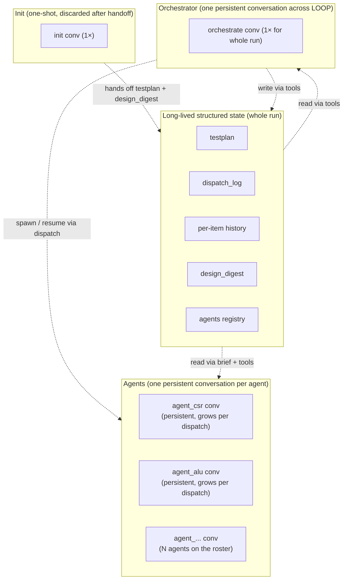
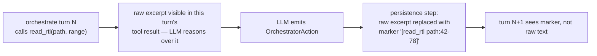
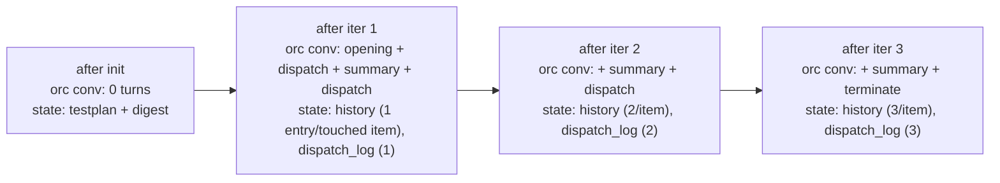
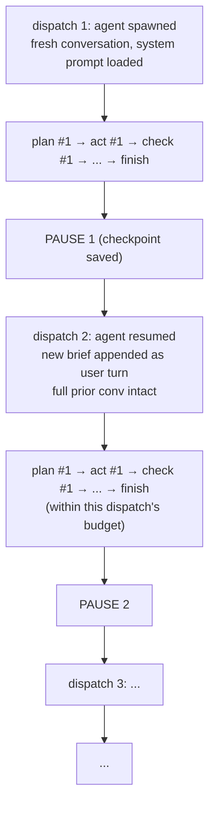

# Context — design reference

How conversations are structured across the workflow. Token cost, agent coherence, and replay all depend on this. Both the orchestrator and each generator agent run as persistent conversations across the whole run; init runs as its own short-lived conversation.

## TL;DR

Three conversation roles, three lifecycles:

- **Orchestrator** — one persistent conversation across the whole LOOP phase. The `orchestrate` node is re-entered every iteration; the system prompt and accumulated message history stay put. The orchestrator is *one continuous reasoning agent* (a project manager) that builds intuition about what's failing across iterations.
- **Init** — a separate short-lived conversation that builds the initial testplan and produces a `design_digest`, then hands off both. Init's heavy spec/RTL excerpts are deliberately walled off from the persistent contexts.
- **Agent (generator)** — **one persistent conversation per agent**, growing across all dispatches the agent receives. The agent is spawned at first dispatch and resumed on every subsequent dispatch to its scope; its `messages`, `work_dir`, and `coverage_history` all carry over. N agents on the roster = N persistent conversations.

Heavy reads (RTL, spec, sim logs) inside any persistent conversation are **transient** — visible to the LLM during the turn that called the read, then collapsed to a marker in persisted history so they do not bloat the running context.

## The conversation taxonomy



Three conversation kinds, each with a clear lifetime:
- **Init**: created at run start, discarded after `build_testplan` returns and `design_digest` is set.
- **Orchestrate**: created at first orchestrate entry (post-init), persists until run termination.
- **Agent**: created at agent spawn (first dispatch to a new `agent_id`), persists across all subsequent dispatches and idle periods, until the run ends.

## Why the orchestrator is one persistent conversation

Earlier drafts of this doc proposed fresh per-node conversations on the orchestrator side. That model traded LLM reasoning trace for bounded per-call cost — the wrong trade for this workflow. The current design wins three things by persisting:

1. **Reasoning trace transfer.** When a feature has been resistant across multiple iterations, the orchestrator sees its own prior reasoning verbatim — what hypotheses it tried, why they failed, what it suspected the underlying problem was. Reducing that to structured outcomes in `history` strips the *texture* that informs the next strategy.
2. **Coherent agent identity.** The orchestrator becomes a single DV engineer who has been there the whole run, not a series of fresh-eyes interns. This matters for the quality of late-iteration decisions, where intuition built on earlier observations dominates.
3. **Future human-in-the-loop.** Engineers will eventually want to ask the orchestrator questions ("why did you mark this blocked?", "try X instead") or steer it mid-run. That only works against a persistent conversational identity.

The cost — context grows across iterations — is bounded by the workflow shape (orchestrate turns are reasoning + structured output, not bulk content) and by the transient-read policy below. We will measure actual growth in practice before adding compaction.

## Init is separate — and stays separate

INIT is its own conversation for one reason: it does heavy spec/RTL reading to enumerate testpoints/covergroups/code_scopes. Pulling that raw content into the persistent orchestrator context would burn the conversation's token budget on bulk text the orchestrator can re-read on demand later anyway.

What init produces and hands off:

- **`testplan`** — written into state via `build_testplan`. The persistent orchestrator reads it via `read_summary` / `read_testplan`.
- **`design_digest`** — a 1-2k token concise summary of the design (top features, RTL hierarchy, known weak spots, coverage model overview). Loaded into the orchestrate conversation's opening user turn and stays there as the orchestrator's permanent design reference.

Init's raw spec/RTL excerpts never enter the orchestrator's persisted context. The orchestrator can call `read_rtl` / `read_spec_excerpt` at any time during the run; those reads are transient.

## Transient reads inside the orchestrate conversation

Mechanic for keeping the persistent conversation lean:



- During the turn: the LLM gets the full tool result and uses it to reason.
- After the turn: the persistence layer rewrites the tool result message to a small marker. The LLM's response (which presumably summarized or used what it needed) stays.
- Future turns: see the marker. If they need the content again, they call the read tool again.

This applies to `read_rtl` and `read_spec_excerpt` specifically — the high-bulk read tools. Small structured reads (`read_summary`, `read_history`, `read_dispatch_log`, `query_coverage`) are kept as-is; their payloads are bounded.

## What lives where

| Memory                      | Location                              | Lifetime                      |
|-----------------------------|---------------------------------------|-------------------------------|
| Testplan items + status     | `state.testplan`                      | Whole run                     |
| Per-item history            | inside testplan items                 | Whole run                     |
| Cross-iteration audit       | `state.dispatch_log`                  | Whole run                     |
| Design summary              | `state.design_digest`                 | Whole run                     |
| Agent registry              | `state.agents`                        | Whole run                     |
| Coverage snapshots          | sim DB + `state.cycle`                | Whole run / iteration         |
| **Orchestrator messages**   | `state.messages`                      | **Whole run (persistent)**    |
| **Agent messages**          | per-agent `AgentState.messages`       | **Whole run, per-agent (persistent)** |
| Per-attempt plan            | `state.cycle` scratch                 | One iteration                 |

Both the orchestrator and each agent maintain dual memory: structured state (testplan + dispatch_log + history + digest + registry on the orchestrator side; coverage_history + work_dir contents on the agent side) plus their persistent message history. Structured state records *what happened*; the conversation records *how the agent thought about it*. The two layer naturally and complement each other.

## Lifecycle: one full run

Walk-through for a 3-iteration functional run with 2 agents on the roster (one per feature: csr and alu), each dispatched once per iteration.

### Phase: INIT (1 conversation, discarded)

- **`init` conversation** — fresh. System: shared persona + workflow + tool-rules + init role. Tools: `read_rtl`, `read_spec_excerpt`, `query_coverage`, `build_testplan`. LLM reads spec/RTL, calls `build_testplan` once, emits `design_digest` as structured output. Conversation discarded; `testplan` and `design_digest` flow into orchestrator state.

### Phase: LOOP (1 persistent orchestrate conversation + N persistent agent conversations)

#### Iteration 1

- **`orchestrate` conv created (first entry)**
  - System: shared blocks + orchestrate role.
  - Opening user turn: `design_digest` + initial testplan summary + baseline coverage + empty agents registry.
  - LLM reasons. Decides to spawn two agents covering csr and alu features.
  - Emits `OrchestratorAction { kind: "dispatch", dispatch_plan: { dispatches: [{agent_id: "agent_csr_a3f1", scope_items: [t1,t2,t3], ...}, {agent_id: "agent_alu_b7e0", scope_items: [t4,t5], ...}] } }`.

- **`dispatch` (no LLM)** — both `agent_id`s are new → spawn. Creates `AgentMetadata` entries, initializes two new `AgentState` instances, opens two new persistent agent conversations.

- **Agent conv `agent_csr_a3f1` (created here, persists for the run)**
  - System (loaded once): shared blocks + agent persona keyed to feature_label="csr" and scope_items=[t1,t2,t3].
  - Opening user turn: dispatch 1 brief + baseline coverage.
  - Loops plan → act → check → plan → ... within the dispatch budget. Writes new test files in `agents/agent_csr_a3f1/work_dir/`.
  - On `finish`, emits `GeneratorReturn`. Conversation **paused** (checkpointed), not discarded.

- **Agent conv `agent_alu_b7e0`** — same pattern, parallel, isolated.

- **`update_state` (no LLM)**
  - `query_coverage`, applies routine patches/history, updates `agents` registry (both still `active`), appends `DispatchRecord`, posts summary turn into the orchestrate conversation:
    ```
    [iteration 1 summary]
    agent_csr_a3f1 (feature: csr): proposed complete on 3 testpoints; truth confirms 2, over-claimed 1. cov 38% → 47%.
    agent_alu_b7e0 (feature: alu): proposed blocked on 1 covergroup. cov 12% → 14%.
    Roster: 2 active agents.
    ```

#### Iteration 2

- **`orchestrate` conv re-entered (second turn, same conversation)**
  - Sees iter 1 summary, knows what each agent tried.
  - May `patch_testplan` to accept the alu agent's blocked claim, then emits new `DispatchPlan` referencing **the same agent_ids** to continue work.

- **Agent conv `agent_csr_a3f1` resumed (NOT recreated)**
  - LangGraph checkpointer loads its prior state: full message history, work_dir intact, coverage_history extended.
  - The new dispatch brief is appended to its existing conversation as a fresh user turn.
  - Agent loops with full memory: "I wrote tb_csr.sv last time and the constraint failed because of X; let me edit it differently this time." Editing — not rewriting — its own files.
  - On `finish`, conversation paused again.

- **Agent conv `agent_alu_b7e0` resumed** — same pattern.

- **`update_state` and `orchestrate`** — same as iter 1.

#### Iteration 3

- Same as iter 2. By now both agents have ~3 invocations of accumulated context. Their conversations are real reasoning artifacts.

- **Final `orchestrate` turn** — emits `OrchestratorAction { kind: "terminate", route_decision: { run_status: "done", ... } }`. Orchestrate conversation ends. All agent conversations are paused-and-preserved on disk (their checkpoints stay).

### Phase: FINALIZE

No LLM. Pure I/O. Serializes the orchestrate conversation and all agent conversations + checkpoints to their canonical paths under work-dir.md's layout.

### Conversation count for a 3-iteration run with 2 agents

| Type           | Count | Notes                                                   |
|----------------|-------|---------------------------------------------------------|
| `init`         | 1     | one-shot, discarded                                     |
| `orchestrate`  | 1     | persistent, 4 turns                                     |
| Agent          | 2     | persistent, each sees 3 dispatches → 3 invocation rounds in one growing conversation |
| **Total**      | **4** | conversations live across the run                       |

Compared to the prior design (one fresh generator conversation per dispatch = 6 generator conversations), the count drops from 8 to 4 and **every agent conversation is a coherent feature-narrative** rather than 3 isolated fragments.

## How context grows



Per orchestrate turn the conversation gains:
- A small set of read tool results (mostly structured, small).
- The LLM's reasoning + the structured `OrchestratorAction`.
- After the turn: any heavy reads collapsed to markers.

Per `update_state` injection the conversation gains:
- One structured summary message (a few hundred tokens).

The growth is roughly linear in iterations and bounded per-iteration. We will observe actual size in practice before deciding whether compaction is needed; compaction is **not** in this design.

## Agent conversation across dispatches

The agent's conversation grows in **two nested time scales**: within a single dispatch (plan → act → check inner loop), and across dispatches (the agent is resumed with a new brief each time the orchestrator dispatches to it).



**Within a dispatch** (plan / act / check inner loop):
- Message history is shared across the inner-loop nodes.
- System prompt is swapped at node entry to match the role (plan vs. act); the agent's persona block stays.
- Tool registration is swapped at node entry to match the role.
- `check` posts a tool-result-style summary turn ("coverage 40 → 42, plateau check passed, continue") so the next `plan` turn sees the loop state.

**Across dispatches**:
- The conversation is paused at `finish` and saved via the agent's checkpointer.
- On the next dispatch to the same `agent_id`, the conversation is loaded; the new brief is appended as a fresh user turn ("New dispatch: targeting items [t2, t5]. Goal: bin_set covering [bin_x, bin_y]. Instructions: try directed sequence approach this time").
- The agent's reasoning resumes with full prior context. It remembers the testbench it wrote, the bugs it hit, the design quirks it noticed.

Why agents get growing conversations across dispatches:
- **Reasoning trace is the highest-value memory.** The agent's prior thinking informs the next attempt better than reduced-to-outcomes structured history can.
- **Testbench coherence.** The agent edits files it wrote in prior dispatches; its conversation is the design notebook for that ongoing codebase.
- **Specialization.** The CSR agent develops a mental model of the CSR module across iterations. Restarting fresh wastes that.
- **Engineer mental model.** Engineers don't get amnesia between assignments; neither should agents.

### Heavy reads inside agents are also transient

Same policy as `orchestrate`: `read_rtl`, `read_spec_excerpt`, and `read_sim_log` results are visible to the LLM during the turn that called them, then collapsed to a marker in persisted history. **Sim logs in particular** can be large; this matters more for agents than for the orchestrator. Without this, an agent that runs 30 sims across its lifetime would carry the full text of all 30 logs in its persistent conversation.

The agent reasons over a sim log in the turn that fetched it, decides what to fix, then the log collapses to "[read_sim_log dispatch_003 — ran sim, identified constraint X failure]". Future re-reads cost a tool call, not permanent context.

## Implications for state messages fields

state.md defines `messages` on both `OrchestratorState` and `AgentState`. Under this context model:

- **`OrchestratorState.messages` is persistent across the whole run.** Created when `orchestrate` is first entered (post-init) and never reset. The init conversation does NOT use this field — init runs in its own conversation that lives outside `OrchestratorState.messages`.
- **`AgentState.messages` is persistent across the whole run, per agent.** Created at agent spawn and grows across every dispatch the agent receives. The system prompt is set once at spawn; subsequent dispatches append a new user turn with the new brief. Within a single dispatch, system prompts swap at inner node boundaries (plan vs. act), but the message history carries through.

## Token economics — rough estimates

| Conversation                | System prompt | Initial user context        | Per-invocation growth                  | Typical total (10-iter run, 3 agents avg.) |
|-----------------------------|---------------|-----------------------------|----------------------------------------|------------------------------|
| `init`                      | ~1k tok       | spec/RTL (5-20k)            | n/a (single shot)                      | 10-30k                       |
| `orchestrate` (whole run)   | ~1.5k tok     | digest + summary (~2k)      | ~1-3k per iter (after transient collapse) | ~12-35k for 10 iters      |
| Agent (each, whole run)     | ~1.5k tok     | brief (1-3k)                | ~5-15k per dispatch (after transient collapse) | ~30-150k per agent over many invocations |

Two consequences:

1. **Per-iteration orchestrator cost is bounded.** Routine reads stay structured-and-small; heavy reads are transient. Linear growth in iterations.
2. **Per-agent cost grows with invocation count.** This is where the cost shifts under the persistent-agent model. An agent invoked 10 times accumulates more context than 10 fresh agents would individually — but it also reasons better. The trade is intentional. We do not pre-add compaction on the agent side either; we measure first.

Prompt caching helps the constant parts of every prompt (persona, workflow, tool-rules, design_digest in orchestrate, agent-identity blocks in agents). Those are eligible for cache hits across nearly every call. For agents specifically, the *prior conversation prefix* on an agent's resume is also cached — so the marginal cost of resuming an agent vs. starting fresh is one new user turn + the new turn's tool calls, not the full prefix re-uploaded uncached.

**Why this design's cost still beats the prior fresh-generator model in practice**: a fresh generator pays for re-reading everything it needs each dispatch (history, RTL excerpts, deciding-what-to-do-from-scratch reasoning). A persistent agent pays for accumulated context but skips the re-derivation. With caching, persistent context is mostly cache hits; re-derivation is always full-cost.

## Replay and debugging

- The persistent orchestrate conversation is itself the run log on the management side. Reading it start-to-end is like reading a project manager's notebook.
- Each agent's persistent conversation is itself the per-feature lab notebook. Reading `agents/agent_csr_a3f1/conversation.jsonl` start-to-end gives a complete account of how CSR coverage was approached over the run.
- We do not need formal mid-run checkpoint replay yet. The conversation history sent to each LLM call already gives full context. Forking a run from iteration N is a future concern.

## Trade-offs we accepted

- **Both orchestrator and agent conversations grow across the run.** No compaction yet — we will measure first. If runs in practice push past comfortable token budgets (most likely on agents that get invoked many times), we add compaction (e.g., periodic summarization of older invocation turns within an agent's conversation), but speculative addition would over-design for unknown growth.
- **Heavy reads need transient handling everywhere.** Small protocol cost: tool result rewriting at message persistence applies in orchestrate, in init, and in every agent. Without this, sim logs and RTL excerpts would accumulate permanently.
- **System-prompt swap mid-conversation (agent side, between plan/act/check) is non-standard.** Most LangGraph examples use one fixed system prompt per agent run. We do this deliberately because plan and act are tactical phases of the same agent's work. Fallback if it confuses the LLM in practice: inject role-switch markers as user turns instead.
- **Replay-from-mid-dispatch is more involved.** With persistent agents, reproducing dispatch 5 of `agent_csr_a3f1` in isolation requires loading the agent's checkpoint as-of-end-of-dispatch-4. Acceptable; the checkpointer makes this reasonable, just not a one-liner.
- **Per-agent conversation can grow large for heavily-used agents.** A central feature dispatched 30 times accumulates substantial context. Caching mitigates cost; worst-case growth is the thing we monitor and add compaction for if needed.

## What this design buys us

- **Continuous orchestrator reasoning** across the run — the manager builds intuition rather than rebuilding strategy every loop.
- **Continuous agent reasoning** within each feature — engineers build expertise rather than restarting per dispatch.
- **Coherent agent identities** for future human-in-the-loop interaction at both levels (talk to the manager about the run; talk to a specific agent about its feature).
- **Strict separation of init's heavy reads** from the orchestrator's running context, via the design_digest handoff.
- **Per-feature lab notebooks on disk** — each agent's conversation is independently readable as the narrative for its scope.
- **Bounded, predictable per-call growth** through transient reads + structured summary turns from `update_state`.
- **The conversations ARE the logs** — debugging the run means reading continuous narratives, not stitching together fragments.
