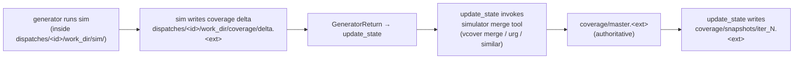

# Coverage merging — design reference

How coverage data flows from per-dispatch sim runs into the authoritative master DB the orchestrator queries. Three principles fix this layer: simulator-native merging (no LLM-parsed reports), three-layer separation of truth/cache/delta, and a single chokepoint for merges (`update_state`).

## The three layers

From testplanning.md, restated for context:

| Layer            | What                                       | Authority              | Lifetime     |
|------------------|--------------------------------------------|------------------------|--------------|
| **Ground truth** | Master coverage DB written by simulator    | yes — sole source      | whole run    |
| **Testplan cache** | `coverage` blocks on testplan items      | last-observed snapshot | whole run    |
| **Per-task delta** | Generator's local coverage from one sim  | dispatch only          | one dispatch |

**Critical rule:** `query_coverage` reads from ground truth (the master DB). Testplan cache values are convenient summaries; they are never the basis for a status decision. Per-task deltas are inputs to the merge, never queryable directly.

## Flow per dispatch



Step-by-step:

1. Generator's `run_sim` produces a per-dispatch delta DB at `dispatches/<id>/work_dir/coverage/delta.<ext>`. The simulator writes this directly; no parsing.
2. Generator returns. `update_state` collects all dispatch deltas from this iteration's batch.
3. `update_state` invokes the simulator's merge tool to fold each delta into `coverage/master.<ext>`. Merges are serialized — one delta at a time, in dispatch_id order. The master DB is the single mutable file at this layer.
4. After merging the batch, `update_state` calls `query_coverage` against the master to compute per-item coverage values for the testplan cache patches and to detect over-claims by generators.
5. `update_state` writes a snapshot of the master DB (`coverage/snapshots/iter_<N>.<ext>`) for delta computation in future iterations and for plateau detection.

## Why merge in `update_state`, not on demand

Merging is expensive (seconds to minutes per merge for large designs). Two options were considered:

- **Lazy:** merge only when `query_coverage` is called.
- **Eager:** merge in `update_state` after every iteration.

We chose eager because:
- `query_coverage` is called many times per `update_state` (one per touched item) and from `orchestrate` ad-hoc. Lazy would either re-merge or invalidate after every patch, both wasteful.
- The natural batching point — "all generators in this iteration have returned" — is exactly where `update_state` sits.
- Failures in the merge are localized to `update_state`, with the generators' deltas preserved on disk for replay if needed.

Trade-off accepted: one merge per iteration, even if downstream `query_coverage` calls are few.

## query_coverage semantics

Single tool, mode-aware. Returns structured numbers; never LLM-parsed text.

```python
def query_coverage(scope: str, mode: Literal["functional", "code"]) -> ToolResult:
    """
    scope: hierarchical name — covergroup name (functional), RTL scope (code),
           or "*" for global.
    mode:  functional or code.

    Returns ToolResult.data shaped like:
      functional:
        { "name": "csr_cg", "pct": 72.5, "items_hit": 145, "items_total": 200,
          "unhit_items": ["bin_x", ...], "snapshot_at": "<iso8601>" }
      code:
        { "name": "alu/...", "line_pct": ..., "branch_pct": ...,
          "toggle_pct": ..., "unhit_lines": [...], "snapshot_at": "..." }
    """
```

Implementation calls the simulator's report tool against `coverage/master.<ext>` and parses the **structured machine-readable output** (typically XML/JSON from the simulator), not the human-readable text report. The parsing layer is a single typed adapter per simulator backend.

`unhit_items` / `unhit_lines` are truncated to a configurable limit (default 50) to keep the tool result bounded. The full list is computable on demand if a generator needs it for `bin_set` goal types.

## Merge failures

The simulator's merge tool can fail for real reasons (UCDB version mismatch, incompatible covergroup signatures from RTL changes mid-run). Handling:

- **Per-dispatch merge fails** → record the failure on the dispatch's `DispatchRecord` and `update_state`'s summary turn. The dispatch's *delta* is preserved on disk; the master DB is untouched (atomic merge, then commit). The orchestrator sees the failure and decides whether to mark the items blocked or accept the dispatch's claim cautiously without coverage truth.
- **Master DB corrupted** (rare) → run goes to `errored`. The run's deltas are still on disk; manual recovery is to re-merge from baseline.

These failures are infrequent in practice but must be loud, not silent — silent merge skips would let the orchestrator reason against a stale master.

## Snapshots and plateau detection

A snapshot is a copy of the master DB at the end of an iteration: `coverage/snapshots/iter_<N>.<ext>`. Used for two things:

1. **Plateau detection in generators.** A generator's `check` node compares its own delta-from-baseline (where baseline is the snapshot at dispatch start) against the plateau threshold. The snapshot at dispatch start is `coverage/snapshots/iter_<N-1>.<ext>` (or `baseline.<ext>` for iteration 1).
2. **Iteration-over-iteration delta visualization** for the final summary and for any future progress dashboards.

Snapshots are simulator-native copies (a file copy of the DB), not derived JSON. Cheap.

The `coverage_snapshot` field in `CycleScratch` (state.md) holds a small JSON projection of the global percentages — used by the LLM in the `update_state` summary turn so the orchestrator sees "coverage went 38% → 47%" without paying the full DB cost in context. The DB itself is the source; the JSON is a teaser.

## Functional vs code mode

The pipeline is identical. The differences are in the simulator commands and in what `query_coverage` returns.

| Aspect            | Functional                              | Code                                |
|-------------------|-----------------------------------------|-------------------------------------|
| What sim records  | covergroup hits, coverpoint bins        | line, branch, toggle, FSM, expr     |
| Merge tool        | `vcover merge` / `urg` / similar        | same — simulators merge both kinds together |
| `query_coverage`  | covergroup-shaped result                | scope-shaped result                 |
| Targets           | per-covergroup pct                      | per-scope multi-metric (line/branch/...) |

Per testplanning.md, runs are single-mode. The mode is fixed in `RunConfig` and propagates into the merge invocation flags and the `query_coverage` adapter.

## Coverage targets

Targets live in `RunConfig.coverage_target` (state.md):

```python
coverage_target = {
    "functional": 100,                      # required pct for all covergroups
    "code": {                               # mode-specific multi-metric
        "line": 95, "toggle": 90, "branch": 95, "fsm": 100
    }
}
```

`decide`-equivalent logic in `orchestrate` checks the master DB via `query_coverage(scope="*", mode=...)` against these thresholds when reasoning about termination. Per-item targets live in the testplan (e.g., `coverage.target_pct` overrides on a covergroup with known unreachable bins) but those are exceptions, not the norm — most overrides should become waivers (per testplanning.md).

## Tool boundary recap

- `query_coverage` — LLM-callable, reads master DB. Used by orchestrate, gen plan, gen check.
- `merge_coverage` (internal Python utility) — called only from `update_state`. Not LLM-callable. Wraps the simulator's merge command.
- `take_snapshot` (internal) — `update_state` after merge. Trivial: copy master to snapshot path.

This separation is deliberate. LLMs query; merging is mechanism.

## What this design buys us

- **Simulator-native merging** — no parsing of report text, no hallucinated numbers. The biggest LLM failure mode in this domain is structurally impossible.
- **Single chokepoint (`update_state`)** for all mutations of the master DB — concurrency-safe by topology.
- **Per-dispatch deltas preserved on disk** — debuggable, reproducible, recoverable.
- **Snapshots at iteration boundaries** — feed plateau detection without extra sim work.
- **`query_coverage` as the only LLM-facing surface** — keeps the API small and prevents drift.
