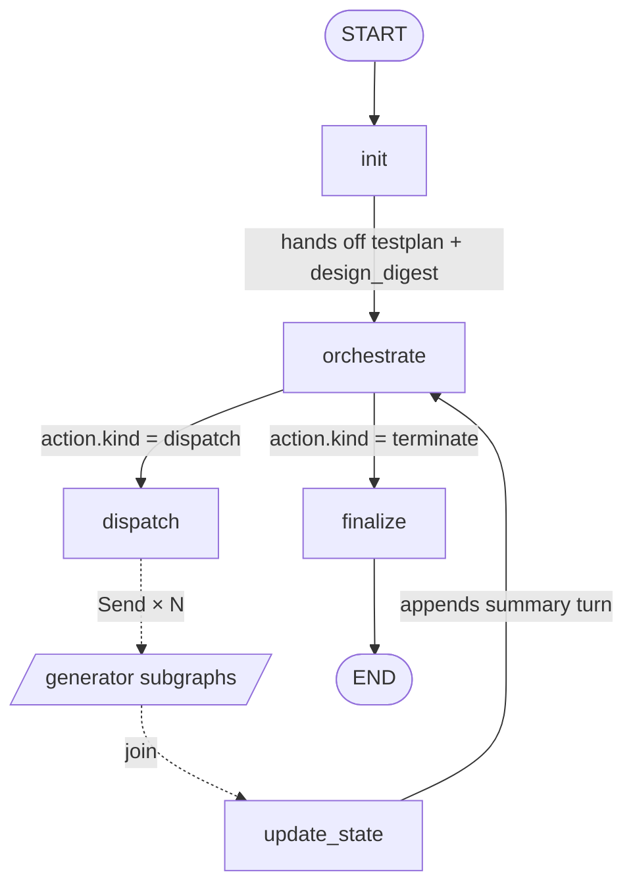
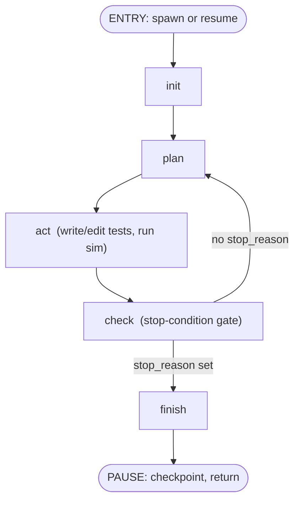

# Graph — design reference

LangGraph topology for the orc-gen workflow. The graph defines control flow over the state defined in state.md and uses the tools from testplanning.md (testplan management) plus the broader tool set (later doc). This doc fixes node decomposition, edges, the dispatch/join pattern, and the orchestrator/generator boundary.

## Top-level shape

Three phases, in order:

```
INIT  →  LOOP  →  FINALIZE
```

- **INIT** runs once: read spec/RTL, build the initial testplan, produce a design digest, take a baseline coverage snapshot. INIT runs as its own short-lived conversation that hands off the testplan + digest to the orchestrator.
- **LOOP** is the iterative cycle: a single persistent `orchestrate` LLM node, dispatch, generators, and a deterministic `update_state` merge. The orchestrate conversation persists across every iteration of the loop — see context.md.
- **FINALIZE** runs once: write the final testplan, emit summary, close out logs.

Three phases (not one big loop) because INIT and FINALIZE have different prompts, different tool surfaces, and run exactly once — folding them into the loop adds conditional branches that buy nothing. INIT is also separated from `orchestrate` because its conversation pulls heavy spec/RTL excerpts that we deliberately do not want polluting the orchestrator's persistent context.

## Orchestrator graph



### Node responsibilities

- **`init`** — load spec, RTL hierarchy, sim config; construct initial `Testplan` (testpoints + covergroups for functional, code_scopes for code); produce a concise `design_digest` (~1-2k tokens summarizing features, RTL structure, known weak spots); snapshot baseline coverage. ReAct loop with read-only filesystem tools and a single `build_testplan` write. Runs in its own conversation that is discarded at handoff — the heavy spec/RTL reads stay here and do not pollute the persistent orchestrator context.
- **`orchestrate`** — the orchestrator's single persistent LLM node. Sees the running conversation history, the design_digest (loaded once at first entry), and the most recent `update_state` summary turn. Reasons about progress, may call read tools (`read_testplan`, `read_summary`, `read_history`, `read_dispatch_log`, `query_coverage`, `read_rtl`/`read_spec_excerpt` on demand), may apply judgment-driven testplan changes (`patch_testplan`, `append_history` for blocking/waivers/instruction additions), and emits a structured `OrchestratorAction` to route the graph. Conversation persists from first entry (post-init) until the run terminates.
- **`dispatch`** — pure function. Convert each brief in `OrchestratorAction.dispatch_plan` to a `Send` targeting the agent subgraph. For each brief: if `agent_id` is new, **spawn** (create `AgentMetadata` entry, initialize `AgentState`, set agent's persistent work_dir); if `agent_id` exists, **resume** (load `AgentState` from checkpoint, append brief as user turn into the persistent conversation). Validates that no `agent_id` appears twice in the same plan (concurrency constraint). Sets `cycle.in_flight`. No LLM.
- **`update_state`** — deterministic merge. For each `GeneratorReturn` in `cycle.pending_results`: call `query_coverage` on touched items, compare proposals to truth, apply `patch_testplan` and `append_history` for routine cases (claim agrees → flip status; claim over-reaches → keep status, note the gap; proposal=blocked → leave status, record claim for orchestrator's judgment), update `AgentMetadata.status` (e.g., flip to `idle` when all `scope_items` are complete), append a `DispatchRecord`, and post a structured summary message into the persistent orchestrate conversation as a "tool-result" style turn. No LLM.
- **`finalize`** — write final testplan to disk, emit run summary, flush logs. No LLM.

### Edges

- `START → init`
- `init → orchestrate` (with handoff payload: testplan written into state, `design_digest` set)
- `orchestrate → dispatch` **or** `orchestrate → finalize` — conditional edge keyed on `OrchestratorAction.kind`
- `dispatch → [generator subgraph(s) via Send] → update_state` (LangGraph join semantics)
- `update_state → orchestrate` (loop continuation; appends a summary turn to orchestrate's persistent conversation before re-entry)
- `finalize → END`

## Agent subgraph (persistent)

Each agent is a compiled LangGraph subgraph with its own checkpointer keyed by `agent_id`. State persists across dispatches; the conversation grows; the work_dir accumulates files. Spawn creates the agent and runs the first invocation; subsequent dispatches resume the agent from checkpoint.



### Node responsibilities

- **`init`** — runs differently based on entry type:
  - **Spawn (first invocation)**: materialize `work_dir`, set `feature_label` and `scope_items` (immutable), seed `messages` with system prompt + the first dispatch brief as opening user turn, record `coverage_baseline`.
  - **Resume**: append the new dispatch brief as a user turn into the existing `messages`, refresh `coverage_baseline` from current global coverage, reset per-invocation fields (`attempt`, `stop_reason`, `proposed_status` for the current invocation).
- **`plan`** — LLM decides next test to write/modify based on the new brief, agent's prior conversation, and last coverage delta. ReAct loop with read tools (`read_rtl`, `read_spec_excerpt`, `query_coverage`).
- **`act`** — apply file changes and run sim. Tool surface: `write_file`, `edit_file`, `run_sim`, `read_sim_log`. Executed within a ReAct loop. `write_file` is used for the first drop of a new test; `edit_file` for surgical patches on subsequent attempts (see tools.md). Files persist in the agent's work_dir across all invocations — by invocation 5 the agent is editing testbenches it wrote in invocation 1.
- **`check`** — deterministic gate. Run `query_coverage`, append to `coverage_history`, evaluate stop conditions in priority order from testplanning.md (budget → goal → plateau → error). Sets `stop_reason` if any fires.
- **`finish`** — populate `proposed_status` for items touched in this invocation and `report`. Returns structured `GeneratorReturn` to the orchestrator. **Does not discard state** — the subgraph checkpointer saves `AgentState` (including the grown `messages`) so the next invocation can resume.

### Edges

- `ENTRY → init → plan → act → check`
- `check → plan` (loop, if no stop_reason) **or** `check → finish` (exit, if stop_reason set)
- `finish → PAUSE` (checkpoint and return; the agent will be resumed on a future dispatch)

### Why explicit nodes, not one ReAct agent

Stop conditions are deterministic and adversarial to "the LLM decides when to stop" — it will under- or over-shoot. Pulling `check` into its own node makes budget/plateau/goal evaluation mechanical and inspectable. The LLM stays in `plan` and `act` where its judgment helps; it does not vote on whether to stop.

## Persistent subgraph (with checkpointer)

Agents are compiled as full LangGraph subgraphs invoked via `Send`, with a checkpointer keyed by `agent_id` so state survives between Sends. They are **not** discarded after each return.

Why this shape:
- Native parallel fan-out via `Send` — the framework handles scheduling and join across multiple agents in the same iteration.
- Per-agent checkpointing is a first-class LangGraph primitive: pause at `finish`, resume from `init` on the next dispatch with state intact.
- Independent message streams per agent — keeps orchestrator's `messages` clean and gives us per-agent streaming for observability (logging.md).
- Each agent is independently inspectable: load its checkpoint and you have the full history of its work on its feature.

**Concurrency constraint**: the `dispatch` node validates that no `agent_id` appears twice in a single `DispatchPlan`. Parallel dispatch across *different* agents is safe and intended; double-dispatch to the same agent in one iteration is rejected with an error that bubbles back to `orchestrate` for re-planning.

## Send / join semantics

- `dispatch` returns `[Send("agent", brief_i) for brief_i in plan]`. LangGraph routes each to the correct agent subgraph instance (keyed by `agent_id`); spawns are created on first reference, resumes load from the agent's checkpoint. Schedules in parallel up to `config.budgets.max_parallel`.
- Each agent's `PAUSE` (post-finish return) flows into `cycle.pending_results` via a list-append reducer. The agent's state remains checkpointed; only the structured `GeneratorReturn` flows into the orchestrator state.
- `update_state` runs once **after all** agents in the batch return — LangGraph's default join behavior. We do not interleave merges with partial returns; merging against a partial batch makes the testplan flicker and breaks the post-iteration summary turn that orchestrate consumes.

If an agent crashes (uncaught exception), the framework returns an error sentinel into `pending_results`. The agent's checkpoint is preserved at the last completed node, so a future re-dispatch can resume from there. `update_state` records the failure as a partial dispatch and the affected items stay in their prior status. The orchestrate LLM sees the failure in the next summary turn and decides whether to retry.

## Conditional routing

Two conditional edges, both LangGraph `Conditional`:

1. `orchestrate → dispatch | finalize` — keyed on `OrchestratorAction.kind`. `dispatch` means the LLM emitted a `DispatchPlan` and the loop continues; `terminate` means it emitted a `RouteDecision` (`done` / `blocked` / `errored`) and the run exits.
2. `check → plan | finish` (within generator) — keyed on `stop_reason` being set.

Everything else is a static edge. Keeping conditionals to two well-defined points makes the graph easy to reason about and trace.

## Where the orchestrator's iteration counter lives

`iteration` is incremented exactly once per loop, at the moment `orchestrate` emits a `DispatchPlan`-flavored `OrchestratorAction` (i.e., when transitioning from `orchestrate` to `dispatch`). Equivalently: iteration N is the Nth dispatch round. The very first `orchestrate` entry — post-init, before any dispatch — is iteration 0 in progress; the moment it dispatches, iteration becomes 1.

`dispatch_log` entries record the iteration in which the dispatch was decided, matching how a human would describe "what the orchestrator tried in round 3".

## Phase boundaries map to lifecycle

The state lifecycle from state.md maps cleanly:

| Lifecycle step                     | Graph node              |
|------------------------------------|-------------------------|
| Build initial testplan + digest    | `init`                  |
| Reason, plan, or terminate         | `orchestrate`           |
| Dispatch in parallel               | `dispatch`              |
| Collect results                    | join (auto)             |
| Merge generator returns into state | `update_state`          |
| Final write-out                    | `finalize`              |

This is the contract: if a future change splits or merges nodes, the lifecycle list in state.md must move with it.

## What this design buys us

- **Phase split (INIT/LOOP/FINALIZE)** keeps single-shot setup/teardown out of conditional branches; INIT separation also protects orchestrate's persistent context from heavy spec/RTL reads.
- **Single persistent `orchestrate` LLM node** preserves reasoning trace across iterations — the orchestrator builds intuition about what's failing instead of rebuilding strategy from structured state every loop. See context.md for the full conversation model.
- **Persistent agent subgraphs** mean each generator accumulates expertise on its feature — testbench coherence, prior-attempt context, and design familiarity carry across dispatches. Manager-and-engineers, not manager-and-temps.
- **Deterministic `update_state` merge** isolates the routine "compare proposal to truth, patch accordingly" mechanics from LLM judgment, and produces a structured summary turn that feeds the orchestrate conversation cleanly.
- **Per-agent checkpointing** is the LangGraph primitive that makes persistence work — pause at `finish`, resume from a fresh `init` on the next dispatch with full state intact.
- **Deterministic `check` node inside agents** keeps the stop-condition contract from testplanning.md enforceable, not LLM-negotiable.
- **Two conditional edges, everything else static** keeps the graph trace readable and the failure modes few.
