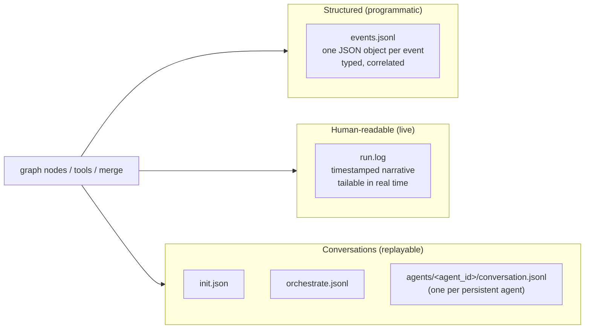

# Logging — design reference

Observability for the orc-gen workflow. Three streams, each with a clear consumer: a structured event log for programmatic post-run analysis, a human-readable run log for live tailing and quick inspection, and the conversation transcripts (already specified in work-dir.md and context.md). Together they make every run debuggable end-to-end without re-execution.

## Three streams



- **`events.jsonl`** — one JSON event per line. Append-only. The authoritative machine-readable record. Path: `<run>/logs/events.jsonl`.
- **`run.log`** — human-readable timeline, tailable while the run is in progress. Path: `<run>/logs/run.log`.
- **Conversations** — separate per-conversation files. The orchestrator's lives at `<run>/conversations/orchestrate.jsonl`; each agent's lives at `<run>/agents/<agent_id>/conversation.jsonl` (per work-dir.md). Owned by the LLM nodes themselves, not the logging subsystem. Both the orchestrator's and each agent's persistent conversation ARE primary log artifacts — events and run.log complement them, not duplicate them.

We deliberately do not collapse these into one stream. Programmatic post-run analysis wants typed events; an engineer watching a live run wants prose; replay wants verbatim conversation. Each consumer reads what fits.

## Event schema

Every event:

```python
class Event(TypedDict):
    timestamp: str                # ISO 8601 with millisecond precision
    run_id: str                   # from work-dir.md naming
    iteration: int | None         # orchestrator iteration, when applicable
    node: str | None              # graph node name when emitted from a node
    agent_id: str | None          # set when emitted from inside an agent subgraph or about an agent
    dispatch_id: str | None       # set when emitted from a specific dispatch's lifecycle
    kind: str                     # one of the categories below
    payload: dict                 # kind-specific structured data
```

Correlation IDs let any event be traced to its dispatch, iteration, and run without joining external sources. `kind` is a flat string namespace, dotted (`tool.called`, `coverage.merged`) — easy to filter with `jq` or grep.

## Event kinds

Grouped for readability; the wire format is one flat namespace.

### Run lifecycle
- `run.started` — payload: `{ config, workspace, run_id }`. First event in the file.
- `run.ended` — payload: `{ run_status, iterations, total_dispatches, wall_time_s }`. Last event.

### Graph node transitions
- `node.entered` — payload: `{ node, iteration }`.
- `node.exited` — payload: `{ node, iteration, duration_s, summary?: str }`.

Emitted automatically by a thin LangGraph stream-event tap. Every node enter/exit produces these without per-node instrumentation.

### LLM tool calls
- `tool.called` — payload: `{ tool_name, args, conversation: "init"|"orchestrate"|"agent:<agent_id>" }`. Emitted before the call.
- `tool.returned` — payload: `{ tool_name, ok, summary, error?, duration_s }`. Emitted after. **`data` is intentionally not logged** in events.jsonl — the structured payload from large reads (`read_rtl` excerpts, `read_testplan` full plans) would dominate the file. The conversation transcript has the full data; events keep the summary for filtering.

### Agent lifecycle
- `agent.spawned` — payload: `{ agent_id, feature_label, scope_items, work_dir, spawned_at_iteration }`. Emitted by `dispatch` node when a new `agent_id` is encountered.
- `agent.invoked` — payload: `{ agent_id, dispatch_id, brief_summary, attempt_budget }`. Emitted by `dispatch` node when an existing agent is resumed.
- `agent.signed_off` — payload: `{ agent_id, reason }`. Emitted by `update_state` when all of an agent's `scope_items` reach `complete` status; the agent moves to `idle`.
- `agent.retired` — payload: `{ agent_id, reason }`. Emitted when the orchestrator explicitly stands an agent down (rare; `idle` is the default).
- `agent.errored` — payload: `{ agent_id, dispatch_id, error }`. Emitted when an agent's subgraph crashes during a dispatch.

### Dispatch lifecycle
- `dispatch.scheduled` — payload: `{ dispatch_id, agent_id, feature_label, item_names, brief_path }`. Emitted by `dispatch` node per Send.
- `dispatch.completed` — payload: `{ dispatch_id, agent_id, stop_reason, return_path, wall_time_s }`. Emitted when an agent pauses post-finish.
- `dispatch.merge_failed` — payload: `{ dispatch_id, agent_id, error }`. Emitted by `update_state` if simulator merge fails for this dispatch.

### Coverage events
- `coverage.snapshot_taken` — payload: `{ path, iteration, summary: { mode-specific pct values } }`.
- `coverage.merged` — payload: `{ dispatch_id, master_path, delta_path, duration_s }`.
- `coverage.queried` — payload: `{ scope, mode, result_summary }`. Lightweight; emitted on every `query_coverage`. Cheap because the result is already structured.

### Testplan changes
- `testplan.patched` — payload: `{ target_type, name, fields_changed, by: "orchestrate"|"update_state" }`. One event per `patch_testplan` call.
- `testplan.history_appended` — payload: `{ target_type, name, outcome, agent_id }`.
- `testplan.snapshot_written` — payload: `{ path, iteration }`. Emitted by `update_state`.

### Errors and warnings
- `error.raised` — payload: `{ where, message, exception_type, traceback }`. Anything uncaught.
- `warning.raised` — payload: `{ where, message }`. For non-fatal anomalies (over-claim by generator, plateau detected, slow merge, etc).

## run.log format

Human-readable. One line per significant event, timestamped, indented to convey nesting. Designed to be `tail -f`-able.

```
2026-04-26 14:03:11.421  run.started  run_20260426-140311_a1b2c3
2026-04-26 14:03:12.108  init: building testplan (mode=functional)
2026-04-26 14:04:02.331  init: testplan ready — 12 testpoints, 8 covergroups; design_digest written
2026-04-26 14:04:02.412  orchestrate: iter 1 — 2 dispatches (2 spawns)
2026-04-26 14:04:02.418    spawn  agent_csr_a3f1   feature=csr  scope=[t1,t2,t3]
2026-04-26 14:04:02.420      dispatch_001_1  budget=5
2026-04-26 14:04:02.422    spawn  agent_alu_b7e0   feature=alu  scope=[t4,t5]
2026-04-26 14:04:02.425      dispatch_001_2  budget=5
2026-04-26 14:09:18.901      dispatch_001_1  completed  stop=goal     cov 0% → 38%
2026-04-26 14:11:42.117      dispatch_001_2  completed  stop=plateau  cov 0% → 14%
2026-04-26 14:11:43.005  update_state: merged 2 deltas into master in 0.7s
2026-04-26 14:11:43.018  update_state: testplan patched — 2 complete, 1 over-claim noted
2026-04-26 14:11:43.020  update_state: roster — 2 active agents
2026-04-26 14:11:43.022  orchestrate: iter 2 — 2 dispatches (2 resumes)
2026-04-26 14:11:43.024    resume  agent_csr_a3f1   dispatch_002_1  budget=5
2026-04-26 14:11:43.026    resume  agent_alu_b7e0   dispatch_002_2  budget=5
...
```

The spawn vs. resume distinction is surfaced explicitly so a reader of the timeline immediately sees roster changes vs. continuing work.

Generated by a single formatter that consumes the same event stream — events.jsonl is canonical, run.log is rendered from it. Same source of truth; two formats.

## Where logging hooks in

Three integration points cover everything:

1. **LangGraph stream events** → `node.entered` / `node.exited`. A single tap on the compiled graph emits these. No per-node code.
2. **Tool call wrapper** → `tool.called` / `tool.returned`. All LLM-callable tools are registered through a thin wrapper that emits these around the call. Internal Python utilities (`merge_coverage`, `take_snapshot`) emit coverage events directly.
3. **Explicit emits** for testplan changes, dispatch lifecycle, and errors/warnings. Called from the relevant graph nodes; small, targeted.

This avoids logging-by-monkey-patch and keeps the integration surface small.

## What is NOT logged in events.jsonl

- **Full LLM message bodies** — those are in conversations/. Linking via `conversation` field on `tool.called` is enough.
- **Tool result `data` payloads for bulk reads** — see above.
- **Raw RTL/spec excerpts** — same reason.
- **Coverage DB binary blobs** — events log paths, not contents.

The principle: events.jsonl should remain readable end-to-end (`cat`-able, `jq`-filterable) for any reasonable run. Bulk content goes to side-car files referenced by path.

## Levels and filtering

No traditional log levels (DEBUG/INFO/WARN/ERROR). The `kind` namespace replaces them — filtering by kind prefix is more useful than by severity for this workflow:
- `error.*` and `warning.*` for anomalies.
- `tool.*` for LLM behavior debugging.
- `coverage.*` for the coverage subsystem.
- `node.*` for graph topology debugging.

Engineers filter with `jq`, not by configuring log levels.

## Concurrency

- `events.jsonl` writes are line-oriented; concurrent writers (parallel generators emitting `tool.called`) append safely if each write is one full line. The logging subsystem buffers per-line and flushes atomically.
- `run.log` is rendered from `events.jsonl` — either live (a tail process renders as events arrive) or post-hoc. We default to live rendering for tail-ability.

## Retention

Same as work directories (work-dir.md): nothing auto-deleted. Logs persist as long as the run dir does. Compression (gzip of `events.jsonl`) is a future concern; raw JSONL is fine for runs we expect to debug.

## Privacy / external systems

- Logs stay local. No telemetry, no remote sinks.
- Spec/RTL content does not appear in event payloads (only paths). If the spec is sensitive, the run dir inherits the workspace's filesystem permissions.
- Conversation transcripts may contain spec/RTL excerpts (per context.md, transient reads ARE briefly visible in the LLM's view). Those live in `conversations/` and follow the same filesystem-permission model.

## What this design buys us

- **Two complementary streams** (events + run.log) cover programmatic and human consumers without doubling instrumentation.
- **Conversations as separate artifacts** keep events.jsonl small and focused on cross-cutting signals.
- **Correlation IDs everywhere** make any event traceable to its dispatch, iteration, and run.
- **Three small integration points** (graph stream tap, tool wrapper, explicit emits) cover all logging without scattering instrumentation across the codebase.
- **Same source of truth** — events.jsonl renders into run.log on the fly; we never maintain two parallel formats by hand.
