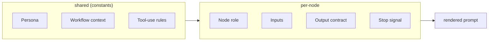

# Prompts — design reference

LLM-facing prompts for each node that runs an LLM. Prompts are the contract between graph topology / tool surface and LLM behavior — they encode role, objective, and the rules that keep behavior bounded. This doc fixes the prompt structure, per-node responsibilities, output contracts, and storage/versioning approach.

## Which nodes have prompts

Only nodes that invoke an LLM. Pure-mechanism nodes have no prompt at all.

| Has prompt? | Nodes                                                                              |
|-------------|------------------------------------------------------------------------------------|
| Yes         | orchestrator: `init`, `orchestrate`. agent: `plan`, `act`                          |
| No          | orchestrator: `dispatch`, `update_state`, `finalize`. agent: `init`, `check`, `finish` |

`update_state`, `dispatch`, and `finalize` are pure mechanism / I/O. `finish` is structured-output-only (a serialization of accumulated state, no judgment). `check` is deterministic stop-condition evaluation. Adding a prompt to any of these would be either dead text or an invitation for LLM judgment we explicitly do not want.

`orchestrate` is the persistent orchestrator — its prompt is loaded once at first entry, the system message stays put, and the conversation grows across the entire LOOP phase.

**Agent prompts are also persistent.** Each agent's system prompt is loaded once at spawn and stays put across all subsequent dispatches; the agent's conversation grows across invocations. See context.md for how all the conversations are engineered.

## Prompt structure

Every node prompt is assembled from layered sections:



Layering keeps rule changes localized — tightening the coverage-extraction rule edits one shared file, not six prompts.

## Persona (shared)

```
You are an expert design verification (DV) engineer working in a coverage-driven
verification workflow. You write SystemVerilog testbenches, reason about hardware
behavior, and use simulator and coverage tooling to make measurable progress.
You operate autonomously within tightly-scoped tasks and respect structured
authority: the orchestrator decides what to verify; the testplan records ground
truth.
```

Short on purpose. Long personas produce verbose outputs. The signals that matter are domain (DV), seniority (expert), and authority model (autonomous within scope).

## Workflow context (shared)

A 6-8 line summary of the orc-gen loop: what the orchestrator does, what generators do, where the testplan and coverage DB sit, and where this LLM call sits in the pipeline. Generated from a single source so testplanning.md / graph.md and the prompts can't drift.

## Tool-use rules (shared)

```
- Coverage numbers come ONLY from query_coverage. Never extract them from sim
  logs, reports, or any free text. Hallucinated coverage is the worst failure
  mode in this system.
- Always check tool result `ok` before acting on `data`. Tool errors are signals
  to retry differently, not to be ignored.
- Keep tool arguments minimal — pass paths, names, and IDs from the inputs you
  were given, not from memory.
- Do not invent tool names or fields. If a field does not appear in the schema
  or this prompt's [Output contract], it does not exist.
```

These four rules cover the dominant LLM failure modes observed in this domain: fabricated coverage numbers, ignored tool errors, drift in path/name arguments, hallucinated schemas.

## Per-node prompts

### Orchestrator: `init`

- **Role**: build the initial testplan from spec/RTL **and** produce a concise `design_digest`.
- **Inputs**: `config` (mode, paths), spec/RTL excerpts available via read tools, baseline coverage snapshot.
- **Behavior**:
  - Functional mode: enumerate testpoints from spec-mandated features and covergroups from the coverage model. Be exhaustive over what the spec mandates; do not invent items the spec does not describe.
  - Code mode: enumerate `code_scopes` from the RTL hierarchy. One scope per module/file, hierarchical paths fully qualified.
  - All items start `status: "todo"`, empty `history`, empty `agents[]`.
  - Produce `design_digest`: a 1-2k token structured summary of the design (top-level features, RTL hierarchy with key modules, known weak spots from spec, coverage model overview). This becomes the orchestrator's permanent design reference — heavy raw spec/RTL excerpts read here do NOT carry over.
- **Output**: one `build_testplan` call + the `design_digest` as structured output. Conversation discarded after handoff.
- **Stop signal**: `build_testplan` returns ok and `design_digest` is set.

### Orchestrator: `orchestrate` (persistent)

The single LLM-bearing node in the LOOP phase. The conversation persists across every iteration — the orchestrator is *one continuous reasoning agent* (a project manager) across the run.

- **Role**: manage the run end-to-end. Reason about progress, manage your roster of agents, plan next dispatches (spawn new agents or resume existing ones), apply judgment-driven testplan changes, decide when to terminate.
- **Inputs (first entry only)**: `design_digest`, current testplan summary, baseline coverage, empty agents registry. Rendered as the opening user turn.
- **Inputs (subsequent entries)**: the `update_state` summary turn that the merge node just appended (deltas, over-claim notes, blocked claims, agent status changes, dispatch_log update). The system prompt is unchanged; the conversation history is unchanged.
- **Behavior**:
  - Treat the persistent conversation as your working memory. You will see what you tried in iteration 3 when iteration 7 starts; use it.
  - **Manage agents like a manager manages engineers.** Each agent owns a fixed scope (a feature or a related group of testpoints / covergroups). When you dispatch to an existing agent, it remembers everything it's done before — its prior testbench, its prior reasoning, its struggles. Use that.
  - **Spawn vs. resume decision** for each item to be dispatched:
    - If an item is already owned by an agent (`testplan.<item>.owner_agent_id` is set), dispatch to that agent. Resume.
    - If an item has no owner and fits an existing agent's `feature_label` / `scope_items` cleanly, you may extend the agent's scope at spawn-time only — but for items added mid-run, prefer spawning a new agent.
    - If an item is new and no existing agent fits, spawn a new agent. Pick a `feature_label` (slug-cased, descriptive) and an explicit `scope_items` list.
  - **Idle agents are still your roster.** Use `read_agents` to see who's signed off. If a regression makes their items relevant again, re-invoke them — they pick up with full memory.
  - Prefer `todo` items first; among `incomplete`, prefer items showing positive coverage momentum from recent dispatches.
  - For each brief: write explicit `instructions` (what's been tried, what to try now — pull from your own prior reasoning AND from what you know about the agent's prior attempts), pick a `goal.type` ∈ {absolute, delta, bin_set, stimulus_only}, set a `budget`.
  - **Concurrency rule**: do not dispatch to the same `agent_id` twice in one iteration. The dispatch node will reject it.
  - **Judgment-driven testplan writes**: when the running picture warrants it (an item has been re-dispatched 3 times with no movement, an agent's "blocked" claim looks correct, a known-unreachable bin needs a waiver), call `patch_testplan` / `append_history` directly *before* emitting your next action. Routine "did the claim match coverage truth" patching is already done by `update_state` — do not redo it.
  - Read tools (`read_rtl`, `read_spec_excerpt`) are available but their results are **transient** — visible only during the turn that called them, then collapsed in persisted history. Re-read freely; the cost is a tool call, not permanent context bloat.
  - When all targets are met, or progress has clearly stalled, or the iteration budget is exhausted, emit a terminating action.
- **Output (per turn)**: structured `OrchestratorAction`:
  - `kind = "dispatch"` with a populated `DispatchPlan` (each entry includes `agent_id` for routing) → the loop continues.
  - `kind = "terminate"` with a populated `RouteDecision` (`done` / `blocked` / `errored`) → the run exits via finalize.
- **Stop signal (per turn)**: `OrchestratorAction` emitted.
- **Stop signal (whole node lifetime)**: when `kind == "terminate"`. Until then, the node is re-entered after every `update_state`.

### Agent: `plan` (persistent)

- **Role**: as the persistent agent for your feature, decide the next test to write or modify in this invocation, given the new brief and your full prior conversation.
- **Persona addition (loaded once at spawn)**: "You are the verification engineer responsible for `<feature_label>`. You own the testbench files in your work_dir; you've worked on this feature before in earlier dispatches and you remember what you tried. The orchestrator dispatches you to make further progress on your scope."
- **Inputs**: this invocation's `brief` (items in scope with their per-item history and the orchestrator's new instructions), `coverage_baseline` (refreshed for this invocation), latest `coverage_history` entry, `work_dir` listing (will include files you wrote in prior dispatches).
- **Behavior**:
  - Treat your prior conversation as your design notebook. The constraint randomization you tried in invocation 1, the sim failure you debugged in invocation 2, the corner case you noticed in invocation 3 — all of that is in your context. Use it.
  - Read RTL/spec excerpts only as needed; do not pull full files.
  - Aim narrow: one or a small set of items per invocation-attempt, not the whole brief at once.
  - When unhit bins are listed (`bin_set` goal), target them specifically.
- **Output**: structured `AttemptPlan { target_items, approach, expected_files }` consumed by `act`.
- **Stop signal**: `AttemptPlan` emitted.

### Agent: `act` (persistent)

- **Role**: apply the plan — write/edit testbench files in your persistent work_dir, run sim, read logs, iterate within this attempt until passing or clearly unproductive.
- **Persona addition (loaded once at spawn)**: same as `plan`'s — same agent identity continues across nodes within a dispatch.
- **Inputs**: latest `AttemptPlan`, current brief, `work_dir` (with files you've accumulated across all prior dispatches).
- **Behavior**:
  - **`write_file` is rare after invocation 1.** Your work_dir already contains the testbenches you wrote previously — most work is editing them. Use `edit_file` by default. Only `write_file` when adding a genuinely new file or when restructuring more than ~half a file.
  - After a sim fail: read the log, locate the cause, patch surgically.
  - Do not call `query_coverage` here — that is `check`'s job. `act` focuses on producing a passing test that exercises the targeted behavior.
  - Stop when the sim passes or consecutive failures show the approach is wrong; the graph routes back to `plan` either way.
- **Output**: tool calls only; no structured payload. Last call is typically a successful `run_sim`, but a failed one is acceptable — `check` decides what it means.
- **Stop signal**: LLM stops emitting tool calls (standard ReAct termination).

## Output contracts referenced above

```python
class DispatchPlan(TypedDict):
    dispatches: list[DispatchBrief]    # see testplanning.md
    rationale: str                     # 1-2 lines, recorded to dispatch_log

class RouteDecision(TypedDict):
    run_status: Literal["done", "blocked", "errored"]
    reason: str

class OrchestratorAction(TypedDict):
    kind: Literal["dispatch", "terminate"]
    dispatch_plan: DispatchPlan | None    # populated when kind == "dispatch"
    route_decision: RouteDecision | None  # populated when kind == "terminate"

class AttemptPlan(TypedDict):
    target_items: list[str]
    approach: str                      # 1-3 sentences
    expected_files: list[str]          # paths under work_dir
```

These travel as the LLM's structured output (tool-calling LLMs support this via response schemas) and flow into state — `OrchestratorAction.dispatch_plan.dispatches` materializes into Sends via the `dispatch` node; `OrchestratorAction.route_decision.run_status` updates `run_status`; `AttemptPlan` is consumed by generator `act` in the same iteration.

## Few-shot examples

Provided for nodes with structured outputs (`init`, `orchestrate`, agent `plan`). Not provided for pure tool-loop nodes (agent `act`) — those benefit more from clear rules than from worked examples, and few-shots there bias the LLM toward mimicking the example rather than reasoning about the inputs.

Examples are stored alongside the prompts, version-controlled, and rotated periodically against runs we know are good so they stay representative.

## Storage and templating

- One file per prompt, organized by node: `prompts/orchestrator/orchestrate.j2`, `prompts/agent/plan.j2`, `prompts/agent/act.j2`, etc.
- Shared blocks (persona, workflow context, tool-use rules) live in `prompts/shared/` and are ``-ed.
- Agent prompts include a small per-spawn template variable (`feature_label`, `scope_items`) so each spawned agent sees its own identity in the system prompt — but the prompt template itself is shared across all agents.
- Rendering happens in the graph node with state-derived context as the only template variables. No prompt pulls from globals — keeps prompts pure functions of state.
- Prompts are git-tracked like code. Logging records the git SHA of the prompt that produced a result, so we can attribute behavior changes to prompt edits.

## What this design buys us

- **Layered prompts** make rule changes localized — tightening a shared rule applies everywhere instantly.
- **Per-node role + output contract** keeps each LLM call narrow and stoppable.
- **Structured outputs over conversational replies** for decisions (DispatchPlan, RouteDecision, AttemptPlan) eliminate "did the LLM finish?" ambiguity.
- **Few-shots only where they help** avoids both anchoring bias in tool-loop nodes and under-specification in structured-output nodes.
- **Git-tracked prompts with logged SHAs** gives replay attribution when behavior shifts during development.
