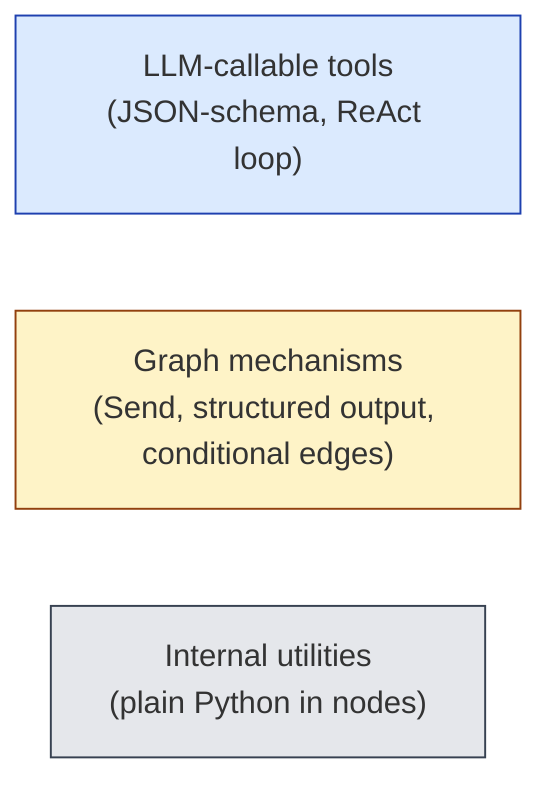

# Tools — design reference

Concrete tool surface for the orc-gen workflow. Tools are partitioned by who uses them (orchestrator vs generator) and by role (state-mutating, read-only, side-effecting). Authority follows from testplanning.md: only the orchestrator mutates the testplan; generators only mutate their `work_dir`. The graph nodes from graph.md register subsets of this surface — tighter surfaces produce more reliable LLM behavior.

## Tool taxonomy

Three things are sometimes called "tools" in the design. Distinguishing them prevents confusion in prompts and graph code.



1. **LLM-callable tools** — registered with the LLM, invoked via tool calls during a ReAct loop. This doc focuses here.
2. **Graph mechanisms** — look like tools at the design level but are actually graph constructs (Send fan-out, structured output emission, conditional routing). Not in any LLM tool list.
3. **Internal utilities** — Python functions used by graph nodes (e.g., the `check` node's stop-condition evaluator). Not tools at all.

The dispatch step is mechanism (2), not a tool — see "Dispatch is structured output" below. This supersedes earlier mentions of `dispatch_test_gen` as a tool.

## Orchestrator tools

### Testplan management (orchestrator-only)

- **`read_testplan(target?, filter?)`** — read full plan, a single named item, or a filter-matched subset (e.g., `{status: "todo"}`). The orchestrator's primary scheduling primitive.
- **`read_summary()`** — counts/percentages only. For "are we done" checks without paying full plan token cost.
- **`patch_testplan(target_type, name, fields)`** — merge fields into one existing item. Strict schema validation; reject hallucinated fields. Used in `reconcile`.
- **`append_history(target_type, name, entry)`** — append-only history. Separated from `patch_testplan` so call sites document intent and can't accidentally overwrite history.
- **`build_testplan(seed)`** — INIT-only. Constructs the initial plan from spec + cov model (functional) or RTL hierarchy (code). Disabled in subsequent phases — the orchestrator must patch, not rebuild.

### Coverage (shared with generators)

- **`query_coverage(scope, mode)`** — returns structured coverage numbers, never LLM-parsed report text. Authoritative.

### Read-only context (shared)

- **`read_rtl(path, range?)`** — RTL source with optional line range to keep context small.
- **`read_spec_excerpt(query_or_section)`** — pulls a relevant excerpt from the spec. Backed by simple section lookup or a local index (left to spec/RAG decisions in a later doc).
- **`read_history(item_name)`** — convenience wrapper for one item's `history` array without paying the full testplan payload. Used heavily in `orchestrate`.
- **`read_dispatch_log(filter?)`** — recent dispatches. Lets `orchestrate` avoid re-trying an approach it just tried.
- **`read_agents(filter?)`** — agent registry view: returns a list of `AgentMetadata` entries (active / idle / retired) optionally filtered by status or feature. Used by `orchestrate` to decide spawn-vs-resume and to see which agents are sitting idle in case a regression makes them relevant again.

### Dispatch / route is structured output, not a tool

The `orchestrate` node ends each turn by emitting a structured `OrchestratorAction`:

```python
class DispatchBrief(TypedDict):
    agent_id: str                     # routing key — new id triggers spawn, existing id triggers resume
    feature_label: str                # human-readable scope name (only authoritative on spawn)
    scope_items: list[str]            # the items this agent owns (only authoritative on spawn)
    instructions: str                 # this invocation's directed guidance
    rtl_context: list[str]            # relevant RTL paths
    spec_excerpts: list[str]          # pre-extracted, not full doc
    baseline_coverage: dict           # snapshot before this dispatch
    goal: dict                        # see testplanning.md goal types
    budget: dict                      # max_iterations, max_tokens, etc.
    # Per-item context for items in scope:
    items_context: list[dict]         # name, history, current coverage, etc.

class DispatchPlan(TypedDict):
    dispatches: list[DispatchBrief]   # one entry per agent invocation in this iteration
    rationale: str                    # short, for dispatch_log

class RouteDecision(TypedDict):
    run_status: Literal["done", "blocked", "errored"]
    reason: str

class OrchestratorAction(TypedDict):
    kind: Literal["dispatch", "terminate"]
    dispatch_plan: DispatchPlan | None    # populated when kind == "dispatch"
    route_decision: RouteDecision | None  # populated when kind == "terminate"
```

The graph routes on `kind`: `dispatch` → `dispatch` node materializes Sends; `terminate` → `finalize`.

**Spawn vs. resume routing** happens in the `dispatch` node based on `agent_id`:
- `agent_id` not in `state.agents` → **spawn**: create `AgentMetadata`, initialize `AgentState` with system prompt + first brief, claim `feature_label` and `scope_items` (immutable thereafter).
- `agent_id` in `state.agents` → **resume**: load `AgentState` from checkpoint, append the new brief as a user turn into the existing `messages`. `feature_label` and `scope_items` from the brief are validated against the agent's stored values; mismatch is an error.
- Same `agent_id` appearing twice in one `DispatchPlan` → rejected (concurrency constraint).

Treating the strategic decision as structured output (not a tool call) gives `orchestrate` a clean exit condition per turn: tools are exploratory; the structured payload is the decision.

## Generator tools

### Read tools (subset of orchestrator's, scoped to brief)

- **`query_coverage(scope, mode)`** — same tool, used in `plan` and `check`.
- **`read_rtl(path, range?)`** — paths constrained to those listed in `brief.rtl_context` plus globally allowed paths.
- **`read_spec_excerpt(query)`** — answers from `brief.spec_excerpts` first; falls back to global spec on miss.
- **`read_sim_log(path)`** — last sim log; path constrained to `work_dir`.

### Action tools (work_dir only)

- **`write_file(path, content)`** — create or fully overwrite a file. Used for initial testbench drop and for whole-file rewrites when the structure has changed enough that patching is silly. **Path resolver enforces `path` is inside `work_dir`.** Out-of-tree writes raise. This is the single highest-leverage safety constraint in the generator surface; everything else is more recoverable.
- **`edit_file(path, old_string, new_string, replace_all?)`** — surgical patch. `old_string` must match the file's existing contents *exactly once* (or `replace_all=true` for renames). On non-unique or zero matches, returns `ok=false` with the count so the LLM can re-anchor. Path constraint identical to `write_file`. New string may be empty (in-file deletion). Used for almost all iteration after the first `write_file` — fixing a constraint, adding a sequence to an existing test, tweaking a randomization weight.
- **`run_sim(testbench_name, sim_config?)`** — invoke simulator via the configured runner. Returns a structured `SimResult` (`exit_code`, `log_path`, `cov_db_delta_path`, `wall_time_s`). Generator never parses sim stdout directly — it reads `read_sim_log` after, but coverage numbers come only from `query_coverage`.

**`write_file` vs `edit_file`** — heuristic the prompts will encode: use `write_file` for the first drop of a new file or when ≥50% of the file is changing; use `edit_file` for everything else. Reasoning is twofold: regenerating a 500-line testbench to fix a 2-line constraint burns tokens *and* drops behaviorally-correct surrounding code that the LLM might subtly perturb on rewrite. Surgical edits keep the testbench focused and the diff history meaningful.

### Stop is mechanism, not a tool

The generator LLM never calls a "stop" tool. The deterministic `check` node from graph.md evaluates stop conditions in priority order from testplanning.md (budget → goal → plateau → error). The LLM proposes status in `finish` via structured output, but cannot terminate its own loop.

## What's deliberately missing

- **No raw shell/bash tool.** Every generator action maps to a typed tool call. Tightens the audit trail (the structured tool name *is* the action) and prevents "I'll just run X" detours that complicate logging.
- **No git tools.** Version control is run-level, not agent-level.
- **No network tools.** Spec/RTL/coverage are local. If RAG comes later it wraps a local index.
- **No delete-file tool.** Generators can edit *within* a file (via `edit_file` with empty `new_string`) but cannot remove files. `work_dir` file inventory stays monotonic and easy to attribute. Cleanup happens between runs at the orchestrator level.
- **No "ask human" tool.** Blocked items return through the structured proposal path and the orchestrator decides whether to escalate. Mid-loop human-in-the-loop is out of scope.

## Tool result shape

Every LLM-callable tool returns a structured result, never free-form text:

```python
class ToolResult(TypedDict):
    ok: bool
    data: Any                       # tool-specific structured payload
    error: str | None               # human-readable; only when not ok
    summary: str                    # short, LLM-friendly recap
```

Why both `data` and `summary`: LLMs reason against `summary`; the rest of the system (logging, reconciliation, replay) reads `data`. Splitting prevents the LLM from extracting numbers out of prose, and prevents downstream code from regex-parsing LLM-facing strings.

## Failure modes

- **Schema mismatch** (LLM passed a hallucinated field) → `ok=false`, error explains, the ReAct loop sees the error and corrects.
- **Out-of-scope path** (e.g., `write_file` outside `work_dir`) → `ok=false`, hard refusal, no partial state.
- **Sim crash / hang** — `run_sim` enforces a timeout from `config.budgets`. Returns `ok=true, data.exit_code != 0` so the LLM sees the failure but the loop continues (a failed sim is a normal outcome to react to, not an exceptional one).
- **Tool-call retry storms** — bounded by the per-node attempt budget; the `check` node will trip the stop condition before tools cycle indefinitely.

## Tool registration by node

Different nodes register different subsets. Smaller surfaces → fewer wrong-tool errors.

| Node           | Tools registered                                                                                                                                                |
|----------------|------------------------------------------------------------------------------------------------------------------------------------------------------------------|
| `init`         | `read_rtl`, `read_spec_excerpt`, `query_coverage`, `build_testplan`                                                                                              |
| `orchestrate`  | `read_testplan`, `read_summary`, `read_history`, `read_dispatch_log`, `read_agents`, `query_coverage`, `read_rtl`, `read_spec_excerpt`, `patch_testplan`, `append_history` |
| `dispatch`     | (none — pure mechanism; performs spawn/resume routing)                                                                                                           |
| `update_state` | `query_coverage`, `patch_testplan`, `append_history` (called from Python, not via LLM); also writes `AgentMetadata.status` updates                               |
| `finalize`     | (none — pure I/O)                                                                                                                                                |
| agent `init`   | (none — pure setup; differs for spawn vs. resume)                                                                                                                |
| agent `plan`   | `read_rtl`, `read_spec_excerpt`, `query_coverage`                                                                                                                |
| agent `act`    | `read_rtl`, `write_file`, `edit_file`, `run_sim`, `read_sim_log`                                                                                                 |
| agent `check`  | (none — deterministic evaluator)                                                                                                                                 |
| agent `finish` | (none — structured output only)                                                                                                                                  |

Two structural notes:

1. `orchestrate` has both read and write tools — the persistent orchestrator drives strategy *and* applies judgment-driven testplan changes (blocking calls, waivers, instruction additions). Routine post-dispatch merging is offloaded to `update_state`, but the LLM retains write authority for the cases that need its judgment.
2. Agents have no testplan tools at all. The single-writer invariant from testplanning.md is enforced by tool registration plus the topological serialization of `orchestrate` and `update_state` (they never run concurrently).
3. `read_rtl` and `read_spec_excerpt` are registered on `orchestrate` and on agents (in `plan` and `act`), but used as **transient** reads — see context.md. The raw excerpt is visible during the turn that called the tool, then collapsed to a marker in the persisted history so heavy reads do not bloat the running conversations of either the orchestrator or any agent.

## What this design buys us

- **Strict authority by registration**: a generator literally cannot mutate the testplan because the tool isn't there.
- **Structured tool results everywhere** kill a major hallucination source (free-text coverage extraction).
- **Dispatch as structured output** gives `plan` a clean exit condition and keeps tool-call semantics consistent (tools = exploration; output = decision).
- **Per-node tool subsets** keep prompts focused and reduce wrong-tool-for-the-job errors.
- **No raw shell** means every action is logged with a typed name — the logging design has a much easier job.
