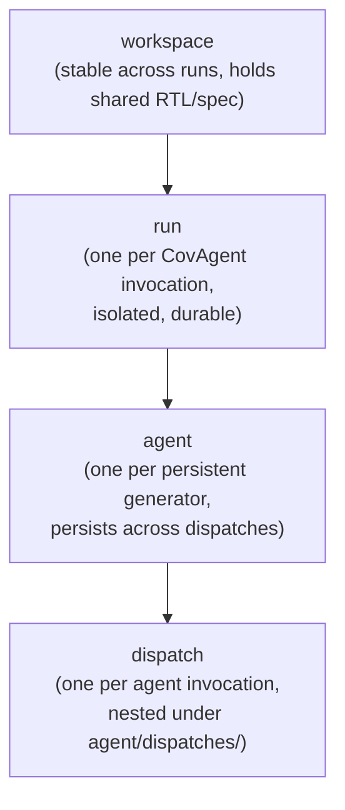

# Work directory — design reference

On-disk layout for the orc-gen workflow. Three layers: a long-lived **workspace** (set by `RunConfig.workspace`), per-**run** directories under it, and per-**agent** work dirs nested inside each run (with per-dispatch records nested under each agent). This doc fixes the layout, naming, ownership, and cleanup policy. Other docs (coverage.md, logging.md) reference these paths.

## Top-level layout

```
<workspace>/
├── shared/
│   ├── rtl/                          # design RTL (read-only, possibly a symlink)
│   └── spec/                         # spec documents (read-only, possibly a symlink)
└── runs/
    └── run_<YYYYMMDD-HHMMSS>_<short-hash>/
        ├── config.json               # frozen snapshot of RunConfig
        ├── lockfile                  # presence = run is in progress
        ├── testplan/
        │   ├── initial.json          # written at end of init
        │   ├── snapshots/
        │   │   ├── iter_001.json     # post-update_state snapshot
        │   │   └── ...
        │   └── final.json            # written by finalize
        ├── conversations/
        │   ├── init.json             # init conversation transcript (one shot)
        │   └── orchestrate.jsonl     # orchestrator persistent conversation
        ├── agents/
        │   └── agent_<feature>_<short-hash>/
        │       ├── metadata.json     # AgentMetadata snapshot (updated on lifecycle changes)
        │       ├── conversation.jsonl # agent's persistent conversation, grows across dispatches
        │       ├── checkpoint/       # LangGraph checkpointer storage for this agent
        │       ├── work_dir/         # PERSISTENT testbench sandbox for this agent
        │       │   └── tests/        # SystemVerilog files accumulate here across all dispatches
        │       └── dispatches/       # one subdir per invocation of this agent
        │           └── dispatch_<id>/
        │               ├── brief.json
        │               ├── return.json
        │               ├── sim/      # compile/run logs from this invocation
        │               └── coverage/
        │                   └── delta.<ext>   # per-dispatch coverage delta DB
        ├── coverage/
        │   ├── baseline.<ext>        # baseline DB at run start
        │   ├── master.<ext>          # incrementally-merged master (authoritative)
        │   ├── snapshots/
        │   │   ├── iter_001.<ext>    # post-iteration snapshot
        │   │   └── ...
        │   └── reports/              # human-readable coverage reports (final)
        ├── logs/
        │   ├── run.log               # human-readable timeline
        │   └── events.jsonl          # structured event stream
        └── summary.md                # final markdown summary written by finalize
```

`<ext>` is simulator-specific (`.ucdb`, `.vdb`, `.cov`).

## Four nested scopes



- **Workspace** lives wherever the user points `RunConfig.workspace`. Holds `shared/` (RTL, spec — typically symlinks to the design's git checkout) and `runs/`. Stable.
- **Run** is a single CovAgent invocation. All artifacts a run produces live under its run dir; nothing leaks above. A run is the unit of "one CovAgent execution end-to-end."
- **Agent** is a persistent generator owning a feature scope. The agent's `work_dir` (referenced from `AgentState.work_dir`) is `<run>/agents/<agent_id>/work_dir/` — testbench files accumulate here across all dispatches the agent receives. Sandbox boundary: `write_file` / `edit_file` path resolution rejects anything outside this dir.
- **Dispatch** is one invocation of an agent. The dispatch directory holds the brief, the return, and per-invocation artifacts (sim logs, coverage delta). It does **not** hold the testbench files — those live in the agent's `work_dir/` and are shared across the agent's dispatches.

Why nested rather than flat: attribution is automatic. Any artifact's path tells you the run, the agent that produced it, and the dispatch that triggered it. Testbench files are owned by an agent and visibly persist across dispatches — the directory layout reflects the engineer-and-their-codebase mental model rather than the previous one-shot-task-and-its-sandbox model.

## Naming

- **Run ID**: `run_<YYYYMMDD-HHMMSS>_<short-hash>`. Timestamp for human ordering; 6-char hash to disambiguate concurrent starts and to make IDs copy-pasteable into URLs/logs without collision risk.
- **Agent ID**: `agent_<feature_label>_<short-hash>` where `feature_label` is the slug-cased scope name the orchestrator chose at spawn (e.g., `agent_csr_a3f1`, `agent_alu_pipeline_b7e0`). Stable for the agent's lifetime.
- **Dispatch ID**: `dispatch_<iteration>_<seq>` where `iteration` is the orchestrator iteration that produced the dispatch and `seq` is the index within that iteration's batch (e.g., `dispatch_003_2` = iter 3, second dispatch). Encodes provenance in the name. Note: the same agent may handle dispatches from many iterations; a dispatch ID alone doesn't tell you the agent — the path does (`agents/<agent_id>/dispatches/dispatch_003_2/`).

These names appear verbatim in `state.dispatch_log`, in `state.agents`, in event logs, and in conversation summary turns — debuggability is improved when an ID someone reads in a log immediately tells them where on disk to look.

## Ownership and writers

| Path                                                     | Writer                                  |
|----------------------------------------------------------|-----------------------------------------|
| `<workspace>/shared/`                                    | external (engineer setup)               |
| `<run>/config.json`                                      | run startup                             |
| `<run>/lockfile`                                         | run startup; deleted by finalize        |
| `<run>/testplan/initial.json`                            | `init` node                             |
| `<run>/testplan/snapshots/`                              | `update_state` node                     |
| `<run>/testplan/final.json`                              | `finalize` node                         |
| `<run>/conversations/init.json`                          | `init` node (on exit)                   |
| `<run>/conversations/orchestrate.jsonl`                  | `orchestrate` node (per turn append)    |
| `<run>/agents/<agent_id>/metadata.json`                  | `dispatch` node (spawn / status update) |
| `<run>/agents/<agent_id>/conversation.jsonl`             | agent subgraph (per turn, persistent)   |
| `<run>/agents/<agent_id>/checkpoint/`                    | LangGraph checkpointer for the agent    |
| `<run>/agents/<agent_id>/work_dir/`                      | agent (write_file/edit_file, run_sim)   |
| `<run>/agents/<agent_id>/dispatches/<id>/brief.json`     | `dispatch` node                         |
| `<run>/agents/<agent_id>/dispatches/<id>/return.json`    | `update_state` node                     |
| `<run>/agents/<agent_id>/dispatches/<id>/sim/`           | agent (run_sim, per-invocation)         |
| `<run>/agents/<agent_id>/dispatches/<id>/coverage/delta.<ext>` | agent's `run_sim` writes coverage delta here |
| `<run>/coverage/baseline.<ext>`                          | `init` node                             |
| `<run>/coverage/master.<ext>`                            | `update_state` node (merge)             |
| `<run>/coverage/snapshots/`                              | `update_state` node                     |
| `<run>/coverage/reports/`                                | `finalize` node                         |
| `<run>/logs/`                                            | logging subsystem (any node)            |
| `<run>/summary.md`                                       | `finalize` node                         |

Three strict invariants:
1. **No node writes outside its declared paths.** Tool implementations enforce by path resolution.
2. **`shared/` is read-only at runtime.** RTL and spec are inputs, never modified.
3. **Agent `work_dir/` is owned by exactly one agent.** Other agents cannot write to it; the orchestrator's `dispatch` node enforces this by passing the correct `work_dir` path into each agent's state at spawn.

## Concurrency

- Each run dir contains a `lockfile` written at startup, deleted by `finalize`. A new run that finds a lockfile in another run dir does *nothing* to that other run; it just creates its own dir. This is a conflict-detection aid for humans, not a kernel-level lock.
- Multiple runs in the same workspace are allowed and isolated by run dir — no shared mutable state at the run level.
- Within a run, parallelism is bounded to the dispatch level: N agents may run in parallel, each in its own `agents/<agent_id>/work_dir/`. They never share files. The same agent never runs twice in parallel — the `dispatch` node validates one-invocation-per-agent-per-iteration. The simulator coverage merge step is serialized in `update_state` (single writer to `coverage/master.<ext>`).

## Cleanup policy

- **Default: nothing is auto-deleted.** Run dirs persist after the run ends. Engineers may want them for debugging, regression comparisons, or as a cache of generated tests.
- **Explicit cleanup** is a manual operation: a `covagent prune` CLI (TBD in implementation) that takes a retention policy (e.g., "delete runs older than 30 days", "delete runs with `run_status=errored` before yesterday").
- **Within-run cleanup** does not happen mid-run. A failed dispatch's `work_dir` stays — its files are evidence for the next iteration's reasoning.

This errs on the side of disk usage over information loss. Tests and waveforms are valuable artifacts; we delete them deliberately, never automatically.

## Re-runs and resumption

- A run is a one-shot end-to-end execution; we do not formally support mid-run resumption (per state.md).
- Re-running against the same workspace simply creates a new run dir. Previous testplans, conversations, and coverage are accessible for comparison but do not feed forward automatically.
- A future "warm-start" mode (carry-over of completed testpoints from a prior run) would be a config option that init reads from a referenced prior run dir; not in scope now.

## Path resolution and the sandbox

`write_file` and `edit_file` enforce the per-agent sandbox:

```
def resolve_write_path(state: AgentState, raw_path: str) -> Path:
    work_dir = Path(state.work_dir).resolve()
    candidate = (work_dir / raw_path).resolve()
    if not candidate.is_relative_to(work_dir):
        raise OutOfScopeError(candidate, work_dir)
    return candidate
```

Same shape for the orchestrator's `patch_testplan` / `append_history` writes — they target structured state, not the filesystem, but the principle (declared path or fail loud) is the same.

`read_rtl` and `read_spec_excerpt` resolve against `<workspace>/shared/rtl/` and `<workspace>/shared/spec/` respectively. The orchestrator and all agents read; none write.

## Why this layout

- **Per-run isolation** — runs never interfere; concurrent runs are safe.
- **Per-agent isolation** — agent sandboxes are physical, enforced by path resolution. No "agent A overwrote agent B's test."
- **Persistent agent dirs** — testbench files accumulate across dispatches in one place per agent. The agent for the CSR feature owns `agents/agent_csr_*/work_dir/` for the whole run; engineers reading the artifacts see one coherent codebase per feature, not scattered fragments.
- **Provenance in paths** — any artifact's full path tells you the run, agent, and dispatch that produced it.
- **Cleanup-by-directory** — deleting a run is `rm -rf <run-dir>`; no cross-tree references to chase.
- **Symlinked shared/** — RTL and spec aren't duplicated per run; a workspace serving 100 runs of the same design holds one copy.
- **Conversations on disk** — both the orchestrator's and each agent's persistent conversation are debuggable post-hoc and replayable.
